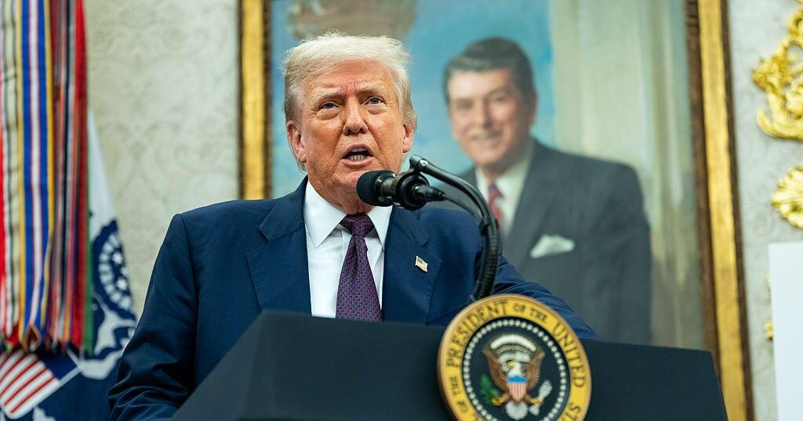
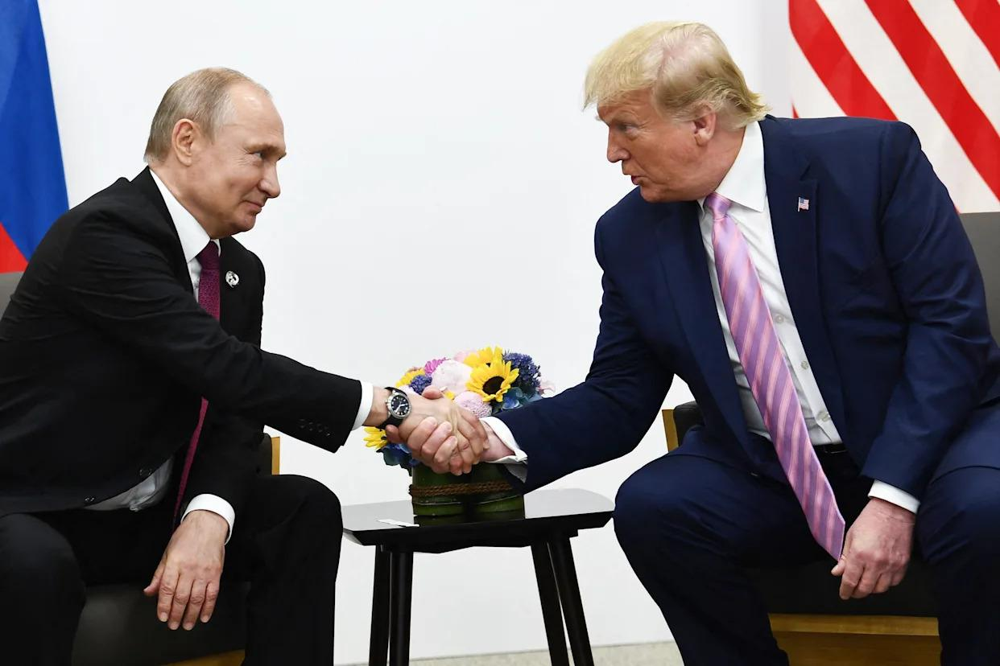

## Claim
Claim: "After Donald Trump won the US presidential election in 2024, NATO Secretary General Mark Rutte said that ‘If Trump surrenders Ukraine to Putin, he will personally expel the United States from the alliance’."

## Actions
```
web_search("Mark Rutte Trump Ukraine Putin NATO")
```

## Evidence
### Evidence from `web_search`
The NATO website contains remarks by NATO Secretary General Mark Rutte with Donald Trump at the White House, discussing keeping Ukraine strong and increasing defense industrial production. Rutte mentioned that if he were Vladimir Putin, he would reconsider negotiations about Ukraine. The remarks also mention European countries' support for Ukraine. ([https://www.nato.int/cps/en/natohq/opinions_237051.htm](https://www.nato.int/cps/en/natohq/opinions_237051.htm))

NPR published an article on July 14, 2025, discussing President Trump's meeting with NATO Secretary-General Mark Rutte . Trump threatened tariffs on countries trading with Moscow if a ceasefire deal with Ukraine wasn't reached. The article mentions Trump's promise to provide weapons to Ukraine through NATO. CBS News reports that Donald Trump is set to meet with NATO Secretary General Mark Rutte , . The article mentions a potential deal to end the conflict between Azerbaijan and Armenia and that Trump is considering authorizing fresh funding for Ukraine. ([https://www.npr.org/2025/07/14/nx-s1-5467272/russia-ukraine-war-trump-nato-weapons-tariffs](https://www.npr.org/2025/07/14/nx-s1-5467272/russia-ukraine-war-trump-nato-weapons-tariffs)) ([https://www.cbsnews.com/news/trump-nato-secretary-general-mark-rutte-meeting-ukraine-russia/](https://www.cbsnews.com/news/trump-nato-secretary-general-mark-rutte-meeting-ukraine-russia/))


## Elaboration
The evidence indicates that Mark Rutte and Donald Trump met after Trump won the US presidential election in 2024. The discussions involved Ukraine, with Trump considering providing weapons and potentially authorizing funding. However, the provided evidence does not contain any statement from Mark Rutte about expelling the United States from NATO if Trump surrenders Ukraine to Putin.

Therefore, the claim cannot be verified based on the provided evidence.


## Actions
```
web_search("Mark Rutte NATO Trump expel US Ukraine Putin")
```

## Evidence
### Evidence from `web_search`
Newsweek reports that there is no evidence that Mark Rutte said he would expel the U.S. from NATO if Trump surrenders Ukraine to Putin, and that the claim originated from social media posts and was fact-checked by BBC Verify. ([https://www.newsweek.com/did-nato-chief-vow-kick-us-out-over-trumps-ukraine-plan-what-we-know-mark-rutte-1983779](https://www.newsweek.com/did-nato-chief-vow-kick-us-out-over-trumps-ukraine-plan-what-we-know-mark-rutte-1983779)) Yahoo News states that a NATO spokesperson called the claim "baseless" and that Rutte congratulated Trump after the election. ([https://www.yahoo.com/news/nato-secretary-general-congratulated-trump-002143816.html](https://www.yahoo.com/news/nato-secretary-general-congratulated-trump-002143816.html)) Euronews debunks the claim, stating there is no evidence to support it and that NATO itself has denied it. ([https://www.euronews.com/my-europe/2024/11/20/no-natos-chief-has-not-threatened-to-expel-us](https://www.euronews.com/my-europe/2024/11/20/no-natos-chief-has-not-threatened-to-expel-us)) , , , 


## Elaboration
The claim is false. Multiple sources, including Newsweek, Yahoo News, and Euronews, debunk the claim that Mark Rutte said he would expel the U.S. from NATO if Trump surrendered Ukraine to Putin. These sources state that the claim is baseless and originated from social media.


## Final Judgement
The claim is demonstrably false. Multiple fact-checking sources have debunked the claim, stating that Mark Rutte did not make the statement attributed to him. The claim originated from social media and has been refuted by NATO and various news outlets.

`false`

### Verdict: FALSE

### Justification
The claim is false. Multiple sources, including [Newsweek](https://www.newsweek.com/did-nato-chief-vow-kick-us-out-over-trumps-ukraine-plan-what-we-know-mark-rutte-1983779), [Yahoo News](https://www.yahoo.com/news/nato-secretary-general-congratulated-trump-002143816.html), and [Euronews](https://www.euronews.com/my-europe/2024/11/20/no-natos-chief-has-not-threatened-to-expel-us), debunk the statement, citing it as baseless and originating from social media.
