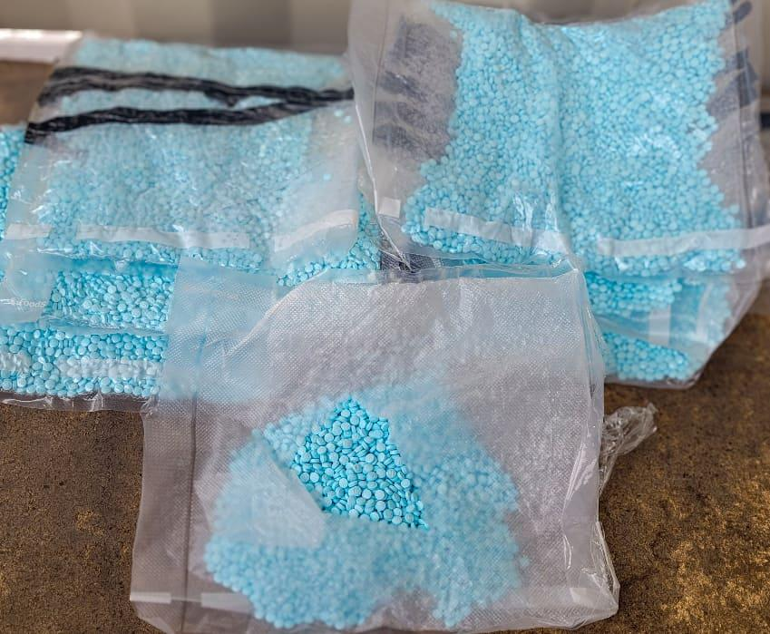

## Claim
Claim: "Mexican President-elect Claudia Sheinbaum rejected an invitation to Ukraine by Volodymr Zelenskyy and said towards him on September 17, 2024: 'If I wanted to see a drug addict, I'd just take a walk around Tijuana.'"

## Actions
```
web_search("Claudia Sheinbaum Zelenskyy Ukraine invitation")
web_search("Claudia Sheinbaum Tijuana drug addict quote")
```

## Evidence
### Evidence from `web_search`
Multiple sources ([IntelliNews](https://www.intellinews.com/mexico-s-president-elect-sheinbaum-turns-down-zelensky-s-invitation-to-ukraine-344262/), [Euromaidan Press](https://euromaidanpress.com/2024/09/18/mexican-president-elect-declines-zelenskyys-invitation-to-visit-ukraine/), and [NV.ua](https://english.nv.ua/nation/sheinbaum-declines-zelenskyy-s-invitation-focuses-on-domestic-issues-50451798.html)) report that Claudia Sheinbaum, the Mexican President-elect, declined an invitation from Ukrainian President Volodymyr Zelenskyy to visit Ukraine. Sheinbaum stated her intention to focus on domestic issues and maintain a policy of non-intervention in foreign affairs. , , 

None of the articles mention the quote attributed to Sheinbaum in the claim.


### Evidence from `web_search`
The provided web sources discuss Claudia Sheinbaum's statements on drug trafficking and her interactions with U.S. figures. One article from workers.org, published in February 2025, focuses on Sheinbaum's comments regarding the U.S.'s role in drug consumption and trafficking, emphasizing Mexican sovereignty. Another article from MSNBC, published on December 4, 2024, mentions Sheinbaum's response to Donald Trump's claims about Mexico's role in the fentanyl crisis, stating that Mexico does not consume synthetic drugs. A Mexico News Daily article, published on February 20, 2025, reports on Donald Trump thanking Sheinbaum for inspiring a U.S. anti-drug campaign, mentioning their discussions on drugs and anti-drug advertising. , , , 

The articles can be found at the following URLs: [https://www.workers.org/2025/02/83990/](https://www.workers.org/2025/02/83990/), [https://www.msnbc.com/opinion/msnbc-opinion/trump-mexico-president-claudia-sheinbaum-fentanyl-response-rcna182496](https://www.msnbc.com/opinion/msnbc-opinion/trump-mexico-president-claudia-sheinbaum-fentanyl-response-rcna182496), and [https://mexiconewsdaily.com/politics/trump-sheinbaum-us-anti-drug-campaign/](https://mexiconewsdaily.com/politics/trump-sheinbaum-us-anti-drug-campaign/).


## Elaboration
The evidence confirms that Claudia Sheinbaum declined an invitation to visit Ukraine. However, there is no evidence to support the quote attributed to her in the claim. The search results do not mention the alleged statement.


## Final Judgement
The claim that Claudia Sheinbaum made the specific quote about Volodymyr Zelenskyy is not supported by the available evidence. While she did decline an invitation to visit Ukraine, there is no information to corroborate the statement attributed to her.

`false`

### Verdict: FALSE

### Justification
The claim is false. While Claudia Sheinbaum did decline an invitation to visit Ukraine, there is no evidence from sources like [IntelliNews](https://www.intellinews.com/mexico-s-president-elect-sheinbaum-turns-down-zelensky-s-invitation-to-ukraine-344262/), [Euromaidan Press](https://euromaidanpress.com/2024/09/18/mexican-president-elect-declines-zelenskyys-invitation-to-visit-ukraine/), and [NV.ua](https://english.nv.ua/nation/sheinbaum-declines-zelenskyy-s-invitation-focuses-on-domestic-issues-50451798.html) to support the specific quote attributed to her.
