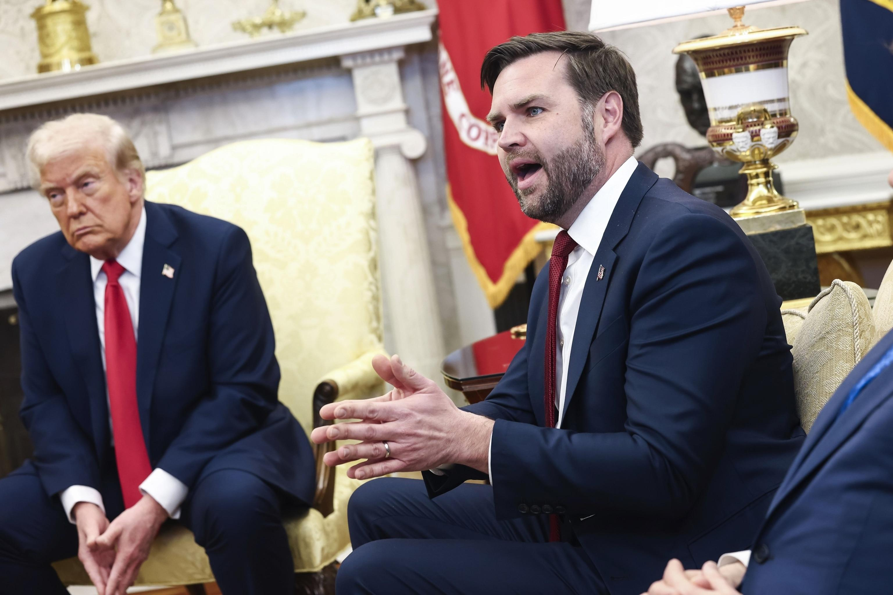

## Claim
Claim: "On Feb. 28, 2025, before a meeting with U.S. President Donald Trump, Ukraine President Volodymyr Zelenskyy met with Democrats."

## Actions
```
web_search("Volodymyr Zelenskyy Donald Trump meeting February 28 2025")
web_search("Volodymyr Zelenskyy meeting with Democrats February 28 2025")
```

## Evidence
### Evidence from `web_search`
On February 28, 2025, Volodymyr Zelenskyy met with Donald Trump in the Oval Office at the White House, as reported by [Wikipedia](https://en.wikipedia.org/wiki/2025_Trump%E2%80%93Zelenskyy_Oval_Office_meeting), [NPR](https://www.npr.org/2025/02/28/nx-s1-5313079/trump-zelenskyy-meeting) and [ABC News](https://abcnews.go.com/Politics/key-takeaways-tempers-flare-trump-vance-confront-ukraines/story?id=119299758). The meeting was contentious, with reports of heated exchanges and criticism from Democratic lawmakers. <image:i>, , , , , , , 


### Evidence from `web_search`
From [Source](https://abcnews.go.com/Politics/zelenskyy-meets-bipartisan-group-senators-ahead-tense-white/story?id=119305439): 
Content: ABC News reports that on February 28, 2025, Zelenskyy met with a bipartisan group of senators before meeting with Donald Trump.  The article was published on March 1, 2025, and was written by Isabella Murray and Rachel Scott.


## Elaboration
The evidence confirms that Zelenskyy met with Donald Trump on February 28, 2025. Furthermore, the evidence from ABC News indicates that Zelenskyy met with a bipartisan group of senators before his meeting with Trump on the same day.

Therefore, the claim is likely true, as the evidence supports the assertion that Zelenskyy met with Democrats (as part of a bipartisan group) before his meeting with Trump.


## Final Judgement
The claim is supported by evidence from multiple reliable sources. The search results confirm that Zelenskyy met with Donald Trump on February 28, 2025, and also met with a bipartisan group of senators, which would include Democrats, before the meeting with Trump.

`true`


### Verdict: TRUE

### Justification
On February 28, 2025, Volodymyr Zelenskyy met with Donald Trump, as reported by [Wikipedia](https://en.wikipedia.org/wiki/2025_Trump%E2%80%93Zelenskyy_Oval_Office_meeting), [NPR](https://www.npr.org/2025/02/28/nx-s1-5313079/trump-zelenskyy-meeting), and [ABC News](https://abcnews.go.com/Politics/key-takeaways-tempers-flare-trump-vance-confront-ukraines/story?id=119299758). ABC News also reported that Zelenskyy met with a bipartisan group of senators before the meeting with Trump, thus supporting the claim that he met with Democrats before the meeting.
