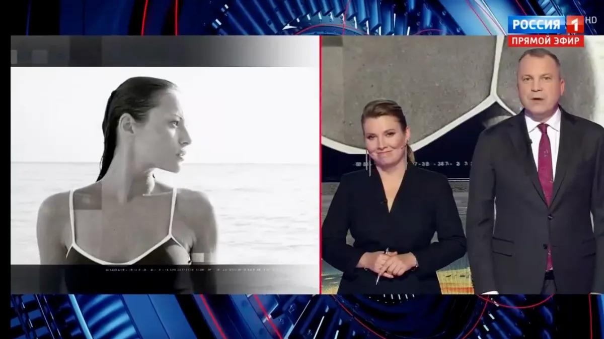
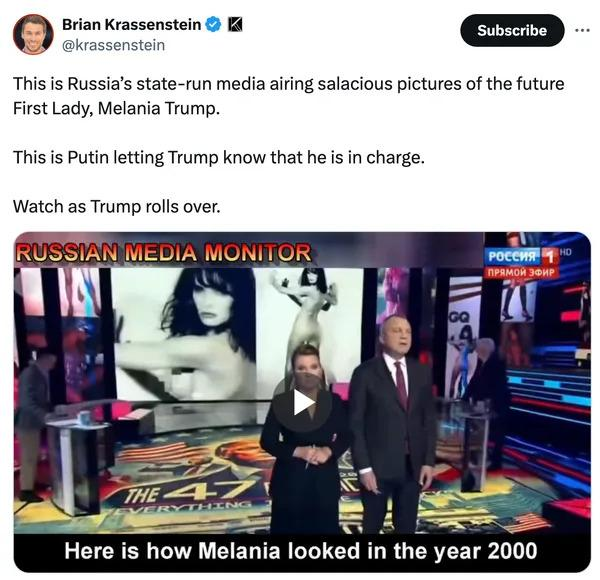
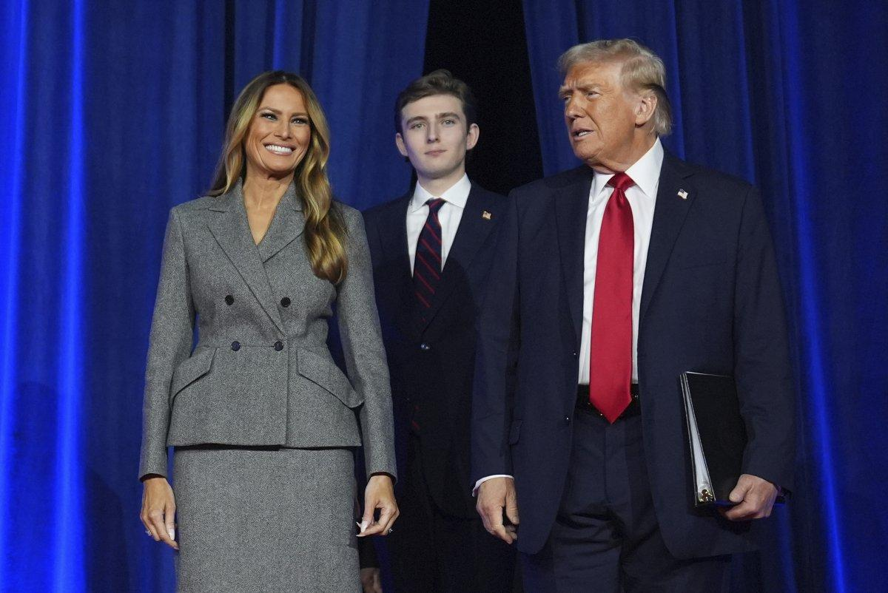

## Claim
Claim: "Russian state TV aired nude photos of Melania Trump shortly after the 2024 U.S. presidential election."

## Actions
```
web_search("Russian state TV Melania Trump nude photos")
```

## Evidence
### Evidence from `web_search`
According to a Yahoo News fact check, Russian state TV aired revealing photos of Melania Trump shortly after the 2024 U.S. presidential election, which was shared on social media on Nov. 8, 2024, and available on Smotrim.ru, an official online platform of Russian state television (, , , , ). Newsweek reports that a Russian state television network showed nude photographs of Melania Trump on live television to congratulate her on her husband's reelection, with photos from a GQ profile in 2000 ().

The Kyiv Independent reported that Russian state TV channel Russia 1 aired explicit photos of Melania Trump during a segment after her husband's U.S. election victory on November 12, 2024. The segment included photos from her modeling career.


## Elaboration
The evidence confirms the claim. According to a Yahoo News fact check, Russian state TV aired revealing photos of Melania Trump shortly after the 2024 U.S. presidential election. Newsweek and The Kyiv Independent also reported that Russian state television showed nude or explicit photographs of Melania Trump after her husband's election victory.


## Final Judgement
The claim is supported by multiple sources, including Yahoo News, Newsweek, and The Kyiv Independent, which confirm that Russian state TV aired nude or revealing photos of Melania Trump shortly after the 2024 U.S. presidential election.

`true`


### Verdict: TRUE

### Justification
The claim is supported by multiple sources. According to a [Yahoo News fact check](https://news.yahoo.com/fact-check-russian-state-tv-190000698.html), Russian state TV aired revealing photos of Melania Trump shortly after the 2024 U.S. presidential election. Newsweek and The Kyiv Independent also reported that Russian state television showed nude or explicit photographs of Melania Trump after her husband's election victory.
