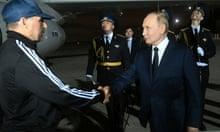

## Claim
Claim: "In August 2024 U.S. President Joe Biden boarded an empty plane after three freed Americans arrived back in the U.S. and exited the aircraft."

## Actions
```
web_search("Joe Biden empty plane August 2024")
```

## Evidence
### Evidence from `web_search`
According to a Times of India article published on August 3, 2024, Joe Biden boarded an empty plane after the arrival of American prisoners from Russia and stayed on the plane for about two minutes. The White House deputy press secretary said that Biden wanted to thank the flight crew. ([https://timesofindia.indiatimes.com/world/us/did-joe-biden-enter-empty-plane-carrying-russian-prisoners-white-house-clarifies/articleshow/112249634.cms](https://timesofindia.indiatimes.com/world/us/did-joe-biden-enter-empty-plane-carrying-russian-prisoners-white-house-clarifies/articleshow/112249634.cms)) 

Yahoo News reported on August 1, 2024, that Biden boarded the plane to speak to the people who helped bring the freed prisoners home. ([https://www.yahoo.com/news/fact-check-no-biden-did-000500209.html](https://www.yahoo.com/news/fact-check-no-biden-did-000500209.html))  The Guardian reported on August 1, 2024, on a prisoner swap between Russia and the U.S. that involved the release of Evan Gershkovich, Alsu Kurmasheva, and Paul Whelan, and that Biden and Harris greeted the freed Americans upon their arrival. ([https://www.theguardian.com/world/live/2024/aug/01/russia-prison-swap-us-journalist-evan-gershkovich-wsj-vadim-krasikov-live?filterKeyEvents=false&page=with%3Ablock-66aba9e68f08a0af63bb3f00](https://www.theguardian.com/world/live/2024/aug/01/russia-prison-swap-us-journalist-evan-gershkovich-wsj-vadim-krasikov-live?filterKeyEvents=false&page=with%3Ablock-66aba9e68f08a0af63bb3f00)) , , 


## Elaboration
The claim is supported by the evidence. Multiple sources confirm that Joe Biden boarded an empty plane after the arrival of freed Americans. The Times of India article states that Biden boarded the empty plane after the arrival of American prisoners from Russia. Yahoo News reported that Biden boarded the plane to speak to the people who helped bring the freed prisoners home. The Guardian also reported on the prisoner swap and the arrival of the freed Americans.


## Final Judgement
The evidence confirms that Joe Biden boarded an empty plane after the arrival of freed Americans in August 2024. Multiple sources, including the Times of India, Yahoo News, and The Guardian, corroborate this event.

`true`


### Verdict: TRUE

### Justification
The claim is accurate. Multiple sources, including a [Times of India article](https://timesofindia.indiatimes.com/world/us/did-joe-biden-enter-empty-plane-carrying-russian-prisoners-white-house-clarifies/articleshow/112249634.cms) and [Yahoo News](https://www.yahoo.com/news/fact-check-no-biden-did-000500209.html), confirm that President Biden boarded an empty plane after the arrival of freed Americans in August 2024.
