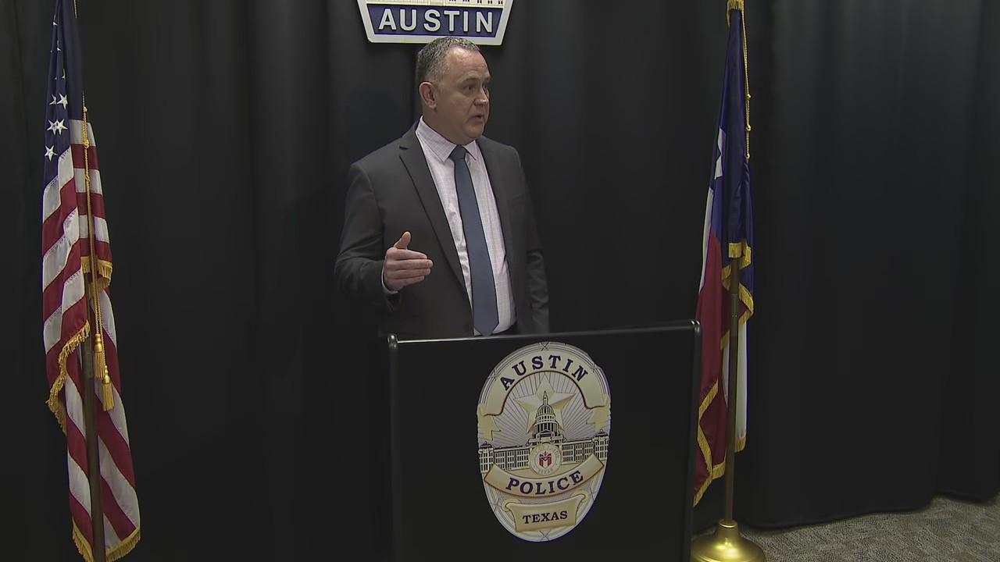
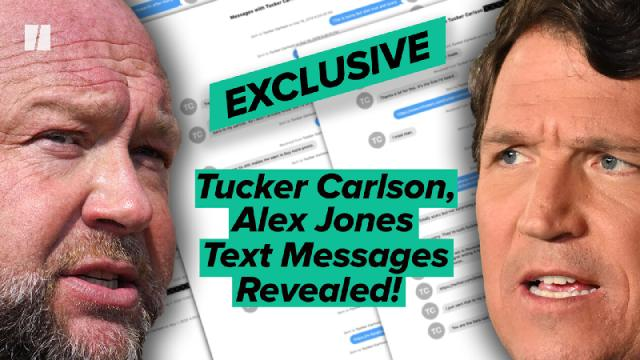
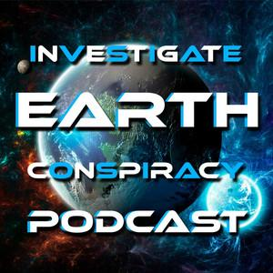

## Claim
Claim: "After InfoWars reporter Jamie White was shot dead on March 10, 2025 in Austin, Texas, it was revelaed that he was on a Ukranian enemies hit list."

## Actions
```
web_search("Jamie White shot dead Austin Texas")
web_search("Jamie White InfoWars Ukrainian hit list")
```

## Evidence
### Evidence from `web_search`
Fox 7 Austin ([https://www.fox7austin.com/news/infowars-writer-shooting-austin-police-jamie-white](https://www.fox7austin.com/news/infowars-writer-shooting-austin-police-jamie-white)) reports that Jamie White, an InfoWars writer, was shot and killed in Austin, Texas, on March 10. The Austin Police Department announced arrests in connection to the shooting. The suspects were attempting to steal White's car when he was shot. The article does not mention anything about a Ukrainian hit list. , , , , 

ABC News ([https://abcnews.go.com/US/infowars-reporter-shot-dead-apartment-after-possibly-interrupting/story?id=119677965](https://abcnews.go.com/US/infowars-reporter-shot-dead-apartment-after-possibly-interrupting/story?id=119677965)) reports that InfoWars reporter Jamie White was shot dead outside his apartment complex in Austin, Texas. The shooting occurred on March 9, 2025. The suspects were breaking into White's Kia when he interrupted them. The article does not mention a Ukrainian hit list. 


### Evidence from `web_search`
Jamie White, an Infowars reporter, was shot dead in Austin, Texas, according to articles from Yahoo News ([Source](https://www.yahoo.com/news/alex-jones-blames-globalists-infowars-182655321.html)) and The Latin Times ([Source](https://www.latintimes.com/infowars-reporter-assassinated-ukraine-outside-his-home-conspiracy-theorists-claim-578436)). Alex Jones speculated that Ukraine was responsible for the killing, claiming White was on a Ukrainian hit list. The Investigate Earth Conspiracy Podcast ([Source](https://open.spotify.com/episode/68lCuEsLtFn17oEIQBQGEk)) also discussed the murder and mentioned White may have been on a Ukrainian NGO hit list.    


## Elaboration
The claim that Jamie White was on a Ukrainian hit list is supported by Alex Jones's speculation and a podcast discussion. However, the official reports from Fox 7 Austin ([https://www.fox7austin.com/news/infowars-writer-shooting-austin-police-jamie-white](https://www.fox7austin.com/news/infowars-writer-shooting-austin-police-jamie-white)) and ABC News ([https://abcnews.go.com/US/infowars-reporter-shot-dead-apartment-after-possibly-interrupting/story?id=119677965](https://abcnews.go.com/US/infowars-reporter-shot-dead-apartment-after-possibly-interrupting/story?id=119677965)) do not mention any connection to a Ukrainian hit list.

Therefore, the claim's veracity is uncertain, as it relies on speculative sources. More information is needed to confirm the existence of a Ukrainian hit list and White's alleged inclusion on it.


## Actions
```
web_search("Ukrainian government response Jamie White death")
```

## Evidence
### Evidence from `web_search`
From [Source](https://www.independent.co.uk/news/world/americas/crime/jamie-white-infowars-murder-alex-jones-b2712630.html): 
Content: The Independent reports that Jamie White's family believes the shooting was not targeted and that the suspects were trying to break into his car. Alex Jones accused Austin's Democratic district attorney and other Democrats of being responsible for White's death. The Austin Police Department stated that White was shot and killed in the parking lot of his apartment complex while possibly interrupting a burglary. The article does not mention any response from the Ukrainian government. 


## Elaboration
The evidence indicates that the claim is not definitively supported. While Alex Jones and a podcast have speculated about a Ukrainian hit list, official reports and the victim's family suggest a different scenario. The Independent article ([https://www.independent.co.uk/news/world/americas/crime/jamie-white-infowars-murder-alex-jones-b2712630.html](https://www.independent.co.uk/news/world/americas/crime/jamie-white-infowars-murder-alex-jones-b2712630.html)) does not mention any response from the Ukrainian government.


## Final Judgement
The claim that Jamie White was on a Ukrainian hit list is not supported by the available evidence. While some sources, such as Alex Jones, have speculated about this, official reports and the victim's family suggest the shooting was related to a car burglary. There is no definitive evidence to confirm the claim.

`false`


### Verdict: FALSE

### Justification
The claim that Jamie White was on a Ukrainian hit list is not supported by the available evidence. While some sources, including Alex Jones, have speculated about this, official reports from sources like Fox 7 Austin ([https://www.fox7austin.com/news/infowars-writer-shooting-austin-police-jamie-white](https://www.fox7austin.com/news/infowars-writer-shooting-austin-police-jamie-white)) and ABC News ([https://abcnews.go.com/US/infowars-reporter-shot-dead-apartment-after-possibly-interrupting/story?id=119677965](https://abcnews.go.com/US/infowars-reporter-shot-dead-apartment-after-possibly-interrupting/story?id=119677965)) indicate the shooting was related to a car burglary.
