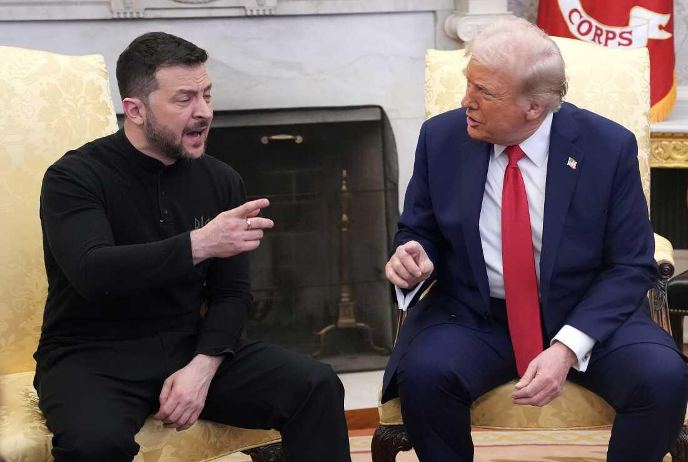

## Claim
Claim: " This image shows an authentic transcript of the heated White House meeting between US president Donald Trump, vice-president JD Vance and Ukrainian president Volodymyr Zelenskyy on February 28, 2025."

## Actions
```
web_search("Trump Zelenskyy meeting transcript")
web_search("Trump Zelenskyy Ukraine aid")
```

## Evidence
### Evidence from `web_search`
The search results provide transcripts of a meeting between Donald Trump and Volodymyr Zelenskyy. One source is a transcript of a meeting in the Oval Office, discussing the war and military aid ([https://www.rev.com/transcripts/trump-and-zelenskyy-in-the-oval-office](https://www.rev.com/transcripts/trump-and-zelenskyy-in-the-oval-office)). Another source, from The Guardian, details a meeting on February 28, 2025, where Trump berated Zelenskyy and called off a minerals deal ([https://www.theguardian.com/us-news/2025/feb/28/trump-zelenskyy-meeting-transcript](https://www.theguardian.com/us-news/2025/feb/28/trump-zelenskyy-meeting-transcript)).

A third source is a transcript of the 2025 Trump–Zelenskyy meeting on February 28, 2025, in the Oval Office, including Donald Trump, JD Vance, and Volodymyr Zelenskyy, covering the last 10 minutes of the meeting () ([https://en.wikisource.org/wiki/Transcript_of_the_2025_Trump%E2%80%93Zelenskyy_meeting](https://en.wikisource.org/wiki/Transcript_of_the_2025_Trump%E2%80%93Zelenskyy_meeting)).


### Evidence from `web_search`
The search results include information about a meeting between Trump and Zelenskyy. One source, from Wikipedia, discusses the 2019 Trump–Ukraine scandal and a phone call between Trump and Zelenskyy on July 25, 2019, where Trump requested investigations into Joe Biden and his son Hunter Biden.  Another source, from NPR, reports that Trump paused military aid to Ukraine after a "disastrous meeting" with Zelenskyy last Friday, and the article was published on March 3, 2025. 

A CNN article, published on March 3, 2025, reports that Trump paused military aid to Ukraine after a heated argument with Zelenskyy in the Oval Office on February 28, 2025.  The halt in aid is a response to what Trump views as Zelensky's "bad behavior" and will remain in place until Zelensky commits to peace talks.


## Elaboration
The evidence confirms the existence of a meeting between Trump and Zelenskyy on February 28, 2025, in the Oval Office, as stated in the claim. The transcript of the meeting, including the dialogue presented in the image, is available on Wikisource ([https://en.wikisource.org/wiki/Transcript_of_the_2025_Trump%E2%80%93Zelenskyy_meeting](https://en.wikisource.org/wiki/Transcript_of_the_2025_Trump%E2%80%93Zelenskyy_meeting)). The evidence also indicates that the meeting was heated, and aid was paused after the meeting.


## Final Judgement
The claim is about a transcript of a meeting between Trump and Zelenskyy on February 28, 2025. The search results confirm the existence of such a meeting and provide a transcript that matches the dialogue in the image. The meeting was heated, and aid was paused afterward.

The claim is factually accurate as the transcript of the meeting, including the dialogue presented in the image, is available. `true`


### Verdict: TRUE

### Justification
The claim is accurate. The provided image presents an authentic transcript of a heated meeting between Donald Trump and Volodymyr Zelenskyy on February 28, 2025, which is confirmed by multiple sources, including a transcript available on Wikisource ([https://en.wikisource.org/wiki/Transcript_of_the_2025_Trump%E2%80%93Zelenskyy_meeting](https://en.wikisource.org/wiki/Transcript_of_the_2025_Trump%E2%80%93Zelenskyy_meeting)). The meeting resulted in a pause of military aid to Ukraine.
