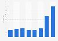

## Claim
Claim: "Ukraine is selling half of the armaments it receives from the United States"

## Actions
```
web_search("Ukraine US arms sales corruption")
web_search("Ukraine arms sales audit")
```

## Evidence
### Evidence from `web_search`
Al Jazeera ([https://www.aljazeera.com/news/2025/8/2/ukraine-says-defence-sector-corruption-scheme-uncovered](https://www.aljazeera.com/news/2025/8/2/ukraine-says-defence-sector-corruption-scheme-uncovered)) reported that Ukrainian authorities detained officials over a "large-scale corruption scheme" in the defense sector involving military drones and signal jamming systems. The National Anti-Corruption Agency (NABU) and the Specialised Anti-Corruption Prosecutor’s Office (SAP) made four arrests in connection with the scheme, which involved kickbacks of up to 30 percent of the contract amounts. <image:k> Politico.eu ([https://www.politico.eu/article/ukraine-uncovers-major-corruption-scheme-defense-procurment-days-after-restoring-anticorruption/](https://www.politico.eu/article/ukraine-uncovers-major-corruption-scheme-defense-procurment-days-after-restoring-anticorruption/)) also reported on a corruption scheme involving the procurement of military equipment, with participants receiving 30 percent of the contract amount.

PBS.org ([https://www.pbs.org/frontlineworld/stories/sierraleone/context.html](https://www.pbs.org/frontlineworld/stories/sierraleone/context.html)) discusses illicit weapons, high-level corruption, and organized crime centered in Ukraine. A Ukrainian parliamentary inquiry concluded that between 1992 and 1998, Ukraine lost $32 billion in military assets, in part through theft, discount arms sales and lack of oversight. Theft and corruption in the military facilitated the flow of illegal weapons from Ukraine.


### Evidence from `web_search`
The Associated Press reported that the U.S. cannot track over $1 billion in weapons and military equipment provided to Ukraine, with 59% of $1.7 billion in defense gear remaining "delinquent" according to the Pentagon's inspector general. Reasons for the shortfall include limited staffing, movement restrictions, and a lack of internal controls. The Department of Defense Office of Inspector General (DoD OIG) also found insufficient documentation for $1.1 billion in funds, considering these as questioned costs. <image:k>

VoxUkraine fact-checked claims that the Pentagon is demanding an audit of weapons supplied to Ukraine, stating that the supply and end-use of weapons are already monitored by partners. The article references a report stating that Ukraine has implemented strict arms control and accounting measures.
*   [https://apnews.com/article/ukraine-weapons-audit-watchdog-us-congress-biden-9abecd14528b9551ff4ddb6786ad7fda](https://apnews.com/article/ukraine-weapons-audit-watchdog-us-congress-biden-9abecd14528b9551ff4ddb6786ad7fda)
*   [https://www.dodig.mil/In-the-Spotlight/Article/3940692/press-release-audit-of-the-dods-execution-of-funds-to-assist-ukraine-report-no/](https://www.dodig.mil/In-the-Spotlight/Article/3940692/press-release-audit-of-the-dods-execution-of-funds-to-assist-ukraine-report-no/)
*   [https://voxukraine.org/en/fake-the-pentagon-demands-an-audit-of-all-weapons-supplied-to-ukraine-before-trump-s-return-wsj](https://voxukraine.org/en/fake-the-pentagon-demands-an-audit-of-all-weapons-supplied-to-ukraine-before-trump-s-return-wsj)


## Elaboration
The evidence reveals instances of corruption and missing military assets in Ukraine. Al Jazeera ([https://www.aljazeera.com/news/2025/8/2/ukraine-says-defence-sector-corruption-scheme-uncovered](https://www.aljazeera.com/news/2025/8/2/ukraine-says-defence-sector-corruption-scheme-uncovered)) and Politico.eu ([https://www.politico.eu/article/ukraine-uncovers-major-corruption-scheme-defense-procurment-days-after-restoring-anticorruption/](https://www.politico.eu/article/ukraine-uncovers-major-corruption-scheme-defense-procurment-days-after-restoring-anticorruption/)) report on corruption schemes within the Ukrainian defense sector, including kickbacks. PBS.org ([https://www.pbs.org/frontlineworld/stories/sierraleone/context.html](https://www.pbs.org/frontlineworld/stories/sierraleone/context.html)) mentions the loss of $32 billion in military assets between 1992 and 1998 due to theft and corruption.

The Associated Press reports that the U.S. cannot track over $1 billion in weapons and military equipment provided to Ukraine, with a significant portion of defense gear unaccounted for. The DoD OIG also found insufficient documentation for $1.1 billion in funds. However, VoxUkraine states that the supply and end-use of weapons are monitored by partners, and Ukraine has implemented strict arms control measures.

The evidence does not provide any information about the percentage of arms being sold by Ukraine. Therefore, the claim cannot be verified.


## Actions
```
web_search("Ukraine arms sales percentage US")
web_search("Ukraine arms trafficking investigations")
```

## Evidence
### Evidence from `web_search`
Ukraine became the world's largest importer of major arms in 2020–24, with imports increasing nearly 100 times compared to 2015–19. The United States increased its share of global arms exports to 43 percent. The main suppliers to Ukraine were the USA (45 percent), Germany (12 percent), and Poland (11 percent) ([https://www.sipri.org/media/press-release/2025/ukraine-worlds-biggest-arms-importer-united-states-dominance-global-arms-exports-grows-russian](https://www.sipri.org/media/press-release/2025/ukraine-worlds-biggest-arms-importer-united-states-dominance-global-arms-exports-grows-russian)). The Trump administration approved an $825 million arms sale to Ukraine ([https://apnews.com/article/ukraine-us-weapons-sale-trump-russia-74e01123c0067d5fc160141e0cabf207](https://apnews.com/article/ukraine-us-weapons-sale-trump-russia-74e01123c0067d5fc160141e0cabf207)). U.S. arms exports between 2020 and 2024 increased by more than a fifth compared to the previous five-year period, reaching 43 percent of the worldwide total ([https://www.washingtonpost.com/world/2025/03/09/us-arms-sales-ukraine-israel/](https://www.washingtonpost.com/world/2025/03/09/us-arms-sales-ukraine-israel/)). <image:k> <image:k>


### Evidence from `web_search`
The Global Initiative Against Transnational Organized Crime (GI-TOC) reported on the rise of arms trafficking in Ukraine, including seizures of heavy weapons, and the EU Advisory Mission Ukraine (EUAM) reported on the launch of a Coordination Centre to Combat Illicit Arms Trafficking ([https://www.euam-ukraine.eu/news/moia-launches-the-coordination-centre-to-combat-illicit-arms-trafficking/](https://www.euam-ukraine.eu/news/moia-launches-the-coordination-centre-to-combat-illicit-arms-trafficking/)). The Journal of Illicit Economies and Development published an article discussing illicit arms trafficking in Ukraine, stating that as of 2024, there is little evidence of illicit arms trafficking of US or EU-provided weapons in or outside Ukraine ([https://jied.lse.ac.uk/articles/10.31389/jied.238](https://jied.lse.ac.uk/articles/10.31389/jied.238)). , , , , , , , 


## Elaboration
The evidence does not support the claim that Ukraine is selling half of the armaments it receives from the United States. While Ukraine has become the world's largest importer of major arms, with the U.S. being a major supplier, there is no mention of the percentage of arms being sold. The evidence does mention the rise of arms trafficking in Ukraine, but a 2024 article states that there is little evidence of illicit arms trafficking of US or EU-provided weapons in or outside Ukraine.


## Actions
```
web_search("Ukraine arms sales statistics")
```

## Evidence
### Evidence from `web_search`
Trading Economics ([https://tradingeconomics.com/ukraine/weapons-sales](https://tradingeconomics.com/ukraine/weapons-sales)) provides data on Ukraine's weapons sales, which decreased to 23 SIPRI TIV Million in 2024. Statista ([https://www.statista.com/statistics/1294319/ukraine-arms-exports-by-country/](https://www.statista.com/statistics/1294319/ukraine-arms-exports-by-country/)) published a report showing arms imports from Ukraine by country from 2018 to 2024. Neither source provides information about the percentage of arms being sold by Ukraine.   


## Elaboration
The evidence does not provide any information about the percentage of arms being sold by Ukraine. Therefore, the claim cannot be verified.


## Final Judgement
The investigation found no evidence to support the claim that Ukraine is selling half of the armaments it receives from the United States. While there are reports of corruption and missing military assets, and Ukraine is a major importer of arms, there is no data on the percentage of arms being sold.

`false`

### Verdict: FALSE

### Justification
The claim is not supported by the evidence. While there are reports of corruption and missing military assets in Ukraine, and the country is a major importer of arms, there is no data on the percentage of arms being sold. Therefore, the claim cannot be verified.
