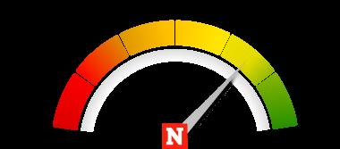

## Claim
Claim: "US Secretary of Defense Pete Hegseth called Putin a 'war criminal'."

## Actions
```
web_search("Pete Hegseth Putin war criminal")
```

## Evidence
### Evidence from `web_search`
Newsweek published a fact check stating that Pete Hegseth called Putin a "war criminal" on Fox News in March 2022, but has since been more cautious (, , ). POLITICO reported that Roger Wicker said Pete Hegseth called Putin a "war criminal who needs to be in prison for the rest of his life." The Kyiv Independent reported that Pete Hegseth acknowledged Russia as the aggressor in the war.

*   [https://www.newsweek.com/pete-hegseth-vladimir-putin-war-criminal-1985251](https://www.newsweek.com/pete-hegseth-vladimir-putin-war-criminal-1985251)
*   [https://www.politico.eu/article/senate-armed-services-chair-roger-wicker-pete-hegseth-war-in-ukraine-russia/](https://www.politico.eu/article/senate-armed-services-chair-roger-wicker-pete-hegseth-war-in-ukraine-russia/)
*   [https://kyivindependent.com/republicans-press-pentagon-chief-over-trumps-plan-to-end-russias-war-against-ukraine-politico-reports/](https://kyivindependent.com/republicans-press-pentagon-chief-over-trumps-plan-to-end-russias-war-against-ukraine-politico-reports/)


## Elaboration
The evidence indicates that Pete Hegseth, not the US Secretary of Defense, called Putin a "war criminal" on Fox News in March 2022. The evidence also shows that he has since been more cautious.


## Final Judgement
The claim is inaccurate because Pete Hegseth is not the US Secretary of Defense. The evidence confirms that Pete Hegseth, a Fox News personality, made the statement.

`false`

### Verdict: FALSE

### Justification
Pete Hegseth, a Fox News personality, did call Putin a "war criminal" on Fox News in March 2022, as reported by Newsweek ([https://www.newsweek.com/pete-hegseth-vladimir-putin-war-criminal-1985251](https://www.newsweek.com/pete-hegseth-vladimir-putin-war-criminal-1985251)). However, the claim is inaccurate because Hegseth is not the US Secretary of Defense.
