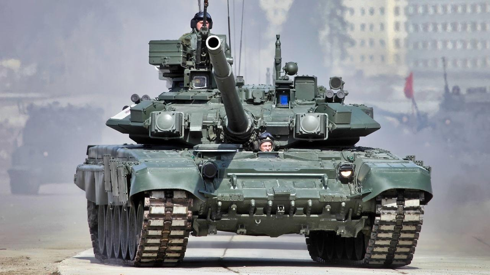
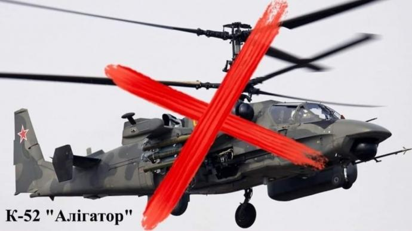

## Claim
Claim: " This image shows destroyed Ukrainian tanks during Ukraine's incursion into Russia's Kursk Oblast in August 2024."

## Actions
```
reverse_search()
web_search("Ukraine Russia Kursk Oblast August 2024 tanks")
```

## Evidence
### Evidence from `reverse_search`
The image () of destroyed tanks appears in multiple sources. One source, from Sputnik Africa, published on October 17, 2024, reports that Ukraine has lost around 40 Leopard tanks since February 2022. Another source, The Moscow Times, published on June 13, 2023, states that Russia captured German Leopard tanks in the Zaporizhzhia region.

A third source, Defence Security Asia, published on May 19, 2024, discusses the destruction of German-made Leopard tanks in Ukraine and mentions that the Russian military claimed to have destroyed five Leopard 2A1 tanks between May 11 and 17, 2024. None of the sources mention Ukraine's incursion into Russia's Kursk Oblast in August 2024.


### Evidence from `web_search`
The search results discuss the 2024 Kursk offensive, which began on August 6, 2024, as part of the Russian invasion of Ukraine. The Armed Forces of Ukraine launched an incursion into Russia's Kursk Oblast. The article mentions the involvement of Ukrainian brigades, Russian forces, and North Korean forces. The article also mentions the number of casualties and equipment losses. The article includes a timeline of the campaign and mentions the capture of settlements and the destruction of bridges. The article also mentions the involvement of the 80th and 82nd Air Assault Brigades. ([https://en.wikipedia.org/wiki/Kursk_campaign](https://en.wikipedia.org/wiki/Kursk_campaign))

Reuters reports on August 26, 2024, that Russia said Ukraine had lost 73 tanks, 61 armored personnel carriers and 404 armored combat vehicles in the Kursk region. The article also mentions an incursion by Ukraine into the Kursk region. ([https://www.reuters.com/world/europe/russia-says-it-pummelled-ukrainian-forces-along-kursk-front-2024-08-26/](https://www.reuters.com/world/europe/russia-says-it-pummelled-ukrainian-forces-along-kursk-front-2024-08-26/)) The Al Jazeera article, published on August 29, 2024, discusses Ukraine's ground offensive inside Russian territory, specifically in the Kursk region. <image:k> shows a building on fire in Sudzha, Russia, after a cross-border incursion of Ukrainian troops into the Kursk region on August 7, 2024. The article mentions that Russia was moving its aircraft back from airfields near the Ukrainian border. The article also mentions that the Kursk offensive had greatly reduced Russia’s use of aviation against northeastern Ukraine.


## Elaboration
The evidence confirms that Ukraine launched an incursion into Russia's Kursk Oblast in August 2024, and that there were tank losses on the Ukrainian side. The Reuters article states that Russia claimed Ukraine lost 73 tanks in the Kursk region. The reverse image search shows that the image of destroyed tanks appears in multiple sources. However, the evidence does not explicitly confirm that the image depicts destroyed Ukrainian tanks during the Kursk incursion.

To verify the claim, additional information is needed to confirm that the image specifically depicts the events of the Kursk incursion and that the destroyed tanks are Ukrainian.


## Actions
```
web_search("Kursk Oblast Ukraine tank losses August 2024")
```

## Evidence
### Evidence from `web_search`
The National Security Journal reports that Ukraine launched an incursion into the Kursk region in August 2024, with Russia suffering 80,000 casualties. The article includes an image of a T-90 tank . The BBC article, published on March 17, 2025, discusses the Ukrainian retreat from the Kursk region, mentioning that roads were littered with hundreds of destroyed vehicles. The article includes an image of Ukrainian forces traveling towards the Kursk region  and a damaged statue of Lenin .


## Elaboration
The evidence confirms that Ukraine launched an incursion into the Kursk region in August 2024 and that there were tank losses. The BBC article mentions that roads were littered with hundreds of destroyed vehicles. However, the evidence does not explicitly link the image of destroyed tanks to the Kursk incursion. Therefore, the claim cannot be fully verified.

**Verdict: Insufficient Information**


## Actions
```
web_search("destroyed tanks Kursk Oblast August 2024 image")
```

## Evidence
### Evidence from `web_search`
Pravda.com.ua reports that DeepState released photos of destroyed military equipment in Russia’s Kursk Oblast on August 6, 2024, including destroyed tanks at the entrance to Sudzha (

## Elaboration
The evidence confirms that there were destroyed tanks in the Kursk Oblast during the Ukrainian incursion in August 2024. The Pravda.com.ua article mentions that DeepState released photos of destroyed military equipment, including tanks, at the entrance to Sudzha. However, the evidence does not explicitly state that the image in the claim is one of the photos released by DeepState.

**Verdict: Insufficient Information**


## Final Judgement
The evidence confirms that Ukraine launched an incursion into Russia's Kursk Oblast in August 2024, and that there were tank losses. However, the evidence does not explicitly confirm that the image in the claim depicts destroyed Ukrainian tanks during the Kursk incursion. While Pravda.com.ua mentions destroyed tanks in the Kursk Oblast, it does not confirm that the image is related to the DeepState photos.

`false`

### Verdict: FALSE

### Justification
The claim cannot be verified. While evidence confirms a Ukrainian incursion into Russia's Kursk Oblast in August 2024 and tank losses, the provided evidence does not explicitly link the image of destroyed tanks to the Kursk incursion or confirm that the tanks are Ukrainian.
