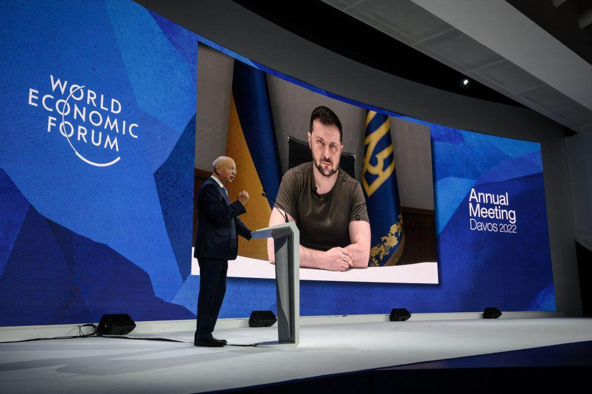
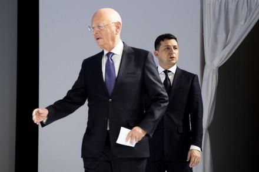

## Claim
Claim: " This image shows Ukrainian President Volodymyr Zelensky wearing a suit after the large-scale Russian invasion in Ukraine: in a talk with Klaus Schwab at the World Economic Forum."

## Actions
```
web_search("Volodymyr Zelensky Klaus Schwab World Economic Forum")
image_search("Volodymyr Zelensky Klaus Schwab World Economic Forum")
```

## Evidence
### Evidence from `web_search`
The World Economic Forum website published an article on January 19, 2024, discussing Ukrainian President Volodymyr Zelenskyy's meeting with leaders at the Annual Meeting of the World Economic Forum in Davos, Switzerland. The article includes an image of Zelenskyy addressing participants at the event. The article mentions Zelenskyy's call for business leaders to invest in Ukraine. [Source](https://www.weforum.org/stories/2024/01/zelenskyy-ukraine-business-investment-davos/) 

The photo of Zelensky and Schwab in suits was taken in January 2020, before the Russian invasion of Ukraine. Since the invasion, Zelensky has not worn suits publicly. [Source](https://uk.news.yahoo.com/photo-zelenskyy-wearing-suit-meeting-171653150.html) 


### Evidence from `image_search`
The search results include images of Klaus Schwab at the World Economic Forum (), Volodymyr Zelensky and Klaus Schwab (), and Volodymyr Zelensky at the World Economic Forum ().

The sources are from [UConn Today](https://today.uconn.edu/2023/02/one-year-after-the-russian-invasion-of-ukraine-can-businesses-prevent-future-wars/), [Shutterstock](https://www.shutterstock.com/editorial/image-editorial/volodymyr-zelensky-president-ukraine-r-klaus-schwab-10532640et), and [ECFR](https://ecfr.eu/article/the-decline-and-fall-of-davos-man/).


## Elaboration
The claim is inaccurate. The image shows Zelensky and Schwab at the World Economic Forum, but it was taken in January 2020, before the large-scale Russian invasion of Ukraine. Since the invasion, Zelensky has not worn suits publicly.


## Final Judgement
The image does show Zelensky and Schwab at the World Economic Forum, but the photo was taken in January 2020, before the Russian invasion. The claim misrepresents the context of the image.

`false`

### Verdict: FALSE

### Justification
The image depicts Volodymyr Zelensky and Klaus Schwab at the World Economic Forum, but it was taken in January 2020, before the Russian invasion of Ukraine, as reported by [Yahoo News](https://uk.news.yahoo.com/photo-zelenskyy-wearing-suit-meeting-171653150.html). Since the invasion, Zelensky has not worn suits publicly.
