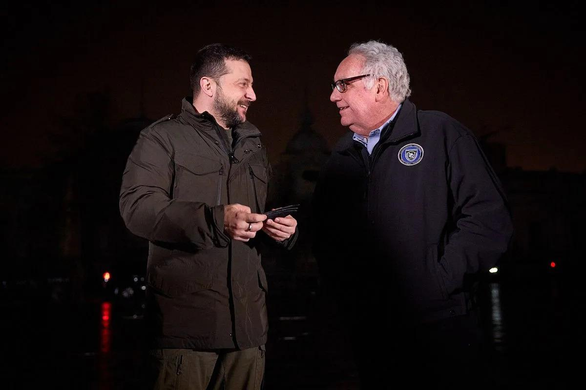

## Claim
Claim: "Warren Buffett has given more than $500 million to Ukraine since 2022."

## Actions
```
web_search("Warren Buffett Ukraine donations")
web_search("Warren Buffett Ukraine aid 2022")
```

## Evidence
### Evidence from `web_search`
Howard Buffett's foundation, not Warren Buffett, has provided significant aid to Ukraine. The foundation aims to surpass $1 billion in giving this year, with approximately $800 million already contributed since the full-scale invasion, according to a report from April 7, 2025, published by Fortune ([https://fortune.com/2025/04/07/warren-buffetts-son-is-on-track-to-donate-1-billion-in-aid-to-ukraine-this-year-and-pledges-to-continue-despite-trumps-shaky-relations/](https://fortune.com/2025/04/07/warren-buffetts-son-is-on-track-to-donate-1-billion-in-aid-to-ukraine-this-year-and-pledges-to-continue-despite-trumps-shaky-relations/)).

Business Insider reported on February 24, 2024, that Howard Buffett's foundation had given $520 million in humanitarian aid to Ukraine ([https://www.businessinsider.com/howard-buffett-gives-500-million-to-ukraine](https://www.businessinsider.com/howard-buffett-gives-500-million-to-ukraine)). Alliance magazine also reported on Howard Buffett's continued philanthropy in Ukraine ([https://www.alliancemagazine.org/blog/howard-buffett-maintains-ukraine-philanthropy-despite-deteriorating-us-support/](https://www.alliancemagazine.org/blog/howard-buffett-maintains-ukraine-philanthropy-despite-deteriorating-us-support/)). <image:k> 


### Evidence from `web_search`
From [Source](https://www.yahoo.com/news/fact-check-warren-buffett-did-130000882.html): 
Content: The search result from Yahoo News fact-checks the claim that Warren Buffett has given more than $500 million to Ukraine, rating it as "False". It states that Howard Buffett, Warren Buffett's son, donated more than $800 million to Ukraine since 2022 through his foundation. , 


## Elaboration
The evidence indicates that the claim is false. While significant aid has been provided to Ukraine, it was Howard Buffett, Warren Buffett's son, who made the donations, not Warren Buffett himself. Howard Buffett's foundation has contributed over $800 million since the full-scale invasion.


## Final Judgement
The claim that Warren Buffett has given more than $500 million to Ukraine since 2022 is false. The evidence shows that Howard Buffett, Warren Buffett's son, made the donations through his foundation.

`false`

### Verdict: FALSE

### Justification
The claim is false. While significant aid has been provided to Ukraine, it was Howard Buffett, Warren Buffett's son, who made the donations, not Warren Buffett himself. Howard Buffett's foundation has contributed over $800 million since 2022, as reported by [Fortune](https://fortune.com/2025/04/07/warren-buffetts-son-is-on-track-to-donate-1-billion-in-aid-to-ukraine-this-year-and-pledges-to-continue-despite-trumps-shaky-relations/) and [Business Insider](https://www.businessinsider.com/howard-buffett-gives-500-million-to-ukraine).
