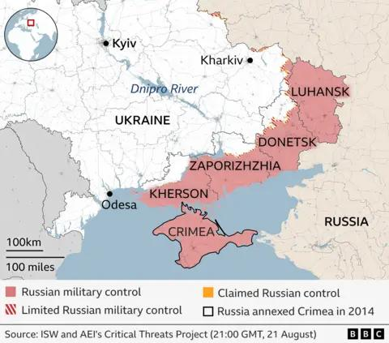
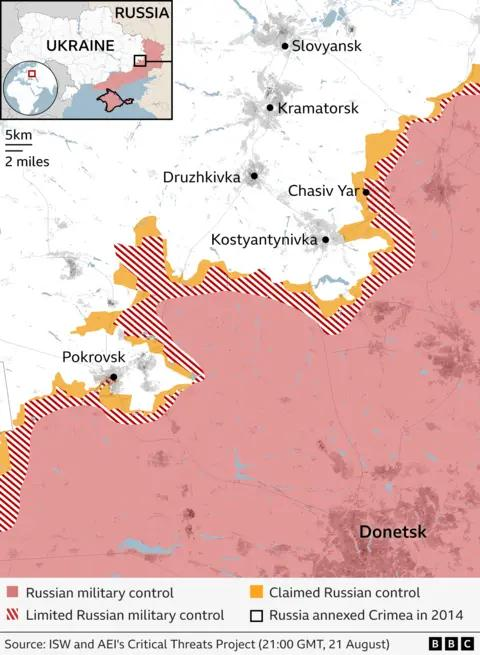

## Claim
Claim: "In early 2025, Ukraine and Russia had reached a peace deal in their years-long war."

## Actions
```
web_search("Ukraine Russia peace deal 2025")
web_search("Ukraine Russia war end date")
```

## Evidence
### Evidence from `web_search`
The Guardian published an article on August 21, 2025, discussing Trump's involvement in peace talks between Russia and Ukraine, mentioning a meeting between Trump and Zelenskyy on August 18, 2025, at the White House (). The article states that Trump intends to let Russia and Ukraine organize a meeting between their leaders without his direct involvement for now.

Wikipedia discusses peace negotiations in the Russian invasion of Ukraine, mentioning a timeline of the war, including sections for January 2025 – May 2025, and June 2025 – present, and that in December 2024, Donald Trump began a push for peace negotiations. A CNN article, published on August 19, 2025, discusses the difference between a ceasefire and a peace deal in the context of the war between Ukraine and Russia (<image:0>, , , , ). It mentions that Donald Trump is pushing for a peace deal, while Ukraine and its allies are more focused on a ceasefire.


### Evidence from `web_search`
The Wikipedia article on the Russo-Ukrainian War ([https://en.wikipedia.org/wiki/Russo-Ukrainian_War](https://en.wikipedia.org/wiki/Russo-Ukrainian_War)) states that the conflict began in late February 2014 and is ongoing, including the Russian annexation of Crimea and the occupation of Ukrainian territory. <image:i>, <image:j>, <image:k>, <image:l>, <image:m>, <image:n>. A BBC article ([https://www.bbc.com/news/articles/c0l0k4389g2o](https://www.bbc.com/news/articles/c0l0k4389g2o)) discusses the ongoing war, mentioning that no peace deal has been reached despite efforts to negotiate. The article also states that the war is in its fourth year, and that in August 2025, Russia has been slowly expanding the territory it controls. , , , .

Newsweek reports that Ukrainian President Volodymyr Zelensky said he sees the war ending in 2025 ([https://www.newsweek.com/zelensky-sees-timeline-end-ukraine-war-2046992](https://www.newsweek.com/zelensky-sees-timeline-end-ukraine-war-2046992)). . The article mentions ongoing talks and areas of disagreement.


## Elaboration
The evidence suggests that a peace deal had not been reached in early 2025. While there were ongoing discussions and negotiations, including Trump's involvement in pushing for a peace deal, the BBC article explicitly states that no peace deal had been reached as of August 2025. Furthermore, the Newsweek article indicates that Zelenskyy envisioned the war ending in 2025, implying that it was still ongoing.


## Final Judgement
The evidence indicates that while there were efforts towards a peace deal, no such deal was reached in early 2025. The BBC article confirms the war was ongoing in August 2025, and the Newsweek article suggests the war's end was anticipated, not already achieved.

`false`

### Verdict: FALSE

### Justification
Based on the evidence, including a BBC article stating that no peace deal had been reached as of August 2025 ([https://www.bbc.com/news/articles/c0l0k4389g2o](https://www.bbc.com/news/articles/c0l0k4389g2o)) and Newsweek reporting Zelenskyy's vision of the war ending in 2025, the claim that a peace deal was reached in early 2025 is false.
