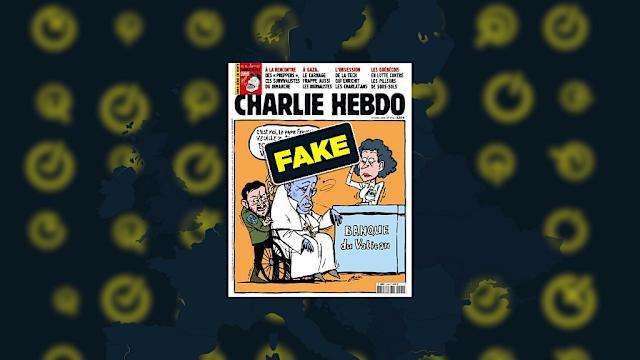
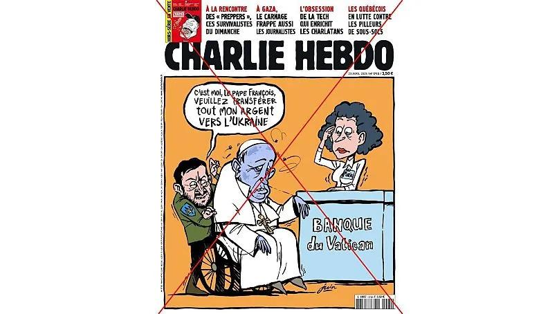
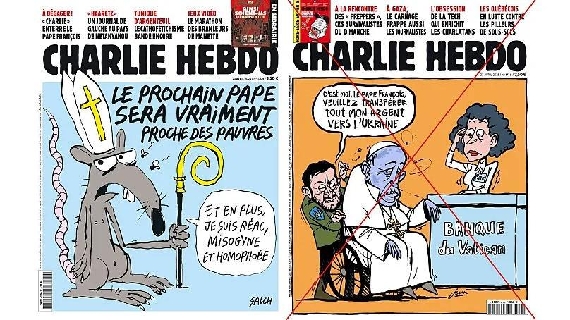

## Claim
Claim: " This image shows a screenshot of an authentic Charlie Hebdo magazine cover from March 20, 2025 illustrating Ukrainian President Volodoymr Zelenskyy lying in a coffin and saying 'Ukraine is an independet state' in French."

## Actions
```
web_search("Charlie Hebdo March 20 2025 cover")
image_search("Charlie Hebdo Zelensky coffin")
```

## Evidence
### Evidence from `web_search`
The web sources indicate that the Charlie Hebdo cover featuring Volodymyr Zelenskyy in a coffin is fake. The cover, dated March 20, 2025, with serial number 1705, was not published by Charlie Hebdo. The real cover was published on March 19, 2025. Another article from Yahoo News discusses a fake Charlie Hebdo cover depicting Zelenskyy and the late Pope Francis. The real Charlie Hebdo edition from April 23, 2025, looks completely different from the fake one.

The articles are available at the following URLs: [Source](https://without-lie.info/en/fake-with-another-fictional-cover-of-charlie-hebdo-magazine-with-a-caricature-of-the-president-of-ukraine/), [Source](https://mythdetector.com/en/coffin-was-not-published-by-charlie-hebdo/), and [Source](https://ca.news.yahoo.com/fake-charlie-hebdo-cover-shows-054516532.html). The image of the fake cover is . The Myth Detector article also includes an image of the fabricated cover . The Yahoo News article includes images of the fake cover , , .


### Evidence from `image_search`
From [Source](https://www.euronews.com/my-europe/2025/01/03/no-charlie-hebdo-didnt-publish-an-issue-with-zelenskyy-as-a-caricature-of-quasimodo): 
Content: Euronews published an article on January 3, 2025, stating that Charlie Hebdo did not publish an issue with Zelenskyy as a caricature. 


## Elaboration
The evidence confirms that the Charlie Hebdo cover featuring Zelenskyy in a coffin is fake. Multiple sources explicitly state that the cover was not published by Charlie Hebdo. The cover's date and serial number are also inconsistent with the magazine's actual publications.


## Final Judgement
The claim is demonstrably false. Multiple sources confirm that the Charlie Hebdo cover depicting Zelenskyy in a coffin is fabricated and was not published by the magazine. `false`

### Verdict: FALSE

### Justification
The claim is false. Multiple sources, including [Myth Detector](https://mythdetector.com/en/coffin-was-not-published-by-charlie-hebdo/) and [Yahoo News](https://ca.news.yahoo.com/fake-charlie-hebdo-cover-shows-054516532.html), confirm that the Charlie Hebdo cover featuring Zelenskyy in a coffin is fabricated and was not published by the magazine.
