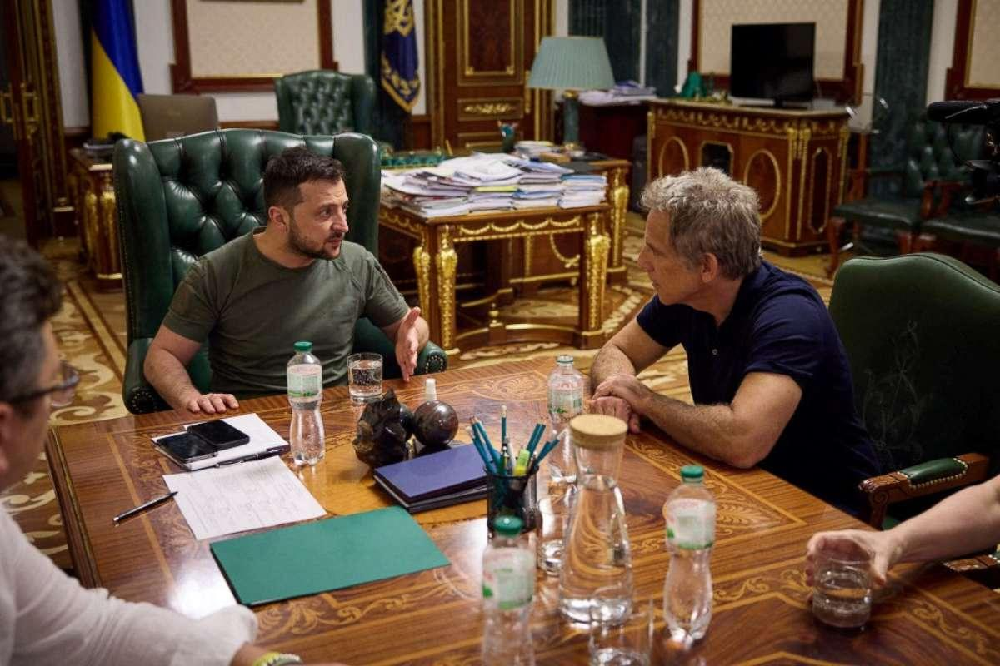

## Claim
Claim: " This image shows Ben Stiller and Ukrainian President Volodymyr Zelensky at their meeting on June 20, 2022, for which Stiller received $4 million from USAID."

## Actions
```
web_search("Ben Stiller Volodymyr Zelensky meeting June 20 2022")
web_search("Ben Stiller USAID Ukraine")
image_search("Ben Stiller Zelensky meeting")
```

## Evidence
### Evidence from `web_search`
Ben Stiller met with Ukrainian President Volodymyr Zelenskyy in Kyiv on June 20, 2022, as part of his role as a UNHCR ambassador. The meeting took place on World Refugee Day. The sources do not mention Stiller receiving $4 million from USAID.

Sources: [ABC News](https://abcnews.go.com/International/ben-stiller-meets-volodymyr-zelenskyy-ukraine-world-refugee/story?id=85517989), [New York Post](https://nypost.com/2022/06/20/ben-stiller-met-with-zelensky-in-ukraine-on-world-refugee-day/), [BBC](https://www.bbc.com/news/av/world-61875351). , , , , , 


### Evidence from `web_search`
Ben Stiller met with Ukrainian President Volodymyr Zelensky on June 20, 2022, as shown in the image . However, Stiller denied claims that he received $4 million from USAID for the trip, stating that he self-funded his humanitarian trip to Ukraine. These claims were amplified by Elon Musk and originated from Russian media.

Sources: [https://www.vanityfair.com/hollywood/story/ben-stiller-denies-elon-musks-retweet-claiming-usaid-funded-the-stars-trip-to-ukraine?srsltid=AfmBOoqmZtyUwoMPiFsX8zL7DdXJOT30rVSXIZLNyC8z9NQ6jnf-Uufb](https://www.vanityfair.com/hollywood/story/ben-stiller-denies-elon-musks-retweet-claiming-usaid-funded-the-stars-trip-to-ukraine?srsltid=AfmBOoqmZtyUwoMPiFsX8zL7DdXJOT30rVSXIZLNyC8z9NQ6jnf-Uufb), [https://www.imdb.com/news/ni65111956/](https://www.imdb.com/news/ni65111956/), [https://www.msnbc.com/morning-joe/watch/-totally-false-actor-ben-stiller-debunks-claims-usaid-funded-ukraine-trip-231285317684](https://www.msnbc.com/morning-joe/watch/-totally-false-actor-ben-stiller-debunks-claims-usaid-funded-ukraine-trip-231285317684)


### Evidence from `image_search`
Town & Country Magazine published an article about Ben Stiller's meeting with Volodymyr Zelensky.  NBC News published an article about Ben Stiller's meeting with Volodymyr Zelenskyy in Ukraine, including a photograph of the meeting.  The Hollywood Reporter shows Ben Stiller meeting with Ukrainian President Volodymyr Zelensky. 

The sources are: [https://www.townandcountrymag.com/society/politics/a40361302/ben-stiller-volodymyr-zelensky-ukraine/](https://www.townandcountrymag.com/society/politics/a40361302/ben-stiller-volodymyr-zelensky-ukraine/), [https://www.nbcnews.com/news/world/ben-stiller-meets-zelenskyy-ukraine-refugees-rcna34472](https://www.nbcnews.com/news/world/ben-stiller-meets-zelenskyy-ukraine-refugees-rcna34472), and [https://www.hollywoodreporter.com/video/ben-stiller-meets-with-ukraine-president-volodymyr-zelensky-thr-news/](https://www.hollywoodreporter.com/video/ben-stiller-meets-with-ukraine-president-volodymyr-zelensky-thr-news/).


## Elaboration
The claim that the image shows Ben Stiller and Ukrainian President Volodymyr Zelensky at their meeting on June 20, 2022, is accurate. However, the claim that Stiller received $4 million from USAID is false. Evidence indicates that Stiller met with Zelensky on June 20, 2022, and that Stiller denied claims that he received funding from USAID, stating that he self-funded his trip.


## Final Judgement
The image accurately depicts Ben Stiller and Volodymyr Zelenskyy meeting on June 20, 2022. However, the assertion that Stiller received $4 million from USAID is false. Stiller himself denied receiving any such funding. `false`

### Verdict: FALSE

### Justification
The image accurately depicts Ben Stiller and Volodymyr Zelenskyy meeting on June 20, 2022, as confirmed by multiple sources, including [ABC News](https://abcnews.go.com/International/ben-stiller-meets-volodymyr-zelenskyy-ukraine-world-refugee/story?id=85517989). However, the claim that Stiller received $4 million from USAID is false, as Stiller denied receiving any such funding, as reported by [Vanity Fair](https://www.vanityfair.com/hollywood/story/ben-stiller-denies-elon-musks-retweet-claiming-usaid-funded-the-stars-trip-to-ukraine?srsltid=AfmBOoqmZtyUwoMPiFsX8zL7DdXJOT30rVSXIZLNyC8z9NQ6jnf-Uufb).
