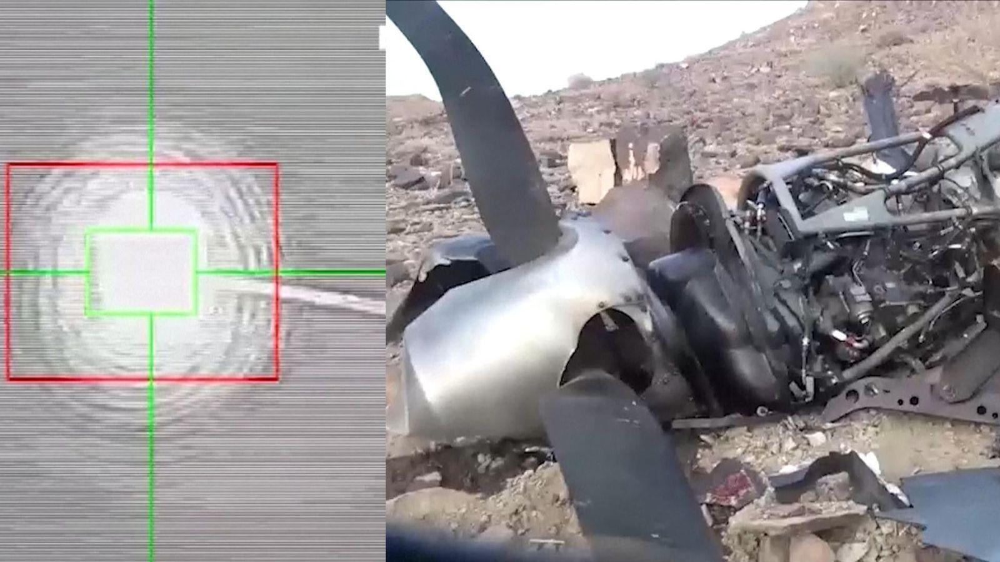
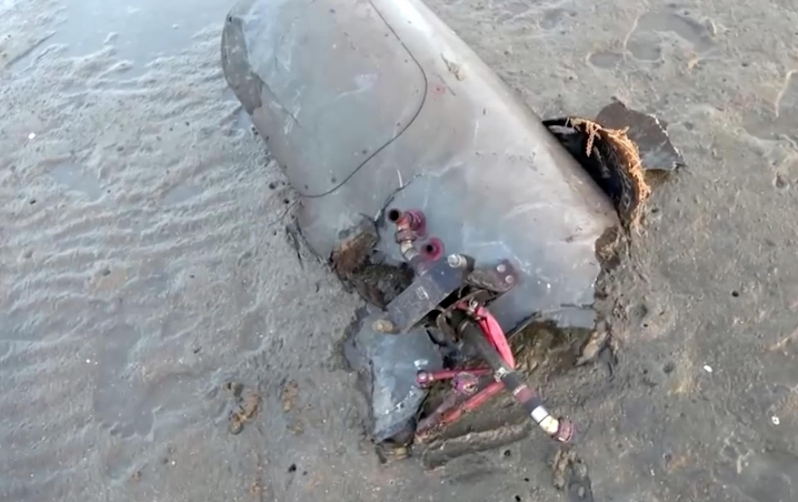

## Claim
Claim: " This image shows a US drone which was shot down in March 2025 by the Houthis using Russian missiles."

## Actions
```
geolocate()
web_search("US drone shot down Houthi Russian missiles")
image_search("drone shot down site")
```

## Evidence
### Evidence from `geolocate`
The most likely countries where the image was taken are: {'Israel': 0.64, 'Palestine': 0.13, 'United Arab Emirates': 0.12, 'Jordan': 0.08, 'Tunisia': 0.01, 'Albania': 0.0, 'Andorra': 0.0, 'Argentina': 0.0, 'Australia': 0.0, 'Austria': 0.0}

### Evidence from `web_search`
The provided sources discuss the downing of US MQ-9 Reaper drones by the Houthis. According to Wikipedia, a US drone was shot down near Hodeidah on February 20, 2024, as part of US-UK airstrikes on Yemen. The Atlantic Council notes that the Houthis possess Russian-made missiles and have claimed to have downed a second US-made drone in the Marib governorate in 2025. Al Jazeera reports that the Houthi armed group shot down seven US Reaper drones between March 31 and April 22, 2025, in Yemen.  <image:0>

The Houthis have claimed responsibility for downing fourteen MQ-9 Reaper drones since November 2023.


### Evidence from `image_search`
Sky News reports that Houthi rebels claimed to have shot down a US military Reaper drone (). ABC News reports that the Houthis shot down a US MQ-9 Reaper drone ().


## Elaboration
The evidence suggests that the Houthis have shot down US drones, including MQ-9 Reapers, using Russian-made missiles. The image's geolocation data indicates a high probability of the image being taken in Israel. However, the provided evidence does not confirm that the image depicts a US drone shot down by the Houthis.

The image search results show images of downed drones, but they do not match the image in the claim. The claim states the drone was shot down in March 2025, but the evidence does not provide the exact location of the incident.

Therefore, the claim is not verifiable due to the lack of information linking the image to a specific drone downing incident by the Houthis.


## Final Judgement
The evidence confirms that the Houthis have shot down US drones using Russian-made missiles. However, the image's geolocation data indicates a high probability of the image being taken in Israel, and the evidence does not confirm that the image depicts a US drone shot down by the Houthis. The image search results show images of downed drones, but they do not match the image in the claim.

The claim is not verifiable because there is no information linking the image to a specific drone downing incident by the Houthis. `false`

### Verdict: FALSE

### Justification
The claim is not verifiable. While the Houthis have shot down US drones using Russian-made missiles, the image's geolocation suggests it was taken in Israel, and there is no evidence to link the image to a specific drone downing incident by the Houthis.
