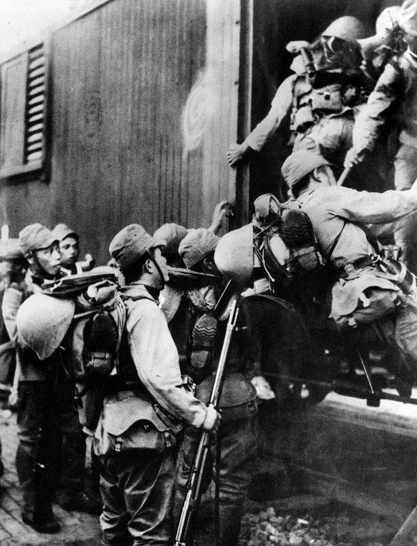
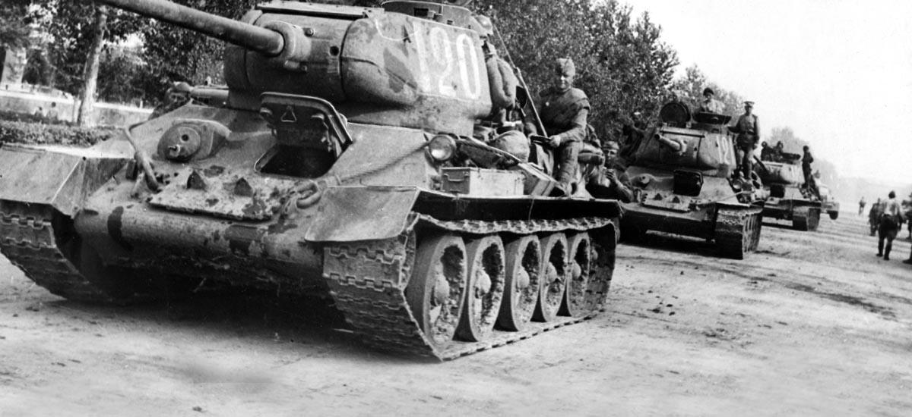

## Claim
Claim: "China and Japan plan to invade the Russian Federation."

## Actions
```
web_search("China Japan invasion Russia")
```

## Evidence
### Evidence from `web_search`
The search results discuss historical conflicts involving Japan, Russia, and China. One article from Wikipedia ([Source](https://en.wikipedia.org/wiki/Soviet_invasion_of_Manchuria)) details the Soviet invasion of Manchuria in 1945, including the involvement of the Chinese Communist Party and war crimes committed by Soviet soldiers. Another article from Britannica ([Source](https://www.britannica.com/place/Manchuria/Manchuria-since-c-1900)) discusses the Russo-Japanese War (1904-1905) and the imperialist expansion in Manchuria.

A Warfare History Network article ([Source](https://warfarehistorynetwork.com/article/the-soviet-invasion-of-manchuria-led-to-japans-greatest-defeat/)) focuses on the Soviet invasion of Manchuria in 1945, which led to Japan's defeat, and mentions the Japanese invasion of Manchuria in 1931 and conflicts between Japan and the Soviet Union in 1938. <image:k>, , , 


## Elaboration
The evidence details historical conflicts between Japan, China, and Russia, including the Soviet invasion of Manchuria in 1945 ([Source](https://en.wikipedia.org/wiki/Soviet_invasion_of_Manchuria)) and the Russo-Japanese War (1904-1905) ([Source](https://www.britannica.com/place/Manchuria/Manchuria-since-c-1900)). The Warfare History Network article ([Source](https://warfarehistorynetwork.com/article/the-soviet-invasion-of-manchuria-led-to-japans-greatest-defeat/)) also mentions the Japanese invasion of Manchuria in 1931 and conflicts between Japan and the Soviet Union in 1938.

The provided search results focus on past conflicts and do not provide any information about current plans for China and Japan to invade Russia.

The claim cannot be verified with the provided evidence. The evidence only covers historical conflicts and does not mention any current plans for invasion.


## Actions
```
web_search("China Japan relations Russia current")
```

## Evidence
### Evidence from `web_search`
The Kremlin's website ([Source](http://www.en.kremlin.ru/events/president/news/77864)) highlights the strong relationship between Russia and China, emphasizing historical friendship and cooperation. Kyodo News ([Source](https://english.kyodonews.net/news/2025/05/2273370ce1bc-china-russia-leaders-statement-avoided-wording-that-could-irk-japan.html?phrase=Germany&words=)) discusses a joint statement between China and Russia that avoided wording that could "irk Japan," and mentions Japan's concerns over joint military exercises between China and Russia. RFE/RL ([Source](https://www.rferl.org/a/military-exercise-japan-taiwan-navy-china-russia-partnership/33491860.html)) reports on joint naval exercises between China and Russia, and Japan's concerns about growing tensions. , , , , , , 


## Elaboration
The new evidence indicates a strong relationship between China and Russia, with the Kremlin emphasizing historical friendship and cooperation ([Source](http://www.en.kremlin.ru/events/president/news/77864)). Joint statements between China and Russia have been carefully worded to avoid upsetting Japan ([Source](https://english.kyodonews.net/news/2025/05/2273370ce1bc-china-russia-leaders-statement-avoided-wording-that-could-irk-japan.html?phrase=Germany&words=)). Japan has expressed concerns about joint military exercises between China and Russia ([Source](https://www.rferl.org/a/military-exercise-japan-taiwan-navy-china-russia-partnership/33491860.html)).

The evidence suggests that China and Russia are strengthening their relationship, which causes concern for Japan. However, there is no evidence to support the claim that China and Japan plan to invade Russia.

The claim is not supported by the evidence.


## Final Judgement
The search results reveal historical conflicts and current geopolitical dynamics. While there is evidence of a strong relationship between China and Russia, and Japan's concerns about this relationship, there is no evidence to support the claim that China and Japan plan to invade Russia.

`false`

### Verdict: FALSE

### Justification
The fact-check reveals historical conflicts between Japan, China, and Russia, but the evidence does not support the claim. Current reports highlight a strong relationship between China and Russia, causing concern for Japan, but there is no evidence of a planned invasion.
