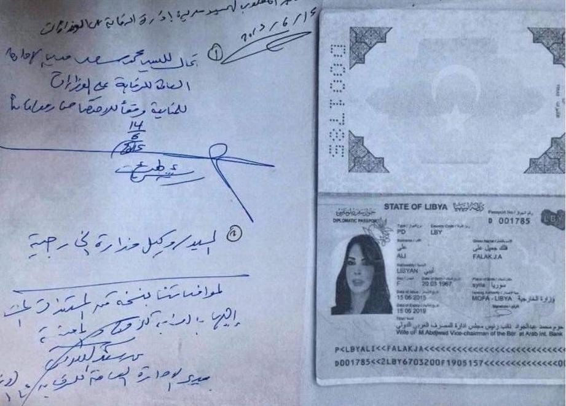

## Claim
Claim: " This image shows an authentic Russian passport of deposed Syrian dictator Bashar al-Assad."

## Actions
```
web_search("Bashar al-Assad Russian passport")
image_search("Bashar al-Assad passport")
```

## Evidence
### Evidence from `web_search`
An AOL article fact-checks an image of a Russian passport purportedly belonging to Bashar al-Assad and states that the image is fake and photoshopped. The article also mentions that Logically Facts debunked the claim. () The Wikipedia article discusses Bashar al-Assad's presidency and mentions that he was born in Damascus on September 11, 1965. ()

An article from NV mentions that Bashar Assad's regime collapsed and he fled to Moscow. ()

*   [https://www.aol.com/fact-check-assad-passport-image-140122086.html](https://www.aol.com/fact-check-assad-passport-image-140122086.html)
*   [https://en.wikipedia.org/wiki/Bashar\_al-Assad](https://en.wikipedia.org/wiki/Bashar_al-Assad)
*   [https://english.nv.ua/nation/relatives-of-bashar-al-assad-arrested-at-beirut-airport-using-fake-passports-50477670.html](https://english.nv.ua/nation/relatives-of-bashar-al-assad-arrested-at-beirut-airport-using-fake-passports-50477670.html)


### Evidence from `image_search`
The search results include a photo of Syrian passports from [Alestiklal.net](https://www.alestiklal.net/en/article/bashar-al-assad-regime-no-more-passports-to-syrians)  and an image of a Libyan diplomatic passport from [Libya Observer](https://libyaobserver.ly/news/bashar-al-assads-cousin-granted-libyan-diplomatic-passport) .


## Elaboration
The evidence indicates that the image of the Russian passport is fake and photoshopped. An AOL article explicitly states that the image has been debunked. Additionally, the NV article mentions that Bashar al-Assad fled to Moscow, which does not imply that he has a Russian passport.


## Final Judgement
The claim that the image shows an authentic Russian passport of Bashar al-Assad is false. Multiple sources, including an AOL article, have debunked the image as fake or photoshopped.

`false`

### Verdict: FALSE

### Justification
The claim is false. An [AOL article](https://www.aol.com/fact-check-assad-passport-image-140122086.html) fact-checks the image and states that it is fake and photoshopped.
