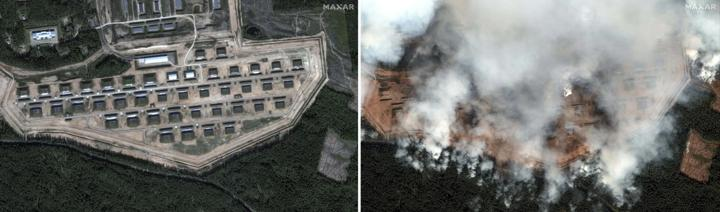

## Claim
Claim: " This image shows a Russian ammunition depot in Toropets, Tver Oblast, before and after it was hit by a, possible nuclear, strike from the North Atlantic Treaty Organization (NATO)."

## Actions
```
geolocate()
web_search("Russian ammunition depot Toropets Tver Oblast")
web_search("Toropets Tver Oblast ammunition depot NATO strike")
```

## Evidence
### Evidence from `geolocate`
The most likely countries where the image was taken are: {'Bhutan': 0.24, 'China': 0.21, 'Malaysia': 0.13, 'Cambodia': 0.09, 'Ghana': 0.09, 'Taiwan': 0.07, 'Madagascar': 0.03, 'Nigeria': 0.02, 'Brazil': 0.01, 'Colombia': 0.01}

### Evidence from `web_search`
The web sources discuss a Ukrainian drone attack on a Russian ammunition depot in Toropets, Tver Oblast, Russia. The attack, which occurred on September 17-18, 2024, caused a large explosion and fires at the depot, which stored fuel tanks, missiles, and artillery ammunition, including Iskander and Tochka-U missiles. The facility was renovated in 2018 and was claimed to meet the highest international standards.

The sources include articles from Wikipedia ([https://en.wikipedia.org/wiki/Toropets_depot_explosions](https://en.wikipedia.org/wiki/Toropets_depot_explosions)), CNN ([https://edition.cnn.com/2024/09/18/europe/ukraine-russian-weapons-depot-drone-attack-intl](https://edition.cnn.com/2024/09/18/europe/ukraine-russian-weapons-depot-drone-attack-intl)), and Euronews ([https://www.euronews.com/my-europe/2024/09/18/what-was-stored-at-the-russian-arms-depot-in-tver-region-struck-by-ukraines-drones](https://www.euronews.com/my-europe/2024/09/18/what-was-stored-at-the-russian-arms-depot-in-tver-region-struck-by-ukraines-drones)), all of which feature images of the depot before and after the attack 

### Evidence from `web_search`
From [Source](https://apnews.com/article/russia-ukraine-toropets-drones-attack-e3d05b2637d316b437e4789a35c7f59e): 
Content: The Associated Press published an article about a Ukrainian drone strike on a Russian ammunition depot in Toropets, Russia. The article includes satellite images of the depot before and after the strike . The depot housed Iskander and Tochka-U missiles, as well as glide bombs and artillery shells. The attack was carried out by Ukraine’s Security Service, along with Ukraine’s Intelligence and Special Operations Forces. The article was published on September 18, 2024.


## Elaboration
The claim that the image shows a Russian ammunition depot in Toropets, Tver Oblast, before and after a NATO strike is inaccurate. The evidence indicates that the image depicts a Ukrainian drone strike on a Russian ammunition depot in Toropets, Tver Oblast, Russia. The attack occurred on September 17-18, 2024, and was carried out by Ukraine’s Security Service, along with Ukraine’s Intelligence and Special Operations Forces.


## Final Judgement
The image does show a Russian ammunition depot in Toropets, Tver Oblast, before and after an attack. However, the attack was carried out by Ukraine, not NATO.

`false`

### Verdict: FALSE

### Justification
The image depicts a Russian ammunition depot in Toropets, Tver Oblast, before and after a Ukrainian drone strike, not a NATO strike as the claim suggests. Multiple sources, including CNN ([https://edition.cnn.com/2024/09/18/europe/ukraine-russian-weapons-depot-drone-attack-intl](https://edition.cnn.com/2024/09/18/europe/ukraine-russian-weapons-depot-drone-attack-intl)) and the Associated Press ([https://apnews.com/article/russia-ukraine-toropets-drones-attack-e3d05b2637d316b437e4789a35c7f59e](https://apnews.com/article/russia-ukraine-toropets-drones-attack-e3d05b2637d316b437e4789a35c7f59e)), confirm the Ukrainian origin of the attack.
