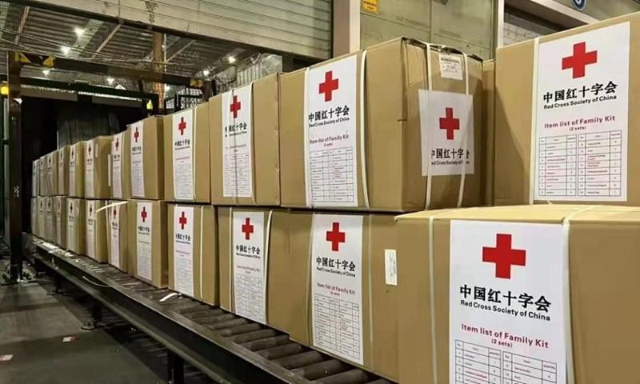
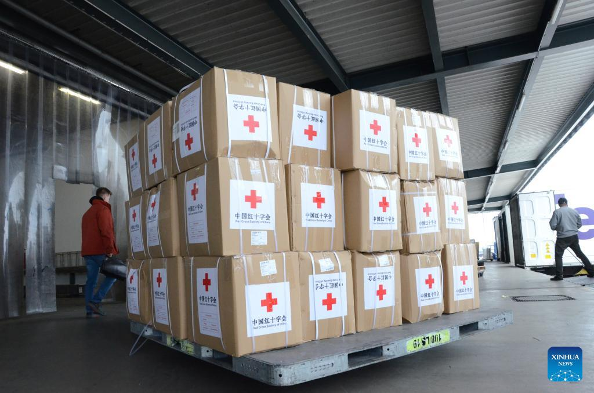

## Claim
Claim: " This image shows the Chinese Communist Party's Red Cross troops in Russia who have changed into winter clothes and set off for the Russian-Ukrainian front to aid Russia in rescuing its occupied territories."

## Actions
```
web_search("Chinese Red Cross troops Russia Ukraine")
image_search("Chinese Red Cross troops Russia")
```

## Evidence
### Evidence from `web_search`
CNN reported on April 16, 2025, about the capture of Chinese nationals fighting for Russia in Ukraine, who claimed they were acting as individuals inspired by social media recruitment videos. The Guardian reported that Chinese troops marched with Russian forces in Moscow's Red Square for Victory Day, with Vladimir Putin and Xi Jinping in attendance. The International Federation of Red Cross and Red Crescent Societies and the International Committee of the Red Cross published a report in 2023 on the Russia-Ukraine conflict, mentioning the Red Cross Society of China's involvement in supporting the response to the conflict.

The sources are: [https://www.cnn.com/2025/04/16/europe/ukraine-russia-chinese-nationals-intl-latam](https://www.cnn.com/2025/04/16/europe/ukraine-russia-chinese-nationals-intl-latam), [https://www.theguardian.com/weather/2025/may/09/chinese-troops-march-with-russian-forces-as-xi-joins-putin-for-victory-day-parade](https://www.theguardian.com/weather/2025/may/09/chinese-troops-march-with-russian-forces-as-xi-joins-putin-for-victory-day-parade), and [https://www.icrc.org/sites/default/files/document_new/file_list/red_cross_movement_activities_overview_ukraine_2022_3.pdf](https://www.icrc.org/sites/default/files/document_new/file_list/red_cross_movement_activities_overview_ukraine_2022_3.pdf). , , , 


### Evidence from `image_search`
The Guardian published an article about large-scale military drills launched by Russia and China amid tensions with the US, including an image of Chinese troops (). USNI News published an article discussing China and Russia's actions in Ukraine and near Taiwan, also including an image of Chinese troops (). Al Jazeera published an article on March 25, 2023, which includes an image of Chinese soldiers ().

The articles can be found at the following URLs: [The Guardian](https://www.theguardian.com/world/2022/sep/01/russia-and-china-launch-large-scale-military-drills-amid-tensions-with-us), [USNI News](https://news.usni.org/2021/04/14/cno-gilday-china-russia-deliberately-testing-allies-cohesion-in-actions-in-ukraine-near-taiwan), and [Al Jazeera](https://www.aljazeera.com/news/2023/3/25/biden-says-no-sign-yet-of-china-sending-weapons-to-russia).


## Elaboration
The evidence indicates that Chinese troops have been involved in activities related to Russia, including marching with Russian forces and participating in military drills. The Red Cross Society of China has also been involved in supporting the response to the Russia-Ukraine conflict. However, the evidence does not explicitly state that Chinese Red Cross troops have changed into winter clothes and set off for the Russian-Ukrainian front to aid Russia in rescuing its occupied territories.

Therefore, the claim cannot be fully verified based on the provided evidence. More information is needed to confirm the specific actions and purpose of the Chinese Red Cross troops in the context described in the claim.


## Actions
```
web_search("Chinese Red Cross Ukraine aid")
image_search("Chinese Red Cross Ukraine")
```

## Evidence
### Evidence from `web_search`
The Chinese Red Cross provided humanitarian aid to Ukraine, including 5 million yuan worth of assistance to the Ukrainian Red Cross Society, as reported by Reuters ([https://www.reuters.com/world/china-provide-5-mln-yuan-worth-humanitarian-assistance-ukraine-2022-03-09/](https://www.reuters.com/world/china-provide-5-mln-yuan-worth-humanitarian-assistance-ukraine-2022-03-09/)). The Chinese government also provided humanitarian aid, including 10 million yuan worth of assistance, and the Red Cross Society of China provided three batches of emergency humanitarian assistance to Ukraine, including food and supplies ([https://global.chinadaily.com.cn/a/202203/22/WS62392e6fa310fd2b29e52706.html](https://global.chinadaily.com.cn/a/202203/22/WS62392e6fa310fd2b29e52706.html)). The International Committee of the Red Cross (ICRC) is also providing aid in Ukraine and accepting donations ([https://www.icrc.org/en/donate/ukraine](https://www.icrc.org/en/donate/ukraine)). , 


### Evidence from `image_search`
The Global Times and Xinhua News Agency reported that the Red Cross Society of China provided humanitarian aid to Ukraine. The aid was in the form of boxes. (, )


## Elaboration
The evidence indicates that the Chinese Red Cross provided humanitarian aid to Ukraine, including financial assistance and supplies. However, there is no evidence to support the claim that Chinese Red Cross troops have changed into winter clothes and set off for the Russian-Ukrainian front to aid Russia in rescuing its occupied territories. The images show boxes of aid, not troops.

Therefore, the claim is not supported by the evidence.


## Final Judgement
The fact-check reveals that the Chinese Red Cross provided humanitarian aid to Ukraine, but there is no evidence to support the claim that Chinese Red Cross troops have changed into winter clothes and set off for the Russian-Ukrainian front to aid Russia. The images show boxes of aid, not troops.

`false`

### Verdict: FALSE

### Justification
The claim is false. While the Chinese Red Cross provided humanitarian aid to Ukraine, there is no evidence to support the claim that Chinese Red Cross troops were deployed to the Russian-Ukrainian front to aid Russia. The provided evidence shows the Red Cross providing aid in the form of supplies, not troops.
