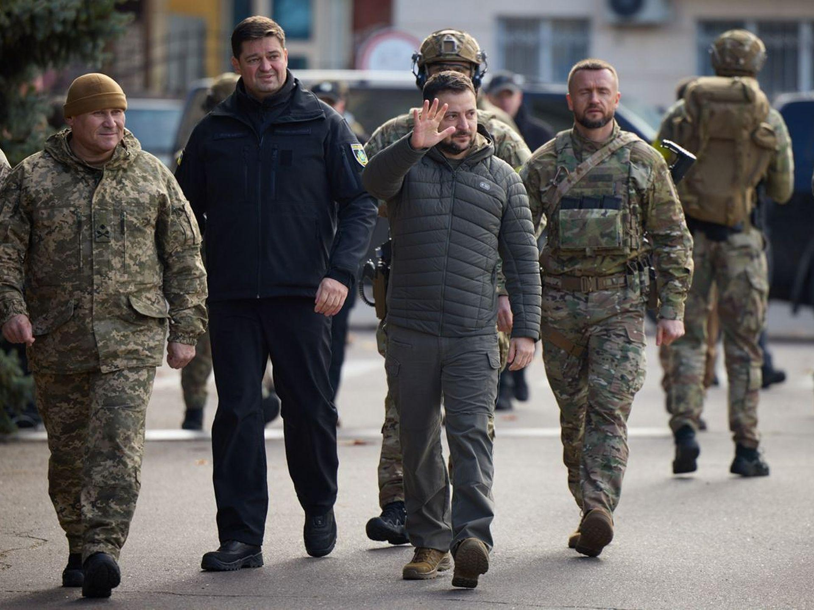

## Claim
Claim: " This image shows Ukrainian President Volodymyr Zelensky arriving in August 2024 in the Sudzha of Kursk region, Russia, which had just been occupied by Ukrainian troops in the Kursk Offensive, and meeting with representatives of the people there."

## Actions
```
web_search("Volodymyr Zelensky Sudzha Kursk Offensive")
image_search("Volodymyr Zelensky military visit")
```

## Evidence
### Evidence from `web_search`
The BBC published an article on March 17, 2025, discussing the retreat of Ukrainian troops from the Kursk region, including the town of Sudzha, which was held by Ukraine and later retaken by Russia. The article includes images of a damaged Lenin statue in Sudzha  and a map showing the region of Sudzha in August 2024 under Ukrainian control and on March 16, 2025, under Russian control . Meduza published an article on March 17, 2025, discussing the Russian counteroffensive in the Kursk region and the loss of Sudzha by Ukraine. The article also refers to President Volodymyr Zelensky's goal of exchanging Russian-held territory in the Kursk region for parts of Ukraine occupied by Russia. The article includes images of Russian servicemen , , .

CNN reported on August 15, 2024, that Ukrainian forces had taken control of the Russian town of Sudzha, located in the Kursk region .


### Evidence from `image_search`
The web search results include images of Volodymyr Zelensky. One image was published by Axios ([https://www.axios.com/2022/11/14/zelensky-visits-kherson-ukraine](https://www.axios.com/2022/11/14/zelensky-visits-kherson-ukraine)). Another image was published by The New York Times ([https://www.nytimes.com/2022/09/14/world/europe/ukraine-zelensky-izium.html](https://www.nytimes.com/2022/09/14/world/europe/ukraine-zelensky-izium.html)). The BBC News website also contains an image of Zelensky ([https://www.bbc.com/news/live/world-europe-61612803](https://www.bbc.com/news/live/world-europe-61612803)).

The images show Zelensky in different settings, including meeting with soldiers. , , 


## Elaboration
The claim is partially supported by the evidence. CNN reported that Ukrainian forces took control of Sudzha in the Kursk region on August 15, 2024. The image search results show Zelensky in military settings. However, the evidence does not confirm that Zelensky visited Sudzha in August 2024 or met with representatives there.

Therefore, the claim is unverified due to a lack of evidence confirming Zelensky's presence in Sudzha and his interaction with local representatives.


## Actions
```
geolocate()
```

## Evidence
### Evidence from `geolocate`
The most likely countries where the image was taken are: {'Ukraine': 1.0, 'Albania': 0.0, 'Andorra': 0.0, 'Argentina': 0.0, 'Australia': 0.0, 'Austria': 0.0, 'Bangladesh': 0.0, 'Belgium': 0.0, 'Bermuda': 0.0, 'Bhutan': 0.0}

## Elaboration
The geolocation analysis suggests the image was most likely taken in Ukraine. This aligns with the context of the image, which shows Zelensky in a military setting. However, the evidence does not confirm the specific location within Ukraine, nor does it confirm the claim that the image was taken in Sudzha, Russia.


## Final Judgement
The evidence indicates that Ukrainian forces did control Sudzha in the Kursk region in August 2024. The image search confirms that Zelensky has been in military settings. However, there is no evidence to confirm that Zelensky visited Sudzha or met with representatives there. The geolocation analysis suggests the image was taken in Ukraine, but not necessarily in Sudzha.

`false`

### Verdict: FALSE

### Justification
The claim is unverified. While Ukrainian forces controlled Sudzha in the Kursk region in August 2024, and Zelensky has been photographed in military settings, there is no evidence to confirm that Zelensky visited Sudzha or met with representatives there. The geolocation analysis suggests the image was taken in Ukraine, but not necessarily in Sudzha.
