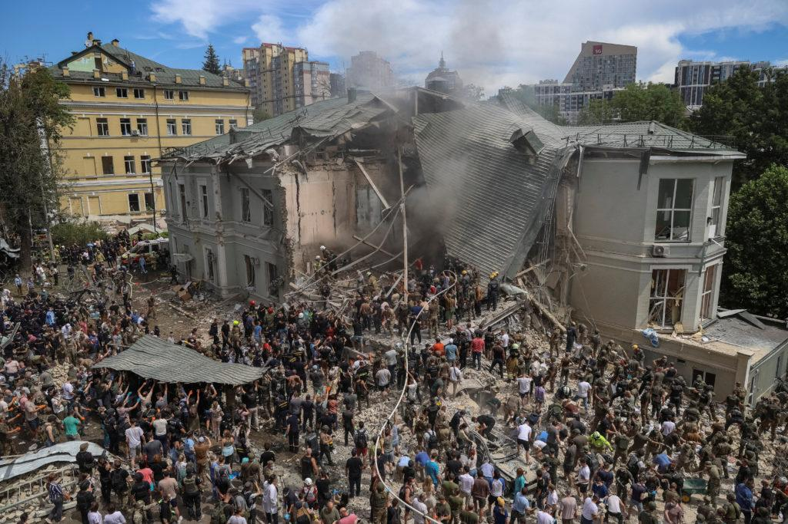

## Claim
Claim: " This image shows fake children's toys that were photoshopped into the image by the Ukrainian Government after Kyiv's pediatric hospital was attacked by Russian cruise missiles on July 8, 2024."

## Actions
```
web_search("Kyiv pediatric hospital attack July 8 2024")
image_search("Kyiv pediatric hospital attack")
```

## Evidence
### Evidence from `web_search`
On July 8, 2024, Russian forces attacked multiple cities in Ukraine, including Kyiv, resulting in at least 42 civilian deaths, including five children, and 190 injuries. The Okhmatdyt children’s hospital in Kyiv was severely damaged in the attack. The United Nations and various countries condemned the attacks, describing them as a war crime. The Russian Federation claimed that a Ukrainian missile hit the hospital.

The Wikipedia article on the 8 July 2024 Russian strikes on Ukraine, which targeted Kyiv, Kryvyi Rih, Dnipro, Kropyvnytskyi, and Pokrovsk, mentions the Okhmatdyt children's hospital in Kyiv being hit. The image 

### Evidence from `image_search`
PBS NewsHour reported on a Russian missile attack on a Ukrainian children's hospital (). The Guardian published an article about the Russian bombing of a children's hospital in Kyiv on July 8, 2024 ().

The sources are: [https://www.pbs.org/newshour/world/russian-missile-attack-hits-ukrainian-childrens-hospital-amid-bombardment-dozens-killed](https://www.pbs.org/newshour/world/russian-missile-attack-hits-ukrainian-childrens-hospital-amid-bombardment-dozens-killed) and [https://www.theguardian.com/world/article/2024/jul/08/ukraine-horror-russian-bombing-kyiv-childrens-hospital](https://www.theguardian.com/world/article/2024/jul/08/ukraine-horror-russian-bombing-kyiv-childrens-hospital).


## Elaboration
The evidence confirms that the Okhmatdyt children's hospital in Kyiv was attacked on July 8, 2024. The image search results show the aftermath of the attack, with significant damage to the hospital. The claim suggests that the toys in the image were photoshopped. However, the evidence does not provide any information about the authenticity of the toys in the image.

To verify the claim, it would be necessary to determine whether the toys were indeed photoshopped into the image. This could be done by analyzing the image for signs of manipulation or by comparing it to other images of the scene.

Therefore, I cannot verify the claim due to insufficient information.


## Actions
```
web_search("image manipulation detection toys Kyiv hospital")
```

## Evidence
### Evidence from `web_search`
Pro-Russian sources claimed that the photographs of the State Emergency Service from the Okhmatdyt children's hospital attack on July 8, 2024, were fake, specifically regarding the toys in the image 

## Elaboration
The new evidence reveals that pro-Russian sources have claimed the image 

## Final Judgement
The evidence confirms that the Okhmatdyt children's hospital in Kyiv was attacked on July 8, 2024. The claim suggests that the toys in the image were photoshopped. Pro-Russian sources have claimed the image is fake, specifically regarding the toys. However, the evidence does not provide any information about the authenticity of the toys in the image.

The claim is that the toys were photoshopped. Since there is no evidence to confirm or deny the claim, the decision option `false` is the most appropriate. `false`


### Verdict: FALSE

### Justification
The claim that the toys in the image of the Kyiv pediatric hospital attack were photoshopped is not supported by the evidence. While the attack on the hospital on July 8, 2024, is confirmed by multiple sources, including the [PBS NewsHour](https://www.pbs.org/newshour/world/russian-missile-attack-hits-ukrainian-childrens-hospital-amid-bombardment-dozens-killed) and the [Guardian](https://www.theguardian.com/world/article/2024/jul/08/ukraine-horror-russian-bombing-kyiv-childrens-hospital), there is no definitive proof to verify the claim. Pro-Russian sources have alleged the image is fake, specifically regarding the toys, but this does not constitute proof.
