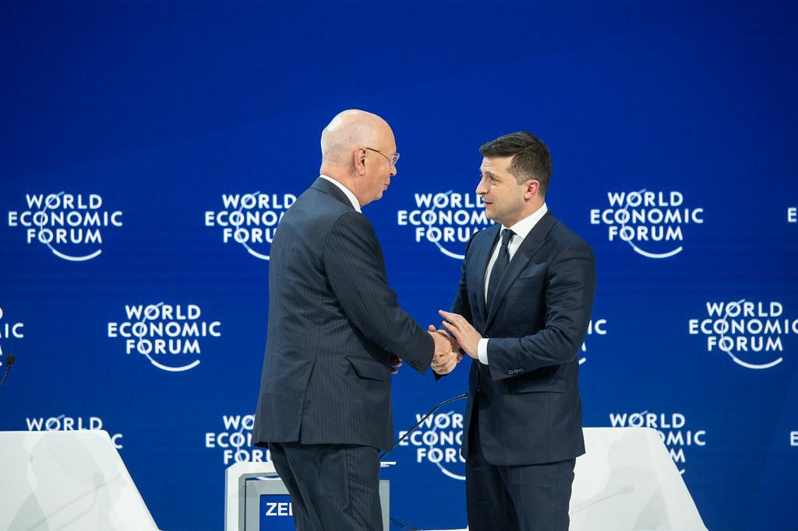

## Claim
Claim: " This image shows Ukrainian President Volodymyr Zelensky wearing a suit after the large-scale Russian invasion in Ukraine: in a talk with Klaus Schwab at the World Economic Forum."

## Actions
```
web_search("Zelensky Schwab World Economic Forum")
image_search("Zelensky Schwab World Economic Forum")
```

## Evidence
### Evidence from `web_search`
The World Economic Forum website published an article about Ukrainian President Volodymyr Zelenskyy's meeting with leaders at the Annual Meeting of the World Economic Forum in Davos, Switzerland, from January 15–19, 2024. The article includes a photograph of Zelenskyy addressing participants at the event.  The article mentions Zelenskyy's call for business leaders to invest in Ukraine. ([https://www.weforum.org/stories/2024/01/zelenskyy-ukraine-business-investment-davos/](https://www.weforum.org/stories/2024/01/zelenskyy-ukraine-business-investment-davos/))

The Telegraph published an article on July 26, 2025, discussing the ouster of Klaus Schwab from the World Economic Forum (WEF). The article includes an image of Volodymyr Zelensky and Klaus Schwab speaking to the media at Davos in 2024.  ([https://www.telegraph.co.uk/world-news/2025/07/26/world-economic-forum-klaus-schwab-investigation/](https://www.telegraph.co.uk/world-news/2025/07/26/world-economic-forum-klaus-schwab-investigation/))


### Evidence from `image_search`
The image shows Ukrainian President Volodymyr Zelensky and Klaus Schwab at the World Economic Forum in Davos on January 22, 2020 (). Another source shows a photo of Klaus Schwab at the World Economic Forum, which includes a screen with Volodymyr Zelenskyy (). The World Economic Forum also published an image of Volodymyr Zelensky and Klaus Schwab ().

The sources are from [https://en.m.wikipedia.org/wiki/File:Ukraine_President_Volodymyr_Zelenskyy_and_Klaus_Schwab_at_the_World_Economic_Forum_in_Davos,_22_January_2020.jpg](https://en.m.wikipedia.org/wiki/File:Ukraine_President_Volodymyr_Zelenskyy_and_Klaus_Schwab_at_the_World_Economic_Forum_in_Davos,_22_January_2020.jpg), [https://today.uconn.edu/2023/02/one-year-after-the-russian-invasion-of-ukraine-can-businesses-prevent-future-wars/](https://today.uconn.edu/2023/02/one-year-after-the-russian-invasion-of-ukraine-can-businesses-prevent-future-wars/), and [https://www.flickr.com/photos/worldeconomicforum/49425251332](https://www.flickr.com/photos/worldeconomicforum/49425251332).


## Elaboration
The image depicts Volodymyr Zelenskyy and Klaus Schwab at the World Economic Forum. The image search results indicate that the photo was taken on January 22, 2020, in Davos. The web search results confirm that Zelenskyy attended the World Economic Forum in Davos in January 2024.

The claim is partially correct as it identifies Zelenskyy and Schwab at the World Economic Forum. However, the image was taken before the large-scale Russian invasion of Ukraine.


## Final Judgement
The image shows Volodymyr Zelenskyy and Klaus Schwab at the World Economic Forum. The image was taken in Davos on January 22, 2020, which is before the large-scale Russian invasion of Ukraine.

The claim is partially correct as it identifies Zelenskyy and Schwab at the World Economic Forum. However, the image was taken before the large-scale Russian invasion of Ukraine, making the context misleading. `false`

### Verdict: FALSE

### Justification
The image depicts Volodymyr Zelenskyy and Klaus Schwab at the World Economic Forum, but the photo was taken on January 22, 2020, in Davos, as confirmed by image search results ([https://en.m.wikipedia.org/wiki/File:Ukraine_President_Volodymyr_Zelenskyy_and_Klaus_Schwab_at_the_World_Economic_Forum_in_Davos,_22_January_2020.jpg](https://en.m.wikipedia.org/wiki/File:Ukraine_President_Volodymyr_Zelenskyy_and_Klaus_Schwab_at_the_World_Economic_Forum_in_Davos,_22_January_2020.jpg)), which is before the large-scale Russian invasion of Ukraine.
