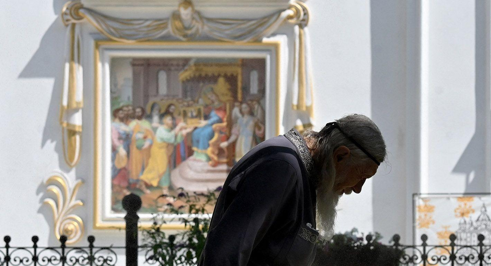

## Claim
Claim: "In August 2024, Ukraine passed legislation banning the Orthodox Church in Ukraine."

## Actions
```
web_search("Ukraine legislation ban Orthodox Church August 2024")
```

## Evidence
### Evidence from `web_search`
Several sources discuss a new Ukrainian law passed in August 2024 that bans religious organizations with ties to the Russian Orthodox Church. Human Rights Watch published an article on October 30, 2024, discussing the law, which could effectively ban congregations of the Ukrainian Orthodox Church (<image:k>). The European Parliament also discussed the ban in a document published on October 10, 2024, mentioning concerns from the UN, Pope Francis, and others regarding potential violations of religious freedom and human rights. The Carnegie Endowment for International Peace published an article on September 4, 2024, stating that the law's main target is the Ukrainian Orthodox Church of the Moscow Patriarchate (UOCMP) ().

*   [https://www.hrw.org/news/2024/10/30/ukraine-new-law-raises-religious-freedom-concerns](https://www.hrw.org/news/2024/10/30/ukraine-new-law-raises-religious-freedom-concerns)
*   [https://www.europarl.europa.eu/doceo/document/E-10-2024-001881\_EN.html](https://www.europarl.europa.eu/doceo/document/E-10-2024-001881_EN.html)
*   [https://carnegieendowment.org/russia-eurasia/politika/2024/08/zapret-upc-v-ukraine](https://carnegieendowment.org/russia-eurasia/politika/2024/08/zapret-upc-v-ukraine)


## Elaboration
The evidence confirms that Ukraine passed a law in August 2024 that could ban religious organizations with ties to the Russian Orthodox Church. The law's main target is the Ukrainian Orthodox Church of the Moscow Patriarchate (UOCMP).


## Final Judgement
The claim is supported by multiple sources, including Human Rights Watch, the European Parliament, and the Carnegie Endowment for International Peace, which confirm the passage of a law in August 2024 in Ukraine that targets religious organizations with ties to the Russian Orthodox Church.

`true`

### Verdict: TRUE

### Justification
In August 2024, Ukraine passed legislation targeting religious organizations with ties to the Russian Orthodox Church, as reported by sources such as [Human Rights Watch](https://www.hrw.org/news/2024/10/30/ukraine-new-law-raises-religious-freedom-concerns) and the [Carnegie Endowment for International Peace](https://carnegieendowment.org/russia-eurasia/politika/2024/08/zapret-upc-v-ukraine). The law's primary focus is the Ukrainian Orthodox Church of the Moscow Patriarchate (UOCMP).
