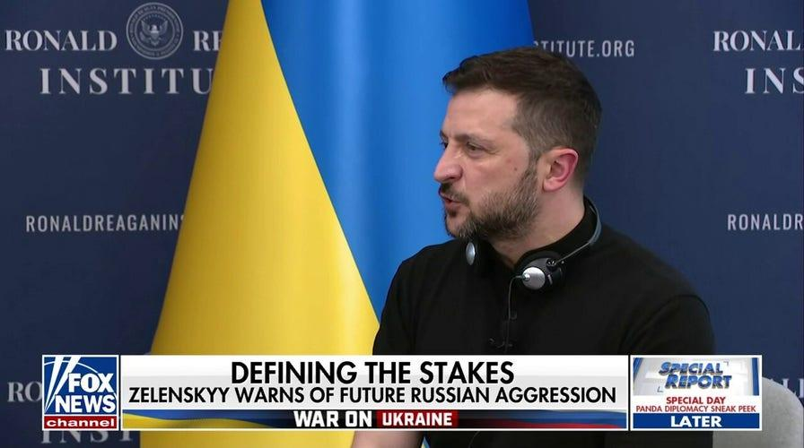
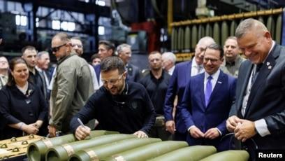
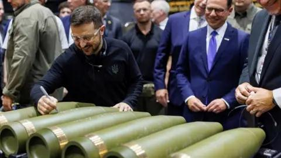

## Claim
Claim: " This image shows Ukrainian President Volodymyr Zelenskyy signing Israeli bombs intended for use against Palestinians in Gaza."

## Actions
```
web_search("Zelenskyy signing bombs")
image_search("Zelenskyy signing bombs")
```

## Evidence
### Evidence from `web_search`
A video and still images falsely claimed that Ukrainian President Volodymyr Zelenskyy signed artillery shells destined for use in Gaza by Israel. The video actually shows Zelenskyy at a U.S. munitions factory supporting Ukraine's defense needs. The video was published in September 2024, and Zelenskyy's handwritten messages on the shells reference Ukraine's war with Russia, not Israel's war in Gaza. Zelenskyy visited the Scranton Army Ammunition Plant (SCAAP) in Pennsylvania and signed some of the shells. 

The Fox News article discusses Ukrainian President Volodymyr Zelenskyy signing a missile at the Scranton Army Ammunition Plant (SCAAP) in President Biden’s hometown. Pennsylvania Democratic Gov. Tim Walz was also present. The article also mentions that the missile was signed with Josh Shapiro.  

*   [https://spotlight.ebu.ch/p/video-caption-falsely-claims-zelenskyy](https://spotlight.ebu.ch/p/video-caption-falsely-claims-zelenskyy)
*   [https://penncapital-star.com/government-politics/shapiro-casey-meet-with-zelenskyy-at-scranton-pennsylvania-ammunitions-factory/](https://penncapital-star.com/government-politics/shapiro-casey-meet-with-zelenskyy-at-scranton-pennsylvania-ammunitions-factory/)
*   [https://www.foxnews.com/politics/josh-shapiro-blasted-signing-missile-alongside-zelenskyy-bidens-hometown-party-war](https://www.foxnews.com/politics/josh-shapiro-blasted-signing-missile-alongside-zelenskyy-bidens-hometown-party-war)


### Evidence from `image_search`
The Associated Press, Radio Free Europe/Radio Liberty, and the BBC all published images of Ukrainian President Volodymyr Zelenskyy signing artillery shells (, , ).

The images show Zelenskyy signing artillery shells.
*   [Source](https://apnews.com/article/zelenskyy-johnson-ambassador-ukraine-biden-harris-trump-d81b0a055d99cfd4804b3f2c00915d09)
*   [Source](https://www.rferl.org/a/zelenskiy-markarova-scranton-munitions-plant-johnson-harris/33135165.html)
*   [Source](https://www.bbc.com/news/articles/c5y30244467o)


## Elaboration
The claim is false. The evidence indicates that the image shows Ukrainian President Volodymyr Zelenskyy signing artillery shells at a U.S. munitions factory, not Israeli bombs. The shells were intended for Ukraine's defense needs in the war against Russia, not for use in Gaza.


## Final Judgement
The claim is demonstrably false. The image shows Zelenskyy signing artillery shells at a U.S. munitions factory, not Israeli bombs. The shells were intended for Ukraine's defense needs, not for use in Gaza. `false`

### Verdict: FALSE

### Justification
The claim is false. The image depicts Ukrainian President Volodymyr Zelenskyy signing artillery shells at a U.S. munitions factory, as confirmed by multiple sources including the [Associated Press](https://apnews.com/article/zelenskyy-johnson-ambassador-ukraine-biden-harris-trump-d81b0a055d99cfd4804b3f2c00915d09), [Radio Free Europe/Radio Liberty](https://www.rferl.org/a/zelenskiy-markarova-scranton-munitions-plant-johnson-harris/33135165.html), and the [BBC](https://www.bbc.com/news/articles/c5y30244467o). These shells were intended for Ukraine's defense against Russia, not for use in Gaza.
