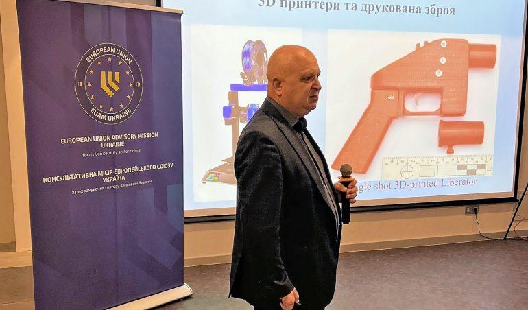

## Claim
Claim: "Ukraine is selling half of the armaments it receives from the United States"

## Actions
```
web_search("Ukraine US arms sales corruption")
web_search("US aid Ukraine arms tracking")
```

## Evidence
### Evidence from `web_search`
Al Jazeera ([https://www.aljazeera.com/news/2025/8/2/ukraine-says-defence-sector-corruption-scheme-uncovered](https://www.aljazeera.com/news/2025/8/2/ukraine-says-defence-sector-corruption-scheme-uncovered)) reported that Ukrainian authorities detained officials over a large-scale corruption scheme in the defense sector involving inflated prices for military drones and signal jamming systems, with kickbacks up to 30 percent of contract amounts. <image:k> Politico ([https://www.politico.eu/article/ukraine-uncovers-major-corruption-scheme-defense-procurment-days-after-restoring-anticorruption/](https://www.politico.eu/article/ukraine-uncovers-major-corruption-scheme-defense-procurment-days-after-restoring-anticorruption/)) also reported on a corruption scheme involving the procurement of military equipment at inflated prices, with participants receiving 30 percent of the contract amount.

PBS Frontline World ([https://www.pbs.org/frontlineworld/stories/sierraleone/context.html](https://www.pbs.org/frontlineworld/stories/sierraleone/context.html)) discusses illicit weapons, high-level corruption, and organized crime centered in Ukraine, highlighting the loss of $32 billion in military assets between 1992 and 1998 due to theft, discount arms sales, and lack of oversight. <image:k>


### Evidence from `web_search`
The United States has provided the largest amount of aid to Ukraine, totaling 114.64 billion euros ($134bn) between January 24, 2022, and June 30, 2025, according to an Al Jazeera article from August 21, 2025, which also mentions military, financial, and humanitarian aid (, ). The Kiel Institute for the World Economy's "Ukraine Support Tracker" database quantifies military, financial, and humanitarian aid pledged to Ukraine since January 24, 2022, with the latest update from August 12, 2025, covering data up to June 2025, and notes that Europe is now leading the US in terms of total volume of military aid provided (, ). Forumarmstrade.org provides a timeline of military aid to Ukraine from 2021 to 2025, listing various countries providing military assistance, including artillery shells, ammunition, air defense systems, drones, and other equipment.

The sources are: [https://www.aljazeera.com/news/2025/8/21/tracking-us-and-nato-support-for-ukraine-a-full-breakdown](https://www.aljazeera.com/news/2025/8/21/tracking-us-and-nato-support-for-ukraine-a-full-breakdown), [https://www.forumarmstrade.org/ukrainearms.html](https://www.forumarmstrade.org/ukrainearms.html), and [https://www.ifw-kiel.de/topics/war-against-ukraine/ukraine-support-tracker/](https://www.ifw-kiel.de/topics/war-against-ukraine/ukraine-support-tracker/).


## Elaboration
The evidence indicates that Ukraine has received significant military aid from the United States and other countries. There is also evidence of corruption within the Ukrainian defense sector, including inflated prices for military equipment and kickbacks. However, the provided evidence does not contain any information about Ukraine selling half of the armaments it receives from the United States.

To verify the claim, information is missing regarding the volume of arms sales by Ukraine and the origin of those arms.


## Actions
```
web_search("Ukraine arms sales US aid")
web_search("Ukraine arms trafficking investigation")
```

## Evidence
### Evidence from `web_search`
The U.S. State Department approved a Foreign Military Sale to Ukraine for Air Delivered Munitions and related equipment for an estimated cost of $825 million, including 3,350 Extended Range Attack Munition (ERAM) missiles and 3,350 Embedded Global Positioning System (GPS)/Inertial Navigation Systems (INS) (<image:k>). The sale will be funded by Denmark, the Netherlands, Norway, and Foreign Military Financing from the United States.

Sources: [https://www.dsca.mil/Press-Media/Major-Arms-Sales/Article-Display/Article/4289280/ukraine-air-delivered-munitions](https://www.dsca.mil/Press-Media/Major-Arms-Sales/Article-Display/Article/4289280/ukraine-air-delivered-munitions) and [https://apnews.com/article/ukraine-us-weapons-sale-trump-russia-74e01123c0067d5fc160141e0cabf207](https://apnews.com/article/ukraine-us-weapons-sale-trump-russia-74e01123c0067d5fc160141e0cabf207).


### Evidence from `web_search`
The Global Initiative Against Transnational Organized Crime published a report on June 18, 2024, highlighting concerns about the diversion of small arms and light weapons (SALW) and ammunition from Ukraine, with criminal groups establishing more organized arms trafficking markets (). The EU Advisory Mission Ukraine (EUAM) reported on February 6, 2025, that the Ministry of Internal Affairs of Ukraine (MoIA) launched a Coordination Centre to Combat Illicit Arms Trafficking (, , , , ). The UN Office on Drugs and Crime stated that no weapons were trafficked to the European Union due to the efforts of Ukrainian law enforcement agencies.


## Elaboration
The evidence reveals that Ukraine is involved in arms sales, including a Foreign Military Sale approved by the U.S. State Department. There are also concerns about arms trafficking and the diversion of weapons from Ukraine, leading to the establishment of a Coordination Centre to combat illicit arms trafficking. However, the evidence does not support the claim that Ukraine is selling half of the armaments it receives from the United States.

The claim is not supported by the evidence. The evidence does not provide any specific figures on the volume of arms sales or the proportion of U.S.-supplied armaments involved.


## Final Judgement
The fact-check reveals that Ukraine receives military aid from the US and other countries, and there are concerns about arms trafficking and corruption within the Ukrainian defense sector. However, there is no evidence to support the claim that Ukraine is selling half of the armaments it receives from the United States.

`false`

### Verdict: FALSE

### Justification
The fact-check found no evidence to support the claim that Ukraine is selling half of the armaments it receives from the United States. While there is evidence of arms sales and concerns about arms trafficking and corruption within the Ukrainian defense sector, the provided sources do not contain any specific figures on the volume of arms sales or the proportion of U.S.-supplied armaments involved.
