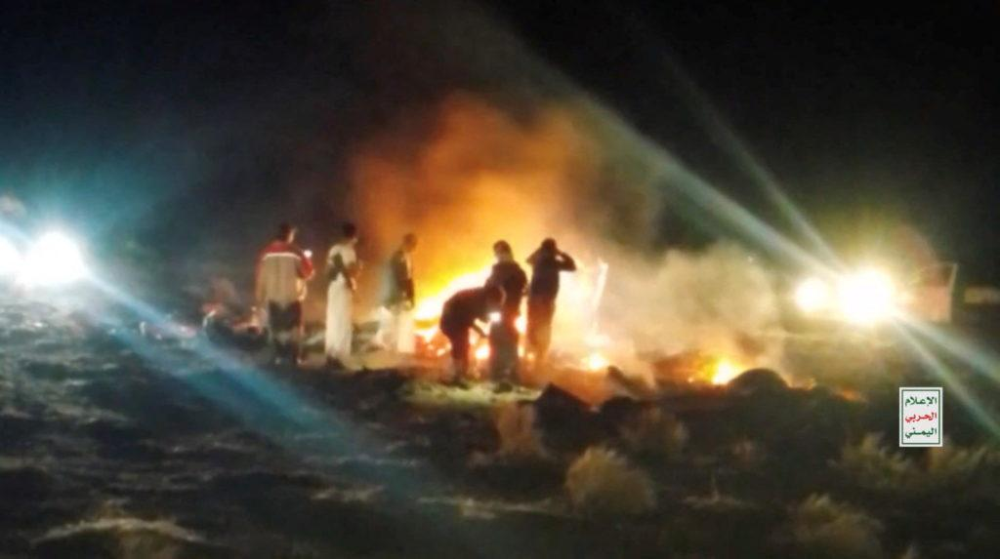
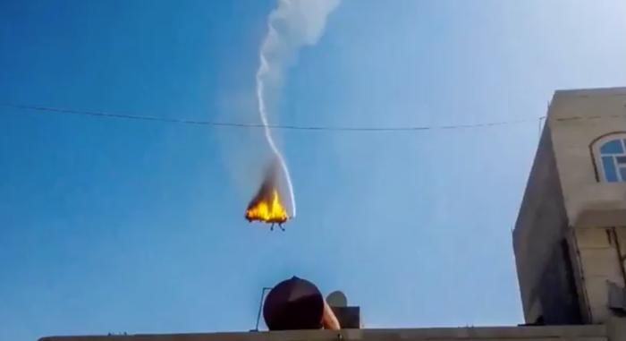

## Claim
Claim: " This image shows a US drone which was shot down in March 2025 by the Houthis using Russian missiles."

## Actions
```
web_search("US drone shot down Houthis Russian missiles")
image_search("drone shot down fire")
geolocate()
```

## Evidence
### Evidence from `web_search`
The Atlantic Council reports that the Houthis have claimed responsibility for downing fourteen MQ-9 Reaper drones since November 2023, including one on December 28, 2024, and another in early 2025. The article also mentions that Iran mediated talks between Russia and the Houthis that led to Moscow supplying Russian-made advanced anti-ship cruise missiles to the group. [Source](https://www.atlanticcouncil.org/blogs/menasource/houthi-strikes-on-us-mq9-reaper-drones/)

NPR and CNN also report on the Houthis shooting down US Reaper drones. NPR states that the Houthis have shot down seven US Reaper drones in recent weeks. [Source](https://www.npr.org/2025/04/25/nx-s1-5377192/houthis-reaper-drones-us-military-yemen) and [Source](https://www.cnn.com/2025/04/25/politics/houthis-target-drones-hampering-trump-mission). The CNN article, published on April 25, 2025, discusses the Houthis' successful targeting of US drones, hindering the US's military campaign. The image 

### Evidence from `image_search`
PBS reports that the Houthis have shot down 7 Reaper drones. () Business Insider published a video showing a US MQ-9 Reaper drone being shot down over Yemen. () The Moscow Times published an article with an image of a large explosion. ()


### Evidence from `geolocate`
The most likely countries where the image was taken are: {'Israel': 0.64, 'Palestine': 0.13, 'United Arab Emirates': 0.12, 'Jordan': 0.08, 'Tunisia': 0.01, 'Albania': 0.0, 'Andorra': 0.0, 'Argentina': 0.0, 'Australia': 0.0, 'Austria': 0.0}

## Elaboration
The evidence confirms that the Houthis have shot down US Reaper drones. The Atlantic Council reports that the Houthis have claimed responsibility for downing fourteen MQ-9 Reaper drones since November 2023, including one in early 2025. [Source](https://www.atlanticcouncil.org/blogs/menasource/houthi-strikes-on-us-mq9-reaper-drones/)

The evidence does not confirm that the image shows a US drone shot down in March 2025. The image search results show other images of drone crashes, but none of them match the image in the claim. The geolocation of the image suggests it was taken in Israel, which contradicts the claim that the drone was shot down by the Houthis in Yemen.

The claim is partially supported by the evidence, but the image's context is not verified. More information is needed to confirm the image's origin and the date of the incident.


## Final Judgement
The evidence confirms that the Houthis have shot down US Reaper drones, but the image's context is not verified. The geolocation of the image suggests it was taken in Israel, which contradicts the claim that the drone was shot down by the Houthis in Yemen.

The claim is not factually accurate because the image is taken out of context. The image does not match the claim that it shows a US drone shot down by the Houthis. `false`


### Verdict: FALSE

### Justification
The claim is inaccurate. While the Houthis have shot down US Reaper drones, the provided image's context is not verified. The geolocation of the image suggests it was taken in Israel, contradicting the claim that the drone was shot down by the Houthis in Yemen.
