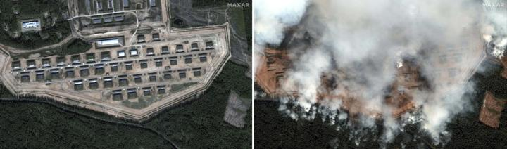

## Claim
Claim: " This image shows a Russian ammunition depot in Toropets, Tver Oblast, before and after it was hit by a, possible nuclear, strike from the North Atlantic Treaty Organization (NATO)."

## Actions
```
geolocate()
image_search("Russian ammunition depot Toropets Tver Oblast")
web_search("Toropets Tver Oblast ammunition depot NATO strike")
```

## Evidence
### Evidence from `geolocate`
The most likely countries where the image was taken are: {'Bhutan': 0.24, 'China': 0.21, 'Malaysia': 0.13, 'Cambodia': 0.09, 'Ghana': 0.09, 'Taiwan': 0.07, 'Madagascar': 0.03, 'Nigeria': 0.02, 'Brazil': 0.01, 'Colombia': 0.01}

### Evidence from `image_search`
CNN published an image of a Russian ammunition depot ([https://edition.cnn.com/2024/09/18/europe/ukraine-russian-weapons-depot-drone-attack-intl](https://edition.cnn.com/2024/09/18/europe/ukraine-russian-weapons-depot-drone-attack-intl)).  The BBC News website contains an image of an explosion ([https://www.bbc.com/news/articles/c30lp1qq6pzo](https://www.bbc.com/news/articles/c30lp1qq6pzo)). 

The Washington Post published an image of a site with smoke ([https://www.washingtonpost.com/world/2024/09/18/ukraine-russia-blast-drones-missiles-tver/](https://www.washingtonpost.com/world/2024/09/18/ukraine-russia-blast-drones-missiles-tver/)). 


### Evidence from `web_search`
The provided web sources discuss a Ukrainian drone attack on a Russian ammunition depot in Toropets, Tver Oblast. The attack, which occurred on September 17-18, 2024, caused multiple explosions. The depot contained various types of missiles, ammunition, and fuel tanks. The Security Service of Ukraine claimed responsibility for the attack.

The Associated Press and Wikipedia both mention the attack and include satellite images of the depot before and after the strike, provided by Maxar Technologies. The Wikipedia article is available here: [https://en.wikipedia.org/wiki/Toropets_depot_explosions](https://en.wikipedia.org/wiki/Toropets_depot_explosions) and the Associated Press article is available here: [https://apnews.com/article/russia-ukraine-toropets-drones-attack-e3d05b2637d316b437e4789a35c7f59e](https://apnews.com/article/russia-ukraine-toropets-drones-attack-e3d05b2637d316b437e4789a35c7f59e). The image 

## Elaboration
The claim is partially accurate. The image does show a Russian ammunition depot in Toropets, Tver Oblast, before and after an attack. However, the attack was carried out by Ukrainian drones, not NATO. The evidence from the web search confirms the location and the nature of the attack, citing the Security Service of Ukraine's responsibility.


## Final Judgement
The image depicts a Russian ammunition depot in Toropets, Tver Oblast, before and after an attack. The attack caused explosions and was carried out by Ukrainian drones, not NATO.

The claim is `false`.

### Verdict: FALSE

### Justification
The image depicts a Russian ammunition depot in Toropets, Tver Oblast, before and after an attack. However, contrary to the claim, the attack was carried out by Ukrainian drones, not NATO, as confirmed by multiple news sources, including the [Associated Press](https://apnews.com/article/russia-ukraine-toropets-drones-attack-e3d05b2637d316b437e4789a35c7f59e) and [Wikipedia](https://en.wikipedia.org/wiki/Toropets_depot_explosions).
