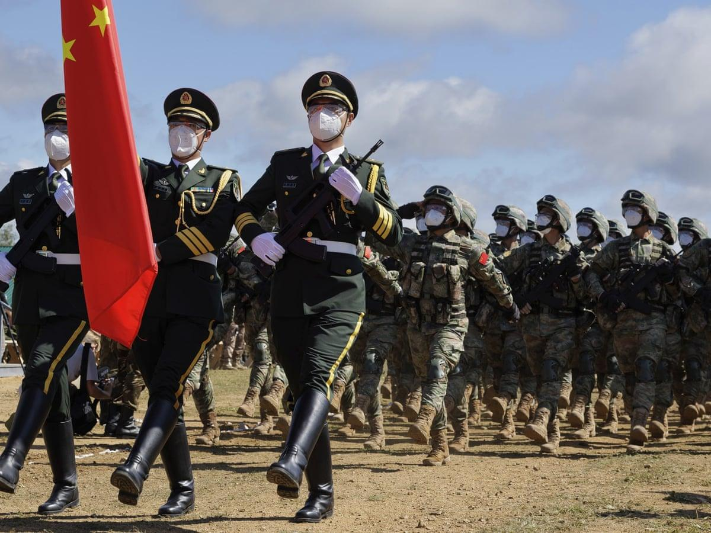
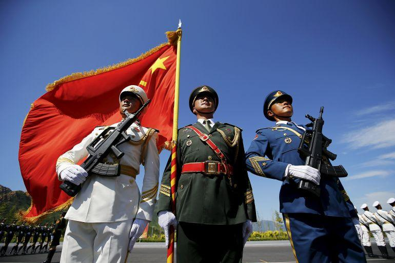

## Claim
Claim: " This image shows the Chinese Communist Party's Red Cross troops in Russia who have changed into winter clothes and set off for the Russian-Ukrainian front to aid Russia in rescuing its occupied territories."

## Actions
```
web_search("Chinese Red Cross troops Russia Ukraine")
image_search("Chinese Red Cross troops Russia")
```

## Evidence
### Evidence from `web_search`
CNN reported on April 16, 2025, about the capture of Chinese nationals fighting for Russia in Ukraine, who claimed they were acting as individuals inspired by social media recruitment videos. The Guardian reported on Chinese troops marching with Russian forces in Moscow's Red Square for Victory Day, with Vladimir Putin and Xi Jinping present. (, , )

The International Federation of Red Cross and Red Crescent Societies and the International Committee of the Red Cross published a report in 2023 on the Russia-Ukraine conflict, mentioning the Red Cross Society of China's involvement in supporting the response to the conflict. The Ukrainian Red Cross Society is at the forefront of the response in Ukraine.


### Evidence from `image_search`
The Guardian published an article about Russia and China launching large-scale military drills. ([https://www.theguardian.com/world/2022/sep/01/russia-and-china-launch-large-scale-military-drills-amid-tensions-with-us](https://www.theguardian.com/world/2022/sep/01/russia-and-china-launch-large-scale-military-drills-amid-tensions-with-us)) 

USNI News published an article discussing China and Russia's actions in Ukraine and near Taiwan. ([https://news.usni.org/2021/04/14/cno-gilday-china-russia-deliberately-testing-allies-cohesion-in-actions-in-ukraine-near-taiwan](https://news.usni.org/2021/04/14/cno-gilday-china-russia-deliberately-testing-allies-cohesion-in-actions-in-ukraine-near-taiwan))  Al Jazeera published an article with an image of Chinese soldiers. ([https://www.aljazeera.com/news/2023/3/25/biden-says-no-sign-yet-of-china-sending-weapons-to-russia](https://www.aljazeera.com/news/2023/3/25/biden-says-no-sign-yet-of-china-sending-weapons-to-russia)) 


## Elaboration
The evidence suggests that the Red Cross Society of China has been involved in supporting the response to the Russia-Ukraine conflict. However, the evidence does not explicitly state that Chinese Red Cross troops have set off for the Russian-Ukrainian front to aid Russia in rescuing its occupied territories. The evidence does show Chinese troops marching with Russian forces in Moscow's Red Square, and Chinese nationals fighting for Russia in Ukraine.

The claim's assertion that the troops are setting off to aid Russia in rescuing its occupied territories cannot be verified with the provided evidence. More information is needed to confirm the specific mission and destination of the troops in the image.


## Actions
```
geolocate()
```

## Evidence
### Evidence from `geolocate`
The most likely countries where the image was taken are: {'China': 0.96, 'Singapore': 0.01, 'Taiwan': 0.01, 'Albania': 0.0, 'Andorra': 0.0, 'Argentina': 0.0, 'Australia': 0.0, 'Austria': 0.0, 'Bangladesh': 0.0, 'Belgium': 0.0}

## Elaboration
The geolocation data indicates that the image was most likely taken in China. The evidence confirms the Red Cross Society of China's involvement in supporting the response to the Russia-Ukraine conflict. However, the evidence does not confirm that the troops in the image are setting off to aid Russia in rescuing its occupied territories.


## Actions
```
web_search("Chinese Red Cross aid Ukraine Russia")
image_search("Chinese Red Cross troops Ukraine Russia")
```

## Evidence
### Evidence from `web_search`
Reuters reported that China's Red Cross would provide humanitarian aid to Ukraine in March 2022, while also noting China's refusal to condemn Russia's actions and the strong relationship between the two countries. The International Committee of the Red Cross (ICRC) is providing emergency relief in Ukraine and seeking donations. The Chinese government provided humanitarian assistance to Ukraine, including aid to the Ukrainian Red Cross Society, with the Red Cross Society of China providing multiple batches of emergency humanitarian assistance, including food and sleeping bags. (, , )


### Evidence from `image_search`
Al Jazeera published an article with an image of Russian troops (). The Guardian published an article about the Russian Red Cross's links to Putin's war in Ukraine (). The Economist published an article discussing why Chinese soldiers are fighting in Ukraine ().


## Elaboration
The evidence indicates that the Red Cross Society of China has provided humanitarian aid to Ukraine. However, the evidence does not support the claim that the image shows Chinese Red Cross troops setting off to aid Russia in rescuing its occupied territories. The evidence shows that China has provided aid to Ukraine, and there is evidence of Chinese soldiers fighting in Ukraine.


## Final Judgement
The evidence suggests that the Red Cross Society of China has provided humanitarian aid to Ukraine. However, the claim that the image shows Chinese Red Cross troops setting off to aid Russia in rescuing its occupied territories cannot be verified. The evidence does not support this specific claim.

`false`

### Verdict: FALSE

### Justification
The evidence indicates that the Red Cross Society of China has provided humanitarian aid to Ukraine, but there is no evidence to support the claim that the image depicts Chinese Red Cross troops setting off to aid Russia in rescuing its occupied territories. The provided sources show China's humanitarian aid to Ukraine and Chinese soldiers fighting in Ukraine, but not the specific scenario described in the claim.
