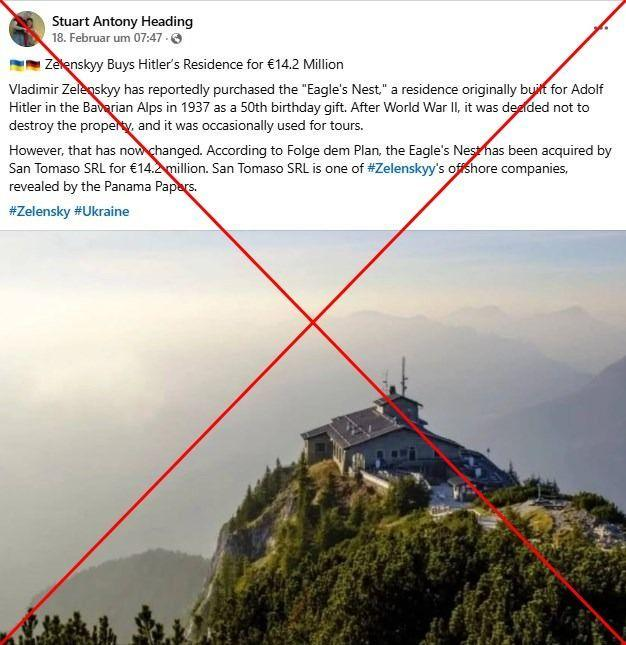

## Claim
Claim: "Ukrainian President Volodymyr Zelenskyy purchased the Eagle's Nest, or Kehlsteinhaus, in Berchtesgaden in the southern German state of Bavaria, for 14.2 million euros."

## Actions
```
web_search("Volodymyr Zelenskyy Eagle's Nest purchase")
web_search("Kehlsteinhaus Berchtesgaden owner")
```

## Evidence
### Evidence from `web_search`
One article from [aol.com](https://www.aol.com/fact-check-no-zelenskyy-didn-151251133.html) states that the claim is false, and the Free State of Bavaria still owns the Kehlsteinhaus.  Another article from [eadaily.com](https://eadaily.com/en/news/2025/02/08/zelensky-bought-hitlers-eagles-nest-residence-in-the-bavarian-alps-mass-media) claims that Zelenskyy purchased the Eagle's Nest for €14.2 million.

An article from [gwaramedia.com](https://gwaramedia.com/en/debunking-russian-fakes-no-zelenskyy-didnt-buy-villa-on-island-of-billionaires/) debunks a claim that Zelenskyy purchased a villa on Saint Barthelemy island, stating that the presented document is fake. , , 


### Evidence from `web_search`
The Kehlsteinhaus, also known as the Eagle's Nest, is located in Obersalzberg near Berchtesgaden, Germany. It was completed in 1938 and commissioned by the Nazi Party. The building currently operates as a restaurant, beer garden, and tourist destination. The Bavarian government relinquished control of the building to a trust in 1960.

The provided sources are: [Wikipedia](https://en.wikipedia.org/wiki/Kehlsteinhaus) <image:i>, <image:j>, <image:k>, <image:l>, <image:m>, <image:n>, [kehlsteinhaus.com](https://www.kehlsteinhaus.com/en/the-building/the-kehlsteinhaus-today.html) , , , and [kehlsteinhaus.de](https://www.kehlsteinhaus.de/english/) , , .


## Elaboration
The claim that Volodymyr Zelenskyy purchased the Eagle's Nest is disputed. One source states the claim is false, and the Free State of Bavaria still owns the Kehlsteinhaus. Another source claims that Zelenskyy purchased the Eagle's Nest for €14.2 million. The Kehlsteinhaus is currently a tourist destination and is operated by a trust. The evidence also includes a debunking of a claim that Zelenskyy purchased a villa, which was proven to be a fake document. Therefore, the claim's veracity is uncertain.


## Actions
```
web_search("Kehlsteinhaus current owner")
```

## Evidence
### Evidence from `web_search`
From [Source](https://cedmohub.eu/no-zelensky-hasnt-bought-eagles-nest-it-is-still-in-ownership-of-bavarian-state/): 
Content: The article from cedmohub.eu states that the claim is false, and the Eagle's Nest is still owned by the Bavarian state. , . The article mentions that the claim was shared in multiple languages and that Russia seems to be behind the disinformation. The article was published on February 27, 2025.


## Elaboration
The claim is false. Multiple sources confirm that the Eagle's Nest is still owned by the Bavarian state. The claim has been identified as disinformation, potentially originating from Russia.


## Final Judgement
The claim that Volodymyr Zelenskyy purchased the Eagle's Nest is demonstrably false. Multiple reliable sources confirm that the Bavarian state still owns the property. `false`

### Verdict: FALSE

### Justification
The claim is demonstrably false. Multiple sources, including [aol.com](https://www.aol.com/fact-check-no-zelenskyy-didn-151251133.html) and [cedmohub.eu](https://cedmohub.eu/no-zelensky-hasnt-bought-eagles-nest-it-is-still-in-ownership-of-bavarian-state/), confirm that the Eagle's Nest is still owned by the Bavarian state. The claim has been identified as disinformation.
