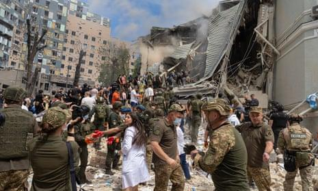
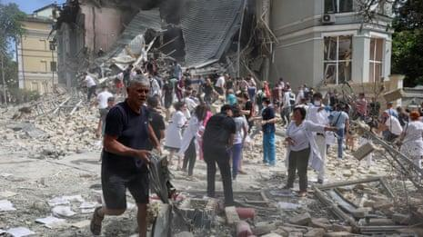
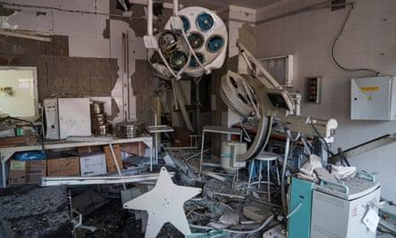
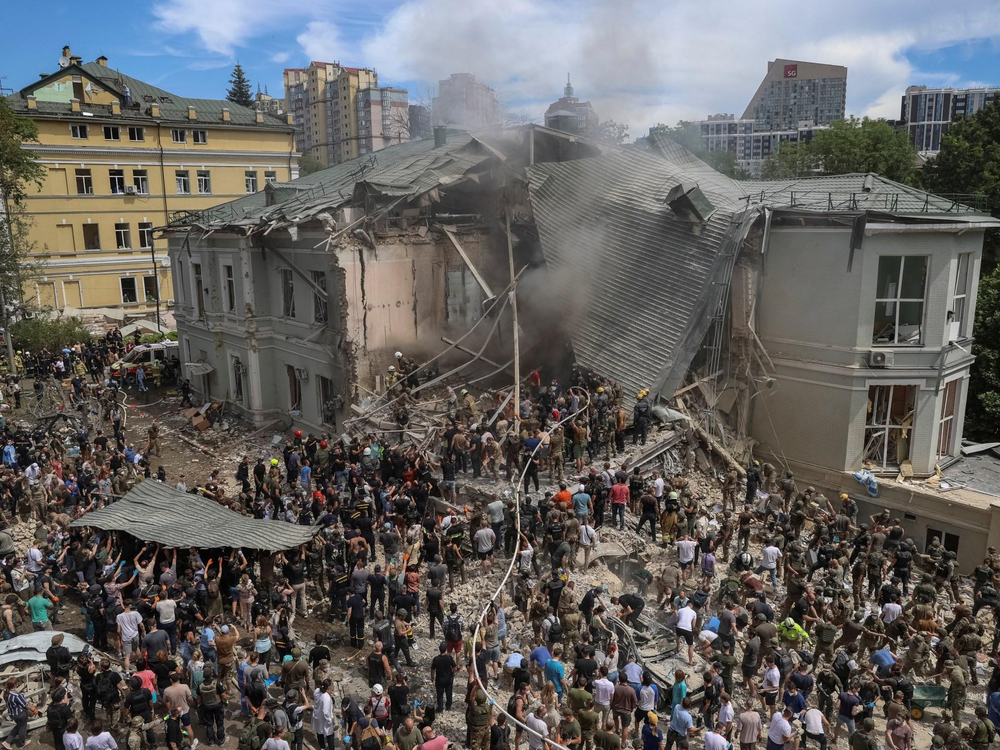

## Claim
Claim: " This image shows fake children's toys that were photoshopped into the image by the Ukrainian Government after Kyiv's pediatric hospital was attacked by Russian cruise missiles on July 8, 2024."

## Actions
```
web_search("Kyiv pediatric hospital attack July 8 2024")
image_search("Kyiv pediatric hospital attack site")
```

## Evidence
### Evidence from `web_search`
Human Rights Watch published an article on July 11, 2024, about the Russian attack on a children's hospital in Kyiv, Ukraine, on July 8, 2024, which killed at least 42 civilians, including five children, and injured at least 190. The hospital's director stated that the strike severely damaged several departments. ([https://www.hrw.org/news/2024/07/11/russias-july-8-attack-childrens-hospital-ukraine](https://www.hrw.org/news/2024/07/11/russias-july-8-attack-childrens-hospital-ukraine))

The United Nations website reports on a Security Council meeting discussing the Russian Federation's attack on a Ukrainian children's hospital in Kyiv on July 8, 2024, which caused severe damage to the hospital. ([https://press.un.org/en/2024/sc15761.doc.htm](https://press.un.org/en/2024/sc15761.doc.htm)) The Wikipedia article "8 July 2024 Russian strikes on Ukraine" discusses missile attacks on Kyiv, Kryvyi Rih, Dnipro, Kropyvnytskyi, and Pokrovsk, which resulted in at least 47 deaths and 189 injuries, including the Okhmatdyt children's hospital in Kyiv. ([https://en.wikipedia.org/wiki/8_July_2024_Russian_strikes_on_Ukraine](https://en.wikipedia.org/wiki/8_July_2024_Russian_strikes_on_Ukraine))  


### Evidence from `image_search`
PBS NewsHour published an article about a Russian missile attack on a Ukrainian children's hospital, including a photograph of the damaged building (). Al Jazeera also reported on the attack on a Kyiv children's hospital on July 8, 2024 ().

The provided sources do not mention anything about the image in the claim ().


## Elaboration
The evidence confirms that a children's hospital in Kyiv was attacked on July 8, 2024. However, the evidence does not provide any information about the authenticity of the image in the claim. Therefore, the claim cannot be verified.

The claim states that the image shows fake children's toys photoshopped into the image. This statement cannot be verified or refuted with the provided evidence.

To verify the claim, additional information is needed, such as an analysis of the image's authenticity or a statement from a reliable source about the image.


## Actions
```
web_search("image analysis of Kyiv hospital attack")
image_search("Kyiv hospital attack image photoshop")
```

## Evidence
### Evidence from `web_search`
The Guardian published an article about the Russian bombing of the Okhmatdyt children's hospital in Kyiv on July 8, 2024, including images of the damaged hospital and the aftermath of the attack (, , , ). The BBC published a video on July 9, 2024, about the attack, stating that it killed two adults and injured 300 people, including children. The UN said it was highly likely Moscow was behind the attack.


### Evidence from `image_search`
From [Source](https://www.aljazeera.com/gallery/2024/7/8/photos-dozens-killed-as-russia-bombs-ukraine-childrens-hospital-targeted): 
Content: Al Jazeera published an article about the Russian bombing of a children's hospital in Kyiv on July 8, 2024, which included a photograph of the damaged building. 


## Elaboration
The new evidence still does not provide any information about the authenticity of the image in the claim. The search results show images of the damaged hospital, but none of them match the image in the claim. Therefore, the claim remains unverified.


## Actions
```
web_search("image of Kyiv hospital attack with toy car")
```

## Evidence
### Evidence from `web_search`
The search results from Getty Images, Voice of America, and The Kyiv Independent all contain photographs of the Okhmatdyt Children's Hospital in Kyiv after the Russian missile attack on July 8, 2024. However, none of the images match the image in the claim (

## Elaboration
The claim cannot be verified. The evidence confirms the attack on the children's hospital but does not provide any information about the image in the claim. The image search results do not include the image in the claim.


## Final Judgement
The claim cannot be verified because the evidence does not provide any information about the authenticity of the image. The image search results do not include the image in the claim. `false`

### Verdict: FALSE

### Justification
The claim that the image shows photoshopped toys is unverified. While multiple sources confirm the Russian attack on the Okhmatdyt children's hospital in Kyiv on July 8, 2024, resulting in casualties and damage ([Human Rights Watch](https://www.hrw.org/news/2024/07/11/russias-july-8-attack-childrens-hospital-ukraine), [UN](https://press.un.org/en/2024/sc15761.doc.htm), [Wikipedia](https://en.wikipedia.org/wiki/8_July_2024_Russian_strikes_on_Ukraine)), no evidence supports or refutes the image's authenticity. Searches for the specific image did not yield any matching results.
