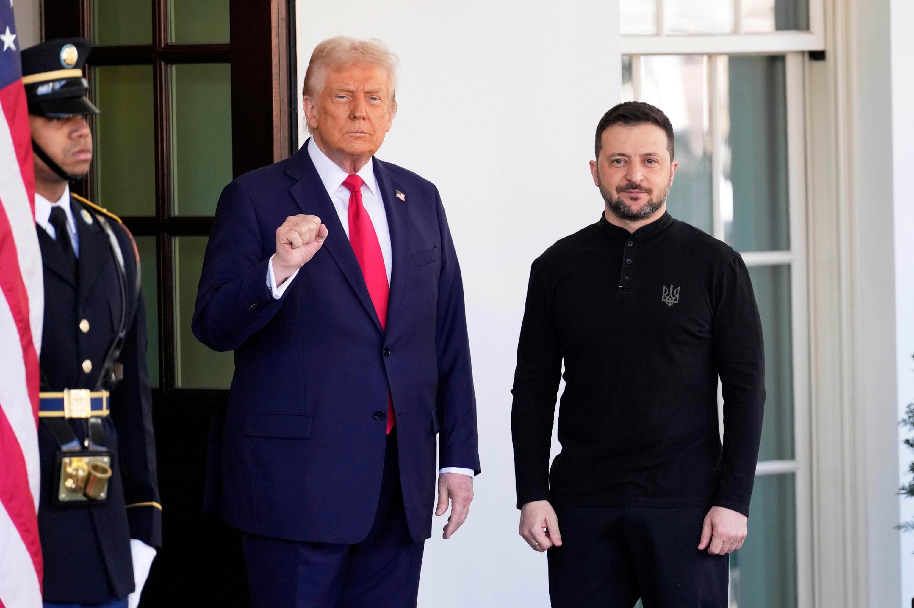

## Claim
Claim: "On Feb. 28, 2025, before a meeting with U.S. President Donald Trump, Ukraine President Volodymyr Zelenskyy met with Democrats."

## Actions
```
web_search("Volodymyr Zelenskyy Donald Trump meeting February 28 2025")
web_search("Volodymyr Zelenskyy meeting Democrats February 28 2025")
```

## Evidence
### Evidence from `web_search`
On February 28, 2025, Volodymyr Zelenskyy met with Donald Trump in the Oval Office at the White House, as reported by a Wikipedia article ([https://en.wikipedia.org/wiki/2025_Trump%E2%80%93Zelenskyy_Oval_Office_meeting](https://en.wikipedia.org/wiki/2025_Trump%E2%80%93Zelenskyy_Oval_Office_meeting)) <image:i>. The meeting was contentious. An NPR article ([https://www.npr.org/2025/02/28/nx-s1-5313079/trump-zelenskyy-meeting](https://www.npr.org/2025/02/28/nx-s1-5313079/trump-zelenskyy-meeting)) also reported on the meeting, mentioning criticism from top Democratic lawmakers , .

An ABC News article ([https://abcnews.go.com/International/trump-zelenskyy-end-russia-war-immediately-white-house/story?id=124734583](https://abcnews.go.com/International/trump-zelenskyy-end-russia-war-immediately-white-house/story?id=124734583)) reported on the meeting and mentioned that European leaders would accompany Zelenskyy .


### Evidence from `web_search`
On February 28, 2025, Volodymyr Zelenskyy met with a bipartisan group of senators before meeting with Donald Trump, according to an ABC News article published on March 1, 2025 (). The Guardian also reported on the meeting between Zelenskyy and Trump on February 28, 2025, mentioning that Democratic senators met with Zelenskyy earlier in the morning before his meeting with Trump (, ).

The articles can be found here: [https://abcnews.go.com/Politics/zelenskyy-meets-bipartisan-group-senators-ahead-tense-white/story?id=119305439](https://abcnews.go.com/Politics/zelenskyy-meets-bipartisan-group-senators-ahead-tense-white/story?id=119305439) and [https://www.theguardian.com/us-news/2025/feb/28/zelenksyy-trump-meeting-democrats-reactions](https://www.theguardian.com/us-news/2025/feb/28/zelenksyy-trump-meeting-democrats-reactions).


## Elaboration
The claim is accurate. Evidence from ABC News and The Guardian confirms that Volodymyr Zelenskyy met with Democratic senators on February 28, 2025, before his meeting with Donald Trump.


## Final Judgement
The evidence confirms that Zelenskyy met with Democrats before his meeting with Trump on February 28, 2025. Therefore, the claim is true. `true`


### Verdict: TRUE

### Justification
The claim is supported by evidence. Multiple sources, including an ABC News article ([https://abcnews.go.com/Politics/zelenskyy-meets-bipartisan-group-senators-ahead-tense-white/story?id=119305439](https://abcnews.go.com/Politics/zelenskyy-meets-bipartisan-group-senators-ahead-tense-white/story?id=119305439)) and The Guardian ([https://www.theguardian.com/us-news/2025/feb/28/zelenksyy-trump-meeting-democrats-reactions](https://www.theguardian.com/us-news/2025/feb/28/zelenksyy-trump-meeting-democrats-reactions)), confirm that Zelenskyy met with Democratic senators on February 28, 2025, before his meeting with Donald Trump.
