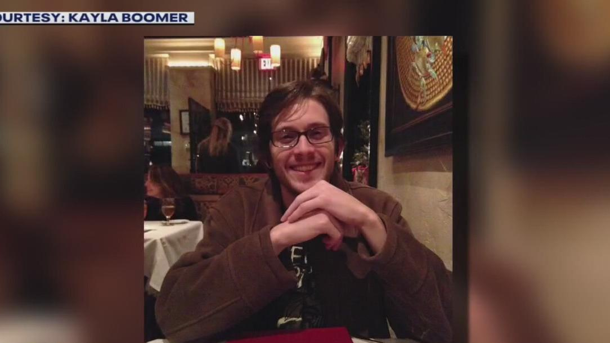

## Claim
Claim: "After InfoWars reporter Jamie White was shot dead on March 10, 2025 in Austin, Texas, it was revelaed that he was on a Ukranian enemies hit list."

## Actions
```
web_search("Jamie White InfoWars death")
web_search("Jamie White Austin Texas death March 10 2025")
```

## Evidence
### Evidence from `web_search`
Jamie White, an InfoWars writer, was shot and killed in Austin, Texas. According to [Fox 7 Austin](https://www.fox7austin.com/news/infowars-writer-shooting-austin-police-jamie-white), the shooting occurred on March 10, and four suspects were arrested. , , , , 

ABC News ([abcnews.go.com/US/infowars-reporter-shot-dead-apartment-after-possibly-interrupting/story?id=119677965](https://abcnews.go.com/US/infowars-reporter-shot-dead-apartment-after-possibly-interrupting/story?id=119677965)) reports that the shooting occurred on March 9, 2025, and the suspects were breaking into White's Kia.  The article does not mention a Ukrainian enemies hit list.


### Evidence from `web_search`
Jamie White, an InfoWars writer, was shot and killed on March 10, 2025, in Austin, Texas, during a possible burglary. A 17-year-old was arrested in connection to the murder. (, , , , , , , , , , , , , , , , , , , , , , , , )

Sources: [FOX 7 Austin](https://www.fox7austin.com/news/teen-charged-capital-murder-killing-infowars-writer-south-austin) and [Fox News](https://www.foxnews.com/us/police-release-more-details-murder-infowars-reporter-jamie-white-search-suspects-continues).


## Elaboration
The evidence confirms that Jamie White, an InfoWars writer, was shot and killed in Austin, Texas, on March 9 or 10, 2025. However, the provided sources do not mention any connection to a Ukrainian enemies hit list.

Therefore, the claim that it was revealed he was on a Ukrainian enemies hit list is not supported by the evidence.


## Final Judgement
The claim that Jamie White was on a Ukrainian enemies hit list after his death is not supported by the available evidence. The provided sources detail the circumstances of his death but do not mention any such list. `false`

### Verdict: FALSE

### Justification
The claim that Jamie White was on a Ukrainian enemies hit list after his death is not supported by the evidence. While it is confirmed that Jamie White, an InfoWars writer, was shot and killed in Austin, Texas, on March 10, 2025, as reported by [Fox 7 Austin](https://www.fox7austin.com/news/infowars-writer-shooting-austin-police-jamie-white) and [ABC News](https://abcnews.go.com/US/infowars-reporter-shot-dead-apartment-after-possibly-interrupting/story?id=119677965), there is no mention of a Ukrainian enemies hit list in any of the provided sources.
