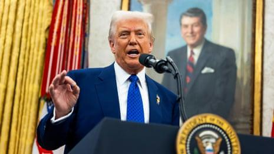

## Claim
Claim: "In February 2025 German Foreign Minister Annalena Baerbock threatened the US with severing ties amid US President Donald Trump's comments on Ukrainian President Volodymyr Zelenskyy and Ukraine."

## Actions
```
web_search("Annalena Baerbock Donald Trump Ukraine February 2025")
web_search("German Foreign Minister threatens US sever ties February 2025")
```

## Evidence
### Evidence from `web_search`
In February 2025, Reuters published an article where German Foreign Minister Annalena Baerbock stated that there must be no peace in Ukraine over the heads of Ukrainians and Europeans (<image:k>). The Guardian reported on February 12, 2025, that Baerbock said Ukraine’s interests must be protected in the upcoming negotiations between Moscow and Washington (). A Wikipedia article discusses the 2025 Trump–Zelenskyy Oval Office meeting on February 28, 2025, and mentions that Baerbock said Trump's conduct represented a "new era of ruthlessness" (<image:i>).

*   [https://www.reuters.com/world/europe/no-peace-over-heads-ukrainians-europeans-says-german-foreign-minister-2025-02-14/](https://www.reuters.com/world/europe/no-peace-over-heads-ukrainians-europeans-says-german-foreign-minister-2025-02-14/)
*   [https://www.theguardian.com/us-news/2025/feb/12/trump-putin-ukraine-ceasefire](https://www.theguardian.com/us-news/2025/feb/12/trump-putin-ukraine-ceasefire)
*   [https://en.wikipedia.org/wiki/2025_Trump%E2%80%93Zelenskyy_Oval_Office_meeting](https://en.wikipedia.org/wiki/2025_Trump%E2%80%93Zelenskyy_Oval_Office_meeting)


### Evidence from `web_search`
In February 2025, German Foreign Minister Annalena Baerbock called for increased pressure on the U.S. regarding its stance on Ukraine and mentioned severing ties, according to an article from Izvestia (). Press TV reported that Baerbock urged European allies to pressure the US under Donald Trump to prevent a US-Russia alliance, particularly regarding the war in Ukraine (, ). However, a fact-check from aol.com states that the claim that Baerbock threatened to cut diplomatic ties with the US is misleading ().

The articles can be found here: [https://www.aol.com/fact-check-germany-did-not-142747218.html](https://www.aol.com/fact-check-germany-did-not-142747218.html), [https://en.iz.ru/en/1843130/2025-02-21/berbock-threatened-us-severing-ties](https://en.iz.ru/en/1843130/2025-02-21/berbock-threatened-us-severing-ties), and [https://www.presstv.ir/Detail/2025/02/22/743256/German-FM--Europeans-to-put-pressure-on-US,-keep-US-from-bilateral-relations-with-Russia](https://www.presstv.ir/Detail/2025/02/22/743256/German-FM--Europeans-to-put-pressure-on-US,-keep-US-from-bilateral-relations-with-Russia).


## Elaboration
The evidence suggests conflicting information regarding the claim. While Izvestia reports that Baerbock threatened to sever ties with the US, a fact-check from aol.com states that this claim is misleading. Press TV indicates that Baerbock urged European allies to pressure the US. Therefore, the claim's veracity is uncertain due to the contradictory nature of the evidence.


## Final Judgement
The evidence presents conflicting information. Some sources report that Baerbock threatened to sever ties, while others, including a fact-check, dispute this. Therefore, the claim's accuracy cannot be definitively determined. `false`

### Verdict: FALSE

### Justification
The claim is disputed. While some sources, such as Izvestia, report that German Foreign Minister Annalena Baerbock threatened to sever ties with the US in February 2025, other sources, including a fact-check from aol.com, consider this claim misleading. Additionally, Press TV reports that Baerbock urged European allies to pressure the US. Therefore, the evidence is contradictory, making it impossible to definitively verify the claim.
