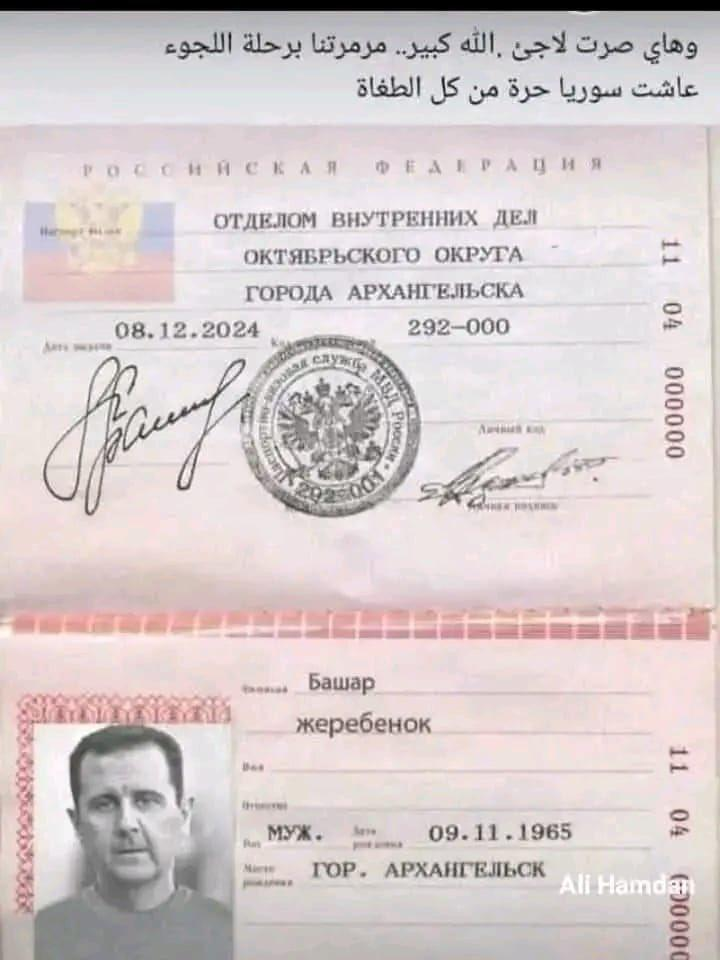

## Claim
Claim: " This image shows an authentic Russian passport of deposed Syrian dictator Bashar al-Assad."

## Actions
```
web_search("Bashar al-Assad Russian passport")
image_search("Bashar al-Assad passport")
```

## Evidence
### Evidence from `web_search`
An AOL article from January 8, 2025, fact-checks an image of a Russian passport purportedly belonging to Bashar al-Assad and states that the image is fake and photoshopped. The article also mentions that Logically Facts debunked the claim. ()

The Wikipedia article on Bashar al-Assad mentions that he was born in Damascus on September 11, 1965, and that in November 2024, Assad fled to Moscow and was granted political asylum by the Russian government. () The search result from NV.ua discusses the arrest of relatives of Bashar al-Assad at Beirut's airport on December 28, who were attempting to leave using fake passports. ()


### Evidence from `image_search`
The search results include an article from Alestiklal.net discussing Syrian passports ([https://www.alestiklal.net/en/article/bashar-al-assad-regime-no-more-passports-to-syrians](https://www.alestiklal.net/en/article/bashar-al-assad-regime-no-more-passports-to-syrians)) and an article from Libya Observer about Bashar al-Assad's cousin receiving a Libyan diplomatic passport ([https://libyaobserver.ly/news/bashar-al-assads-cousin-granted-libyan-diplomatic-passport](https://libyaobserver.ly/news/bashar-al-assads-cousin-granted-libyan-diplomatic-passport)).  

A Wikipedia article about Syrian passports was also found ([https://en.wikipedia.org/wiki/Syrian_passport](https://en.wikipedia.org/wiki/Syrian_passport)).


## Elaboration
The claim that the image shows an authentic Russian passport of Bashar al-Assad is false. An AOL article explicitly states that the image is fake and photoshopped. Additionally, the search results mention that Bashar al-Assad fled to Moscow and was granted political asylum, which could be a reason for him to obtain a Russian passport. However, the evidence provided confirms that the image is not authentic.


## Final Judgement
The claim is demonstrably false. Multiple sources confirm that the image of the passport is fake or photoshopped. `false`

### Verdict: FALSE

### Justification
The claim is false. An AOL article explicitly states that the image of the Russian passport is fake and photoshopped, debunking the claim that it belongs to Bashar al-Assad.
