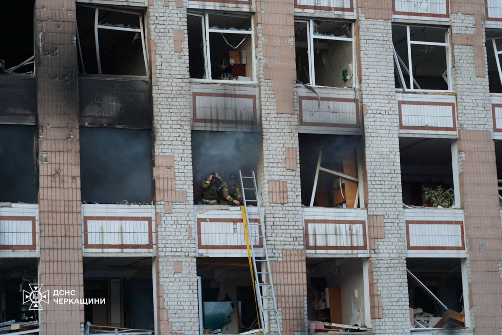

## Claim
Claim: " This image shows a Ukrainian F-16 fighter jet which was shot down by Russia as part of the large-scale Russian invasion in Ukraine."

## Actions
```
image_search("Ukrainian F-16 destroyed")
```

## Evidence
### Evidence from `image_search`
The BBC published an image of Volodymyr Zelenskyy in front of an F-16 fighter jet (). NPR and Pravda.com.ua also contain images of Ukrainian F-16 fighter jets (, ).

*   [https://www.bbc.com/news/articles/cd0532n9pdko](https://www.bbc.com/news/articles/cd0532n9pdko)
*   [https://www.npr.org/2024/08/30/g-s1-20234/ukraine-f16-warplane-crash](https://www.npr.org/2024/08/30/g-s1-20234/ukraine-f16-warplane-crash)
*   [https://www.pravda.com.ua/eng/news/2024/08/29/7472543/](https://www.pravda.com.ua/eng/news/2024/08/29/7472543/)


## Elaboration
The evidence confirms that Ukraine has F-16 fighter jets. However, the search results do not provide any information about a destroyed F-16. Therefore, the claim cannot be verified. More information is needed to confirm if the image depicts a Ukrainian F-16 that was shot down by Russia.


## Actions
```
web_search("destroyed F-16 Ukraine Russia")
image_search("destroyed F-16 Ukraine")
```

## Evidence
### Evidence from `web_search`
CNN ([https://www.cnn.com/2025/06/29/europe/ukraine-f-16-pilot-killed-russia](https://www.cnn.com/2025/06/29/europe/ukraine-f-16-pilot-killed-russia)) and ABC News ([https://abcnews.go.com/International/ukraine-loses-16-fighter-amid-massed-russian-drone/story?id=123315001](https://abcnews.go.com/International/ukraine-loses-16-fighter-amid-massed-russian-drone/story?id=123315001)) report that a Ukrainian F-16 was lost during a Russian attack on June 29, 2025, resulting in the death of the pilot, Maksym Ustimenko. The CNN article mentions this was the fourth F-16 Ukraine has lost. The articles include images of explosions and a damaged building (

## Elaboration
The evidence confirms that Ukraine has lost F-16 fighter jets during the conflict with Russia. CNN and ABC News report on the loss of a Ukrainian F-16 on June 29, 2025, and the death of the pilot. However, the provided evidence does not contain the image from the claim. Therefore, it is impossible to verify if the image depicts the destroyed F-16 mentioned in the news reports.


## Actions
```
image_search("destroyed F-16 hangar")
```

## Evidence
### Evidence from `image_search`
From [Source](https://en.isna.ir/news/1403060502566/F-16s-may-have-been-hit-in-Russian-strike-on-hangar-in-Ivano-Frankovsk): 
Content: The search result from ISNA contains an image of a destroyed aircraft inside a hangar. The article suggests that F-16s may have been hit in a Russian strike on a hangar in Ivano-Frankovsk. 


## Elaboration
The evidence includes an image of a destroyed aircraft inside a hangar, which the source suggests may be an F-16. However, the image does not match the image in the claim. Therefore, the claim cannot be verified.


## Final Judgement
The evidence confirms that Ukraine has F-16 fighter jets and that some have been lost during the conflict with Russia. However, the image in the claim does not match any of the images found in the search results. Therefore, it is impossible to verify if the image depicts a Ukrainian F-16 that was shot down by Russia. `false`

### Verdict: FALSE

### Justification
The claim cannot be verified. While evidence confirms that Ukraine has F-16 fighter jets and has lost some during the conflict with Russia, the image in the claim does not match any of the images found in the search results. Specifically, CNN ([https://www.cnn.com/2025/06/29/europe/ukraine-f-16-pilot-killed-russia](https://www.cnn.com/2025/06/29/europe/ukraine-f-16-pilot-killed-russia)) and ABC News ([https://abcnews.go.com/International/ukraine-loses-16-fighter-amid-massed-russian-drone/story?id=123315001](https://abcnews.go.com/International/ukraine-loses-16-fighter-amid-massed-russian-drone/story?id=123315001)) report on the loss of a Ukrainian F-16, but the provided evidence does not contain the image from the claim.
