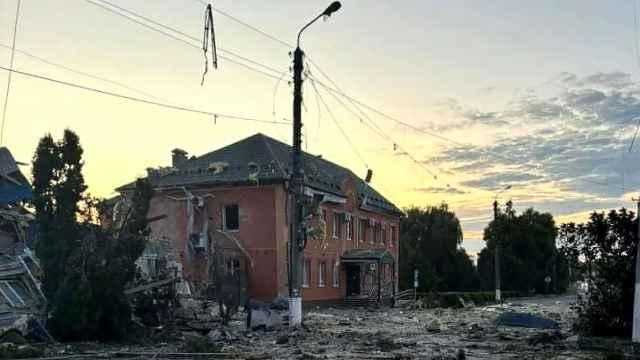
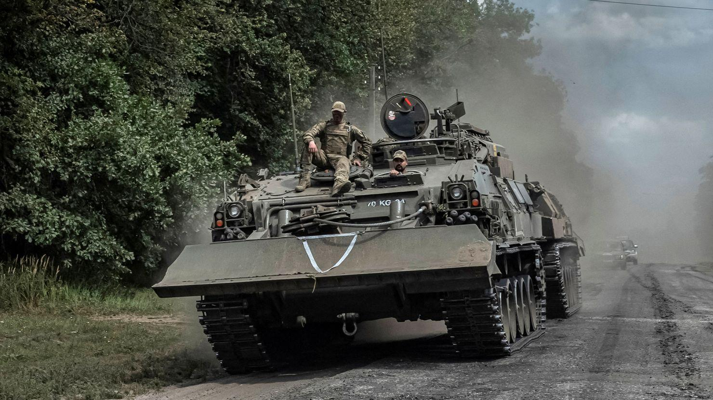

## Claim
Claim: " This image shows Ukrainian President Volodymyr Zelensky arriving in August 2024 in the Sudzha of Kursk region, Russia, which had just been occupied by Ukrainian troops in the Kursk Offensive, and meeting with representatives of the people there."

## Actions
```
web_search("Volodymyr Zelensky Kursk Offensive")
web_search("Volodymyr Zelensky Sudzha Russia")
```

## Evidence
### Evidence from `web_search`
The BBC News article from November 12, 2024, discusses the situation in the Kursk region of Russia, mentioning a statement by Volodymyr Zelensky about the Ukrainian military's incursion and a potential Russian counter-offensive ([https://www.bbc.com/news/articles/c9vn1x23x88o](https://www.bbc.com/news/articles/c9vn1x23x88o)). The Moscow Times reports on the ongoing conflict in the Kursk region, mentioning a shock offensive launched by Kyiv in August 2024 and Zelensky's statement about Ukraine's continued fighting there ([https://www.themoscowtimes.com/2025/04/27/zelensky-says-ukraine-still-fighting-in-russias-kursk-a88884](https://www.themoscowtimes.com/2025/04/27/zelensky-says-ukraine-still-fighting-in-russias-kursk-a88884)). ABC News reports that Zelensky said Ukraine launched a fresh offensive in the Kursk region in January 2025, with Ukrainian troops attacking villages north of Sudzha ([https://abcnews.go.com/International/ukraine-bringing-war-back-russia-zelenskyy-after-new/story?id=117408954](https://abcnews.go.com/International/ukraine-bringing-war-back-russia-zelenskyy-after-new/story?id=117408954)).

The articles mention the Kursk region, the Kursk Offensive, and Sudzha. The BBC News article includes images , . The Moscow Times article includes images , , . The ABC News article includes an image .


### Evidence from `web_search`
According to CNN ([https://www.cnn.com/2024/08/15/europe/kursk-incursion-sudzha-captured-ukraine-intl](https://www.cnn.com/2024/08/15/europe/kursk-incursion-sudzha-captured-ukraine-intl)) and the Associated Press ([https://apnews.com/article/russia-belgorod-state-of-emergency-b7fb57c21a43f0f06bf79a4477eb62e9](https://apnews.com/article/russia-belgorod-state-of-emergency-b7fb57c21a43f0f06bf79a4477eb62e9)), Volodymyr Zelensky stated that Ukrainian forces had taken control of Sudzha, a town in Russia's Kursk region, in August 2024.

Polskie Radio ([https://www.polskieradio.pl/395/9766/artykul/3496996,ukrainian-forces-withdraw-from-sudzha-zelensky-denies-encirclement-in-kursk-region](https://www.polskieradio.pl/395/9766/artykul/3496996,ukrainian-forces-withdraw-from-sudzha-zelensky-denies-encirclement-in-kursk-region)) reports that Ukrainian forces withdrew from certain areas in the Kursk region, and Zelensky denied encirclement, speaking at a press conference in Kyiv on March 12, 2025. 


## Elaboration
The evidence confirms that Ukrainian forces, according to Zelensky, took control of Sudzha in the Kursk region in August 2024 ([https://www.cnn.com/2024/08/15/europe/kursk-incursion-sudzha-captured-ukraine-intl](https://www.cnn.com/2024/08/15/europe/kursk-incursion-sudzha-captured-ukraine-intl)). The evidence also indicates that Ukrainian forces later withdrew from some areas in the Kursk region ([https://www.polskieradio.pl/395/9766/artykul/3496996,ukrainian-forces-withdraw-from-sudzha-zelensky-denies-encirclement-in-kursk-region](https://www.polskieradio.pl/395/9766/artykul/3496996,ukrainian-forces-withdraw-from-sudzha-zelensky-denies-encirclement-in-kursk-region)).

The evidence does not explicitly state that the image shows Zelensky arriving in Sudzha in August 2024 or meeting with representatives there. Therefore, the claim cannot be fully verified.


## Actions
```
image_search("Zelensky Sudzha Kursk August 2024")
```

## Evidence
### Evidence from `image_search`
From [Source](https://www.understandingwar.org/backgrounder/russian-offensive-campaign-assessment-august-23-2024): 
Content: The Institute for the Study of War and Critical Threats published a map showing the Ukrainian incursion into Kursk Oblast as of August 23, 2024, including the location of Sudzha. 


## Elaboration
The image search provides a map from the Institute for the Study of War and Critical Threats, showing the Ukrainian incursion into Kursk Oblast as of August 23, 2024, including the location of Sudzha. This supports the claim that Sudzha was a location of interest during the Kursk Offensive in August 2024. However, the evidence still does not confirm that the image depicts Zelensky in Sudzha in August 2024.


## Actions
```
image_search("Zelensky Kursk region August 2024")
```

## Evidence
### Evidence from `image_search`
From [Source](https://www.cnn.com/2024/11/11/europe/russia-ukraine-kursk-intl): 
Content: CNN published an article about the situation in the Kursk region. The article includes an image of military vehicles. 


## Elaboration
The evidence confirms that the Kursk region and Sudzha were areas of conflict during the Kursk Offensive in August 2024. However, the evidence does not provide any information to verify that the image depicts Zelensky in Sudzha in August 2024. Therefore, the claim remains unverified.


## Final Judgement
The evidence confirms that the Kursk region and Sudzha were areas of conflict during the Kursk Offensive in August 2024. However, the evidence does not provide any information to verify that the image depicts Zelensky in Sudzha in August 2024. Therefore, the claim remains unverified. `false`

### Verdict: FALSE

### Justification
The claim is unverified. While evidence confirms the Kursk region and Sudzha were areas of conflict during the Kursk Offensive in August 2024, the provided evidence does not confirm that the image depicts Volodymyr Zelensky in Sudzha during that time.
