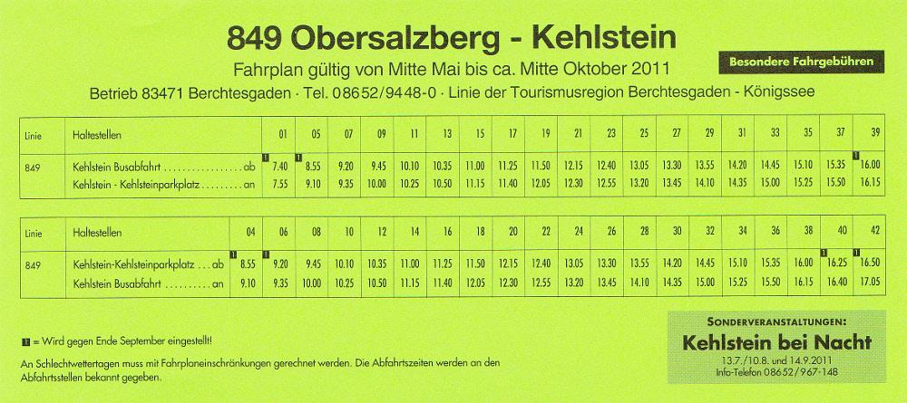

## Claim
Claim: "Ukrainian President Volodymyr Zelenskyy purchased the Eagle's Nest, or Kehlsteinhaus, in Berchtesgaden in the southern German state of Bavaria, for 14.2 million euros."

## Actions
```
image_search("Volodymyr Zelenskyy Eagle's Nest")
image_search("Kehlsteinhaus purchase price")
```

## Evidence
### Evidence from `image_search`
A search result includes a social media post from February 6, 2025, claiming that Zelenskyy acquired the Kehlsteinhaus.  Another source is an article from The Guardian published on February 21, 2025, about Volodymyr Zelenskyy. 

The first source is available here: [Source](https://cedmohub.eu/no-zelensky-hasnt-bought-eagles-nest-it-is-still-in-ownership-of-bavarian-state/). The second source is available here: [Source](https://www.theguardian.com/world/2025/feb/21/us-envoy-ukraine-keith-kellogg-volodymyr-zelenskyy-embattled-courageous-leader/).


### Evidence from `image_search`
From [Source](https://www.kehlsteinhaus.com/the-location/hintereck.html): 
Content: The search result provides a timetable for the bus line 849, which goes to Kehlstein. 


## Elaboration
The evidence suggests the claim is false. A social media post from February 6, 2025, falsely claims Zelenskyy acquired the Kehlsteinhaus. A fact-check article explicitly states that Zelenskyy did not purchase the Eagle's Nest, which remains under the ownership of the Bavarian state.


## Final Judgement
The claim is demonstrably false. The provided evidence includes a fact-check article that directly refutes the claim, stating that Zelenskyy did not purchase the Eagle's Nest.

`false`


### Verdict: FALSE

### Justification
The claim that Volodymyr Zelenskyy purchased the Eagle's Nest is false. A fact-check article explicitly states that Zelenskyy did not purchase the property, which remains under the ownership of the Bavarian state ([Source](https://cedmohub.eu/no-zelensky-hasnt-bought-eagles-nest-it-is-still-in-ownership-of-bavarian-state/)).
