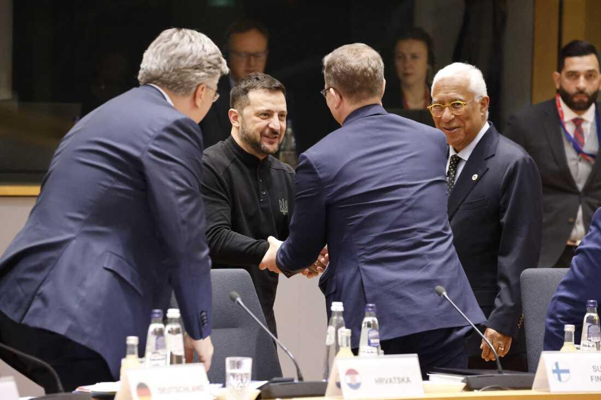

## Claim
Claim: " This is an authentic image of world leaders taking off their suits to symbolically support Ukraine at the London summit on Ukraine on March 2, 2025."

## Actions
```
reverse_search()
```

## Evidence
No new evidence found.

## Elaboration
There is no new evidence to analyze the claim.


## Actions
```
image_search("London summit Ukraine March 2 2025")
image_search("European leaders support Ukraine")
```

## Evidence
### Evidence from `image_search`
Al Jazeera ([Source](https://www.aljazeera.com/news/2025/3/2/european-leaders-gather-in-london-to-strengthen-support-for-ukraine)) published an article about the London summit on Ukraine on March 2, 2025, which includes a photograph of European leaders.  ABC News ([Source](https://abcnews.go.com/International/zelenskyy-set-european-summit-london-after-trump-showdown/story?id=119338966)) also published an article about the London summit on Ukraine, which includes a photograph of the summit. 


### Evidence from `image_search`
Reuters published an image of European leaders posing with Volodymyr Zelenskyy (). NPR published an article about the European Union summit on Ukraine, including an image of Zelenskyy shaking hands with other leaders ().

The sources are: [https://www.reuters.com/world/europe/uks-starmer-tries-revive-hope-ukraine-peace-summit-2025-03-01/](https://www.reuters.com/world/europe/uks-starmer-tries-revive-hope-ukraine-peace-summit-2025-03-01/) and [https://www.npr.org/2025/03/06/nx-s1-5318674/ukraine-russia-european-union-summit-trump](https://www.npr.org/2025/03/06/nx-s1-5318674/ukraine-russia-european-union-summit-trump).


## Elaboration
The provided evidence includes images from the London summit on Ukraine on March 2, 2025. However, none of the images show European leaders taking off their suits. Therefore, the claim is not supported by the evidence.

Insufficient information is available to verify the claim.


## Final Judgement
The search results from the image search do not show the leaders taking off their suits. The images from the summit show the leaders wearing suits. Therefore, the claim is not supported by the evidence.

`false`

### Verdict: FALSE

### Justification
The claim that European leaders took off their suits to support Ukraine at the London summit on March 2, 2025, is not supported by the evidence. While the summit did take place, images from the event, as reported by sources like Al Jazeera and ABC News, show the leaders wearing suits, and no evidence suggests they removed them.
