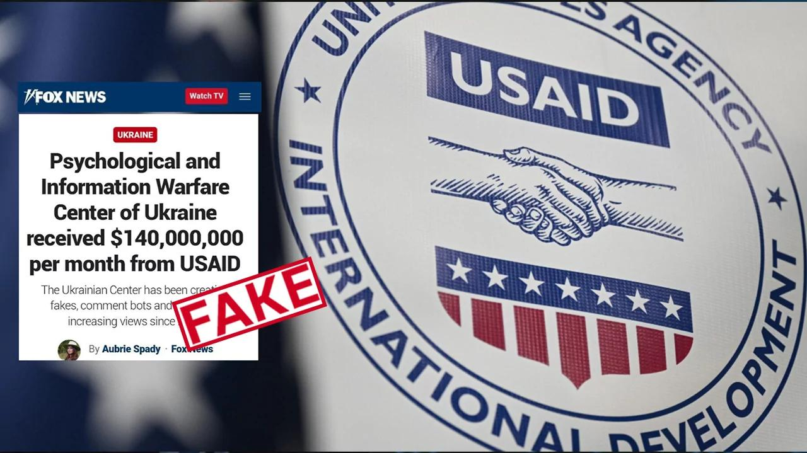

## Claim
Claim: " This image shows a screenshot of an authentic Fox News article with the title 'Psychological and Information Warfare Center of Ukraine received $140,000,000 per month from USAID'."

## Actions
```
reverse_search()
```

## Evidence
No new evidence found.

## Elaboration
The image is a screenshot of a Fox News article. The article's title is "Psychological and Information Warfare Center of Ukraine received $140,000,000 per month from USAID." The article claims that the Ukrainian Center has been creating fakes, comment bots, and artificially increasing views since 2022.


## Actions
```
image_search("Fox News Ukraine USAID information warfare")
```

## Evidence
### Evidence from `image_search`
Gwara Media debunks the claim that Fox News wrote an article about Ukraine's Center for Information Operations receiving $140 million per month from USAID. The image  has the word "FAKE" superimposed on it. Another search result is a Fox News article that includes an image of a Fox News broadcast .

Relevant URLs: [https://gwaramedia.com/en/debunking-russian-fakes-no-fox-news-didnt-write-about-ukraines-center-for-information-operations-receiving-140m-per-month-from-the-usaid/](https://gwaramedia.com/en/debunking-russian-fakes-no-fox-news-didnt-write-about-ukraines-center-for-information-operations-receiving-140m-per-month-from-the-usaid/) and [https://www.foxnews.com/world/senators-urge-usaid-hurry-distribute-congressionally-approved-aid-global-food-crisis](https://www.foxnews.com/world/senators-urge-usaid-hurry-distribute-congressionally-approved-aid-global-food-crisis).


## Elaboration
The claim is false. Gwara Media debunked the claim that Fox News wrote an article about Ukraine's Center for Information Operations receiving $140 million per month from USAID. The image of the article has the word "FAKE" superimposed on it.


## Final Judgement
The image in the claim is a screenshot of a Fox News article. However, the article is fake, as confirmed by Gwara Media. The image has the word "FAKE" superimposed on it. Therefore, the claim is not factually accurate. `false`

### Verdict: FALSE

### Justification
The claim is false. The image is a screenshot of a fabricated Fox News article, as debunked by [Gwara Media](https://gwaramedia.com/en/debunking-russian-fakes-no-fox-news-didnt-write-about-ukraines-center-for-information-operations-receiving-140m-per-month-from-the-usaid/). The image itself has the word "FAKE" superimposed on it.
