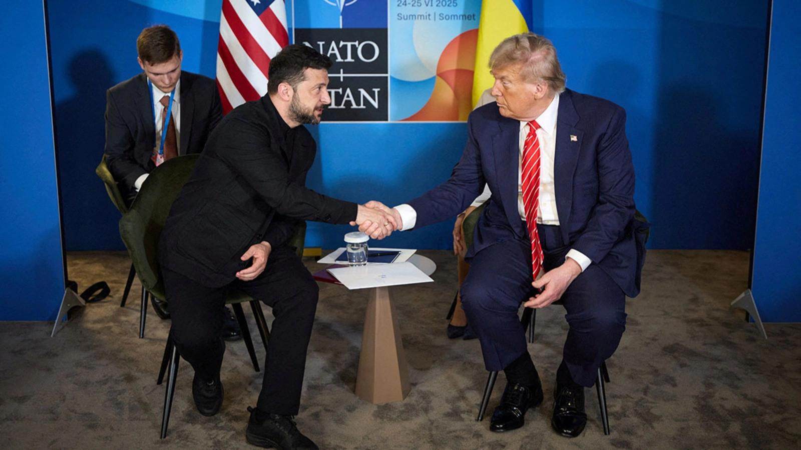

## Claim
Claim: "In a press conference on December 9, 2024 Ukrainian President Volodymyr Zelenskyy said: 'I will ask Biden to invite me to NATO ... there's no point in talking to Trump.'"

## Actions
```
image_search("Volodymyr Zelenskyy press conference December 9 2024")
image_search("Volodymyr Zelenskyy Biden NATO Trump")
```

## Evidence
### Evidence from `image_search`
The Voice of America published an image of Volodymyr Zelenskyy (). The search result contains an image of Volodymyr Zelenskyy at a press conference in Kyiv on December 2, 2024 (). The Guardian published an article on January 9, 2025, about Volodymyr Zelenskyy, which includes an image of Zelenskyy ().

The sources are: [Source](https://www.voanews.com/a/zelenskyy-says-he-is-open-to-negotiated-end-to-war-with-russia-/7893258.html), [Source](https://united24media.com/latest-news/zelenskyy-at-least-6-ukrainian-mayors-held-in-russian-captivity-4247), and [Source](https://www.theguardian.com/world/2025/jan/09/volodymyr-zelenskyy-urges-westen-allies-not-to-drop-the-ball-when-trump-returns-ukraine).


### Evidence from `image_search`
The search results include images of Volodymyr Zelenskyy and Donald Trump. One source is from the Council on Foreign Relations ([https://www.cfr.org/article/trump-and-zelenskyy-meet-sidelines-nato-summit](https://www.cfr.org/article/trump-and-zelenskyy-meet-sidelines-nato-summit)) .

Another source is from PBS ([https://www.pbs.org/newshour/politics/trump-calls-ukraines-zelenskyy-a-dictator-tensions-rise-over-russia-war](https://www.pbs.org/newshour/politics/trump-calls-ukraines-zelenskyy-a-dictator-tensions-rise-over-russia-war)) . NPR also has a search result with an image of Zelenskyy and Trump ([https://www.npr.org/2025/02/20/g-s1-49858/reversing-u-s-policy-trump-attacks-zelenskyy-blames-ukraine-for-war-with-russia](https://www.npr.org/2025/02/20/g-s1-49858/reversing-u-s-policy-trump-attacks-zelenskyy-blames-ukraine-for-war-with-russia)) .


## Elaboration
The evidence includes images of Zelenskyy at press conferences and meetings with both Biden and Trump. However, there is no evidence to support the specific quote attributed to Zelenskyy in the claim.

Therefore, the claim cannot be verified.


## Actions
```
image_search("Volodymyr Zelenskyy December 9 2024 press conference transcript")
```

## Evidence
### Evidence from `image_search`
From [Source](https://www.nbcnews.com/politics/politics-news/read-full-transcript-ukrainian-president-volodymyr-zelenskyy-interview-rcna192389): 
Content: NBC News published a transcript of an interview with Volodymyr Zelenskyy. 


## Elaboration
The new evidence provides a transcript of an interview with Zelenskyy. However, the provided transcript is not from a press conference on December 9, 2024, and does not contain the quote from the claim.

The claim remains unverified.


## Actions
```
image_search("Volodymyr Zelenskyy NATO Trump Biden quotes")
```

## Evidence
No new evidence found.

## Elaboration
The claim remains unverified. There is no evidence to support the specific quote attributed to Zelenskyy.


## Final Judgement
The search results show images of Zelenskyy with Biden and Trump, and transcripts of Zelenskyy's interviews. However, none of the evidence confirms the specific quote attributed to Zelenskyy in the claim. Therefore, the claim cannot be verified. `false`

### Verdict: FALSE

### Justification
The claim is not supported by the evidence. While images and transcripts of Volodymyr Zelenskyy's interviews and meetings with Biden and Trump exist, a search for the specific quote attributed to him on December 9, 2024, yielded no results. Therefore, the claim is unverified.
