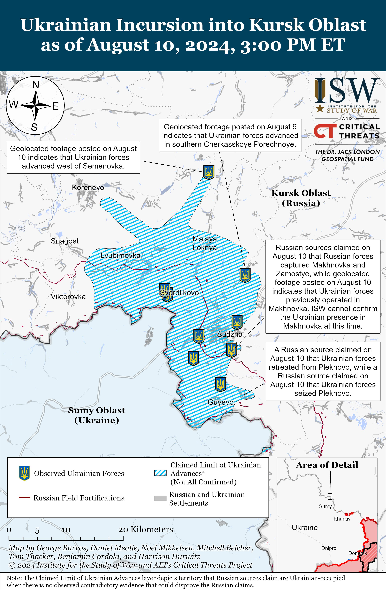
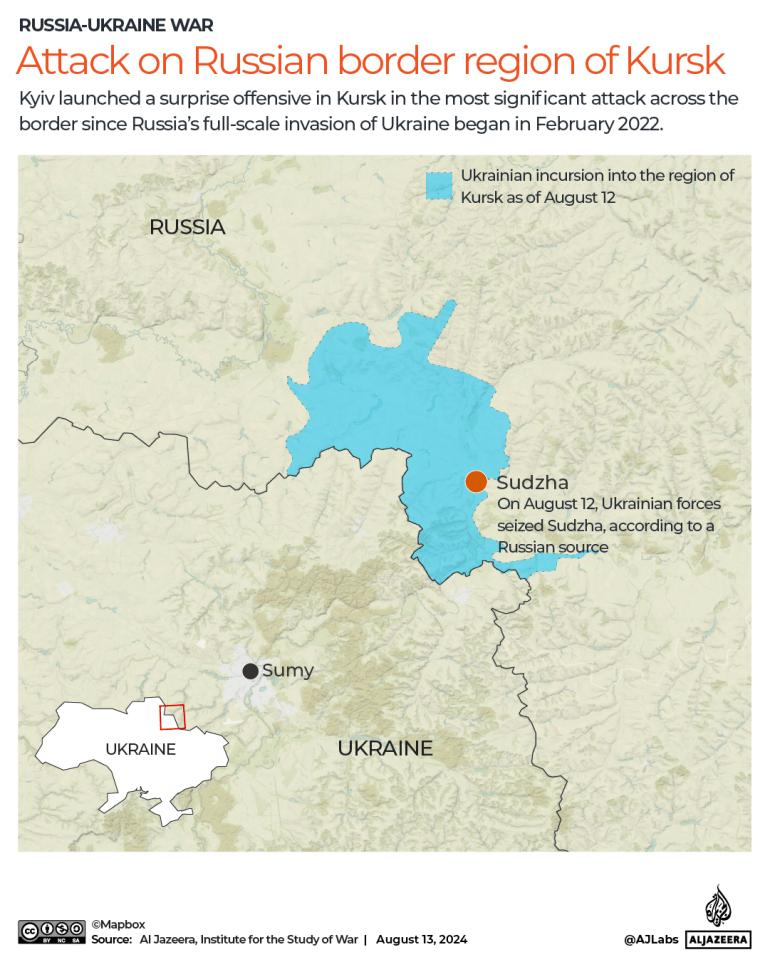
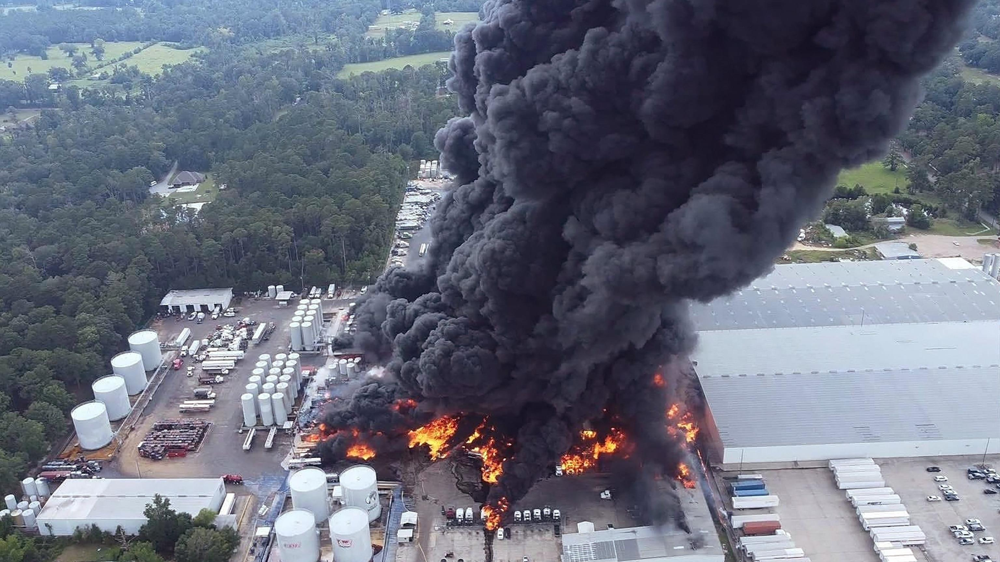
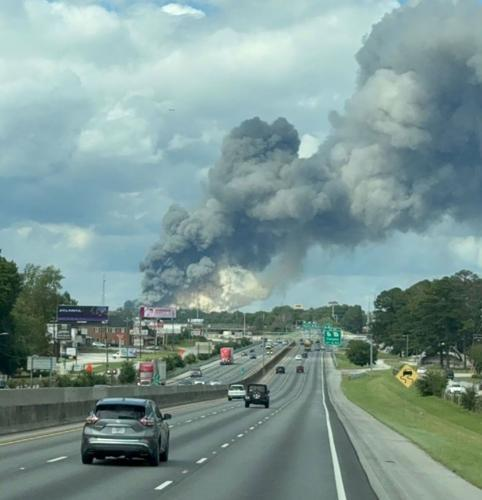
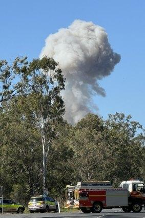
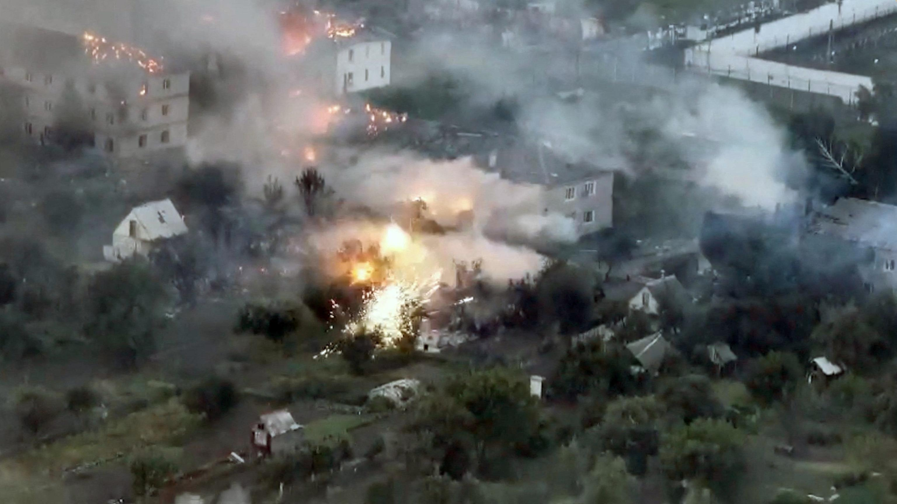

## Claim
Claim: " This image shows a chemical attack by the Armed Forces of Ukraine during the Kursk offensive in August 2024."

## Actions
```
reverse_search()
image_search("chemical attack Kursk offensive August 2024")
geolocate()
```

## Evidence
### Evidence from `image_search`
The Institute for the Study of War (ISW) published a map of the Ukrainian incursion into Kursk Oblast as of August 10, 2024, which indicates the Ukrainian forces advanced west of Semenovka. ([https://www.understandingwar.org/backgrounder/russian-offensive-campaign-assessment-august-10-2024](https://www.understandingwar.org/backgrounder/russian-offensive-campaign-assessment-august-10-2024)) 

Al Jazeera published an article on August 13, 2024, about the attack on the Russian border region of Kursk, mentioning a surprise offensive in Kursk by Kyiv. ([https://www.aljazeera.com/news/liveblog/2024/8/13/russia-ukraine-live-news-russia-hits-back-at-ukrainian-forces-in-kursk](https://www.aljazeera.com/news/liveblog/2024/8/13/russia-ukraine-live-news-russia-hits-back-at-ukrainian-forces-in-kursk)) 


### Evidence from `geolocate`
The most likely countries where the image was taken are: {'Palestine': 0.27, 'Jordan': 0.13, 'Ukraine': 0.08, 'Israel': 0.05, 'Argentina': 0.03, 'Kyrgyzstan': 0.03, 'Lesotho': 0.03, 'Mexico': 0.03, 'Pakistan': 0.03, 'Russia': 0.03}

## Elaboration
The evidence indicates that there was an offensive in the Kursk region in August 2024, with Ukrainian forces advancing. The image search results do not provide any information about a chemical attack. The geolocation of the image is inconclusive, with Russia being one of the possible locations.

Based on the available evidence, it is impossible to verify the claim that the image shows a chemical attack by the Armed Forces of Ukraine during the Kursk offensive in August 2024. More information is needed to confirm the nature of the attack and the involvement of the Ukrainian forces.


## Actions
```
image_search("chemical explosion road")
```

## Evidence
### Evidence from `image_search`
The search results include images of explosions and fires. ABC News shows an image of an explosion in Louisiana (), while WAAY TV shows a fire at a Georgia chemical plant (). The Brisbane Times reported on a trailer of chemicals exploding after a crash on the Bruce Highway on August 30, 2024 ().


## Elaboration
The new evidence provides additional examples of explosions, including one involving chemicals on a highway. However, none of the new evidence supports the claim about the image depicting a chemical attack by the Armed Forces of Ukraine during the Kursk offensive in August 2024. The search results do not provide any information about the specific event in the image.

Therefore, the claim remains unverified due to a lack of supporting evidence.


## Actions
```
image_search("chemical explosion Kursk offensive")
```

## Evidence
### Evidence from `image_search`
From [Source](https://abcnews.go.com/Politics/us-concerned-ukraines-kursk-assault-russia-prepares-counterattack/story?id=113022137): 
Content: ABC News published an article about the Kursk offensive, including an image of an explosion. 


## Elaboration
The new evidence from ABC News shows an image of an explosion related to the Kursk offensive. However, the image does not match the one in the claim. The new evidence does not provide any information about a chemical attack.

The claim remains unverified.


## Final Judgement
The evidence indicates that there was an offensive in the Kursk region in August 2024, but there is no evidence to support the claim that the image shows a chemical attack by the Armed Forces of Ukraine. The image search results do not provide any information about a chemical attack. The geolocation of the image is inconclusive.

`false`

### Verdict: FALSE

### Justification
The claim is not supported by the evidence. While there was an offensive in the Kursk region in August 2024, as reported by the [Institute for the Study of War](https://www.understandingwar.org/backgrounder/russian-offensive-campaign-assessment-august-10-2024) and [Al Jazeera](https://www.aljazeera.com/news/liveblog/2024/8/13/russia-ukraine-live-news-russia-hits-back-at-ukrainian-forces-in-kursk), there is no evidence to suggest that the image depicts a chemical attack by Ukrainian forces.
