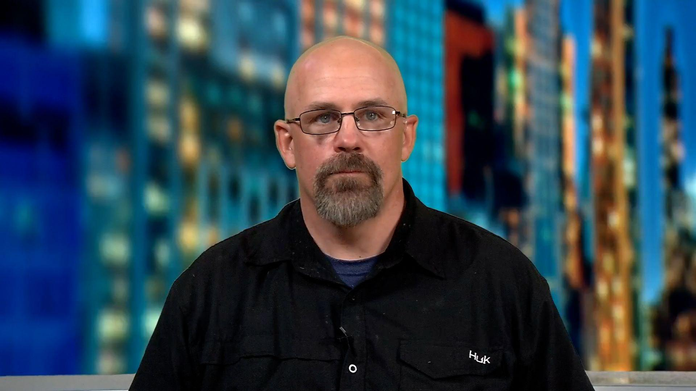
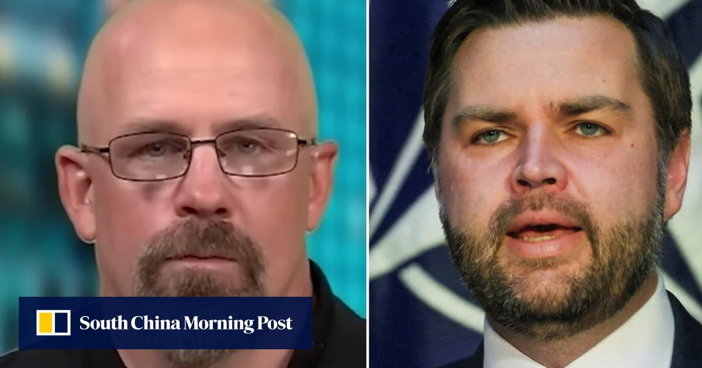
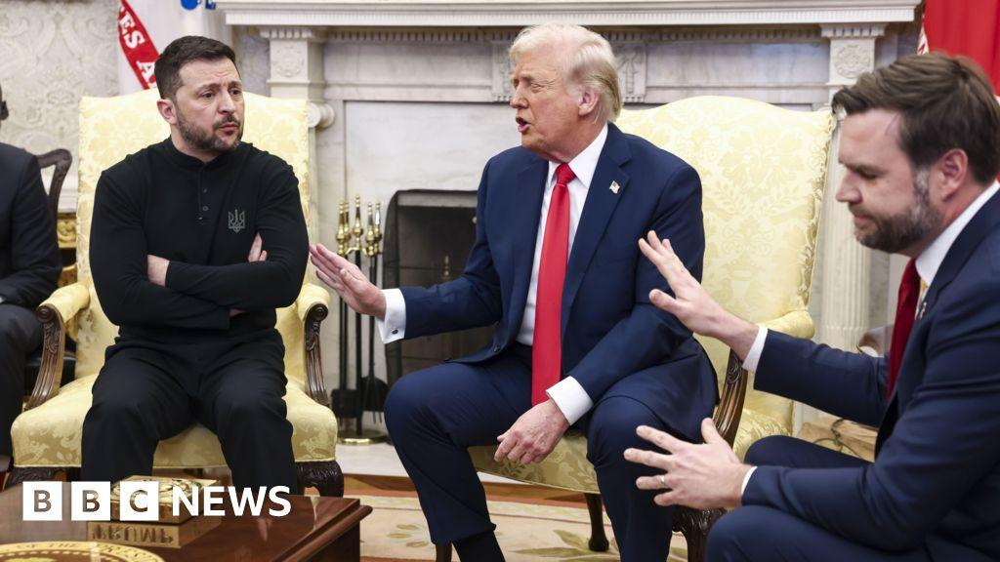
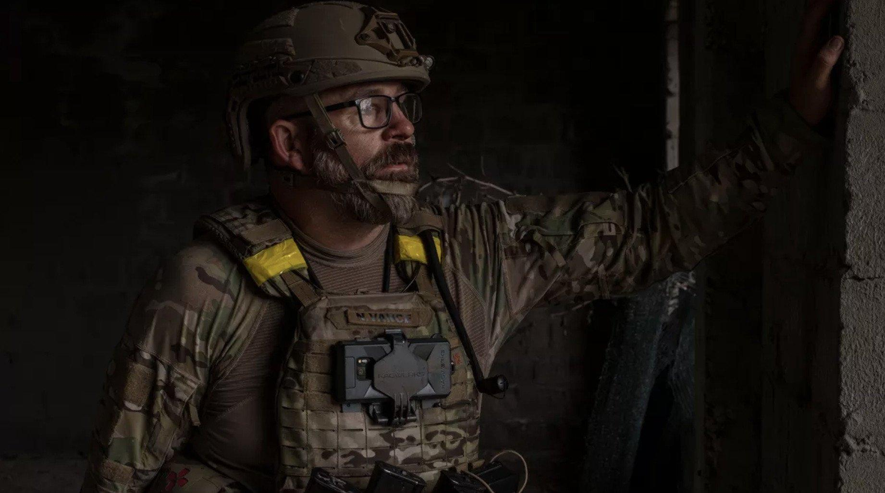
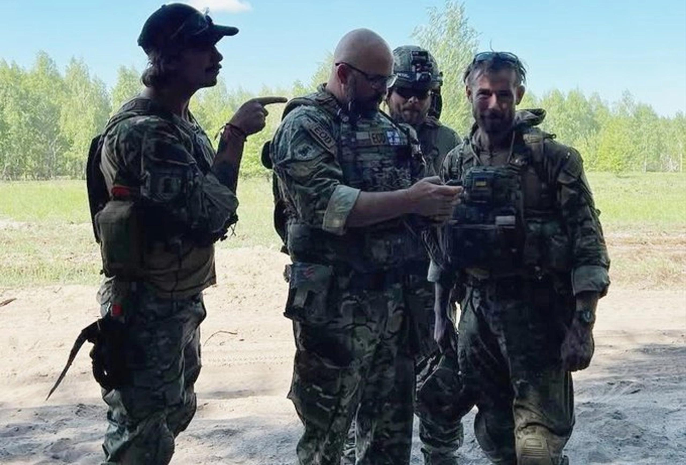
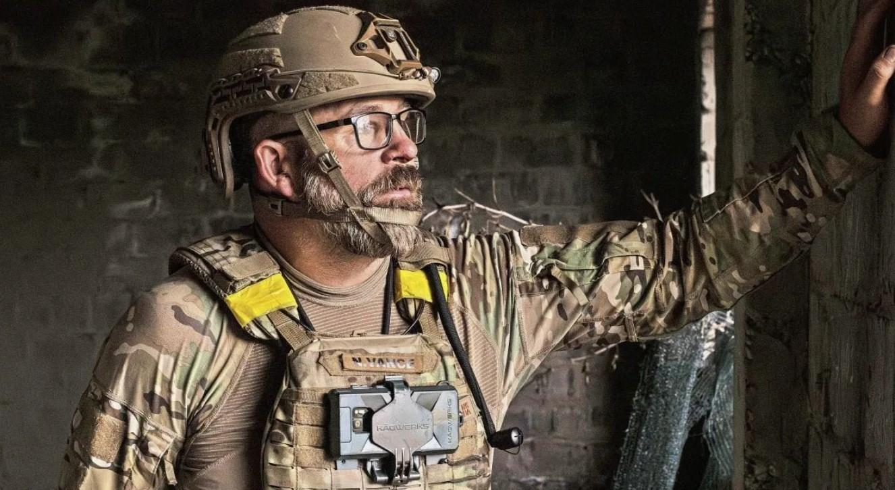

## Claim
Claim: "U.S. Vice President JD Vance's cousin Nate Vance fought in Ukraine for three years during its war with Russia."

## Actions
```
image_search("JD Vance cousin Nate Vance Ukraine war")
```

## Evidence
### Evidence from `image_search`
CNN published an image of Nate Vance (). The South China Morning Post published an article about Nate Vance, the cousin of U.S. Vice President J.D. Vance ().

The BBC News shows an image of Donald Trump, Volodymyr Zelenskyy, and JD Vance ().


## Elaboration
The evidence confirms that Nate Vance is the cousin of U.S. Vice President J.D. Vance. However, the provided evidence does not contain any information about Nate Vance fighting in Ukraine for three years.

Therefore, the claim cannot be verified with the available information.


## Actions
```
image_search("Nate Vance Ukraine war")
image_search("Nate Vance military service Ukraine")
```

## Evidence
### Evidence from `image_search`
From [Source](https://united24media.com/latest-news/jd-vances-cousin-a-us-marine-veteran-fighting-in-ukraine-speaks-out-on-us-aid-6574): 
Content: United24media.com published an image of Nate Vance in military uniform. 


### Evidence from `image_search`
Kyiv Post published an image of Nate Vance in Ukraine (). SOFREP published an article about Nate Vance, the cousin of the U.S. Vice President, and his experience in the Ukraine war, along with an image of him in military gear ().


## Elaboration
The new evidence confirms that Nate Vance, the cousin of U.S. Vice President J.D. Vance, has been involved in the war in Ukraine. Images from United24media.com, Kyiv Post, and SOFREP show Nate Vance in military uniform and in Ukraine. However, the evidence does not specify the duration of his involvement.

Therefore, the claim that Nate Vance fought in Ukraine for three years cannot be verified with the available information.


## Actions
```
image_search("Nate Vance Ukraine war duration")
```

## Evidence
No new evidence found.

## Elaboration
The evidence confirms that Nate Vance, the cousin of U.S. Vice President J.D. Vance, fought in the war in Ukraine. However, there is no information about the duration of his involvement.

Therefore, the claim that Nate Vance fought in Ukraine for three years cannot be verified.


## Final Judgement
The evidence confirms that Nate Vance, the cousin of U.S. Vice President J.D. Vance, fought in the war in Ukraine. However, the duration of his involvement is not specified in the available evidence. Therefore, the claim that Nate Vance fought in Ukraine for three years cannot be verified. `false`

### Verdict: FALSE

### Justification
The claim that U.S. Vice President J.D. Vance's cousin, Nate Vance, fought in Ukraine for three years cannot be verified. While evidence from sources like the [Kyiv Post](https://kyivpost.com/) and [SOFREP](https://sofrep.com/) confirms Nate Vance's involvement in the war in Ukraine, the provided information does not specify the duration of his service.
