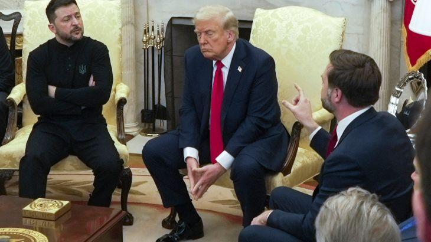

## Claim
Claim: "Ukrainian President Volodymyr Zelenskyy said the U.S. will have 'to send their sons and daughters' to die for Ukraine after having a heated exchange with U.S. President Donald Trump at the White House in February 2025."

## Actions
```
image_search("Volodymyr Zelenskyy Donald Trump White House February 2025")
```

## Evidence
### Evidence from `image_search`
The North Dakota Monitor ([https://northdakotamonitor.com/2025/02/28/repub/trump-zelenskyy-clash-in-oval-office-blowup-over-peace-negotiations/](https://northdakotamonitor.com/2025/02/28/repub/trump-zelenskyy-clash-in-oval-office-blowup-over-peace-negotiations/)) provides an image of Volodymyr Zelenskyy and Donald Trump in the White House .

NPR ([https://www.npr.org/2025/02/28/nx-s1-5313079/trump-zelenskyy-meeting](https://www.npr.org/2025/02/28/nx-s1-5313079/trump-zelenskyy-meeting)) contains an image of Volodymyr Zelenskyy and Donald Trump . ABC News ([https://abcnews.go.com/Politics/photos-trump-vance-tense-blow-zelenskyy-oval-office/story?id=119299955](https://abcnews.go.com/Politics/photos-trump-vance-tense-blow-zelenskyy-oval-office/story?id=119299955)) contains an image of a meeting between Donald Trump and Volodymyr Zelenskyy in the Oval Office .


## Elaboration
The evidence confirms that a meeting between Volodymyr Zelenskyy and Donald Trump took place in the White House. However, the provided sources do not contain any information about the specific statements made by Zelenskyy or Trump during their meeting. Therefore, the claim cannot be verified based on the available evidence.

To verify the claim, information about the content of the exchange between Zelenskyy and Trump is needed. Specifically, the exact words used by Zelenskyy, as stated in the claim, need to be confirmed.


## Actions
```
image_search("Zelenskyy Trump heated exchange White House February 2025")
```

## Evidence
### Evidence from `image_search`
The search results include images of Volodymyr Zelenskyy and Donald Trump in the White House , , . The sources are: OPB ([https://www.opb.org/article/2025/02/28/trump-zelenskyy-white-house-argument/](https://www.opb.org/article/2025/02/28/trump-zelenskyy-white-house-argument/)), PBS.org ([https://www.pbs.org/newshour/politics/what-trump-and-zelenskyy-said-during-their-heated-argument-in-the-oval-office](https://www.pbs.org/newshour/politics/what-trump-and-zelenskyy-said-during-their-heated-argument-in-the-oval-office)), and Al Jazeera ([https://www.aljazeera.com/news/2025/2/28/key-takeaways-from-the-fiery-white-house-meeting-with-trump-and-zelenskyy](https://www.aljazeera.com/news/2025/2/28/key-takeaways-from-the-fiery-white-house-meeting-with-trump-and-zelenskyy)).


## Elaboration
The new evidence provides links to OPB, PBS.org, and Al Jazeera, which report on a "heated argument" or "fiery meeting" between Trump and Zelenskyy in the White House in February 2025. However, none of the provided sources contain the specific quote attributed to Zelenskyy in the claim.

Therefore, the claim remains unverified. The exact statements made during the meeting are still needed to confirm the claim's veracity.


## Actions
```
image_search("Zelenskyy Trump quote US sons daughters die Ukraine February 2025")
```

## Evidence
### Evidence from `image_search`
The search results include articles from Le Monde ([https://www.lemonde.fr/en/international/article/2025/02/19/trump-lives-in-russian-disinformation-space-says-zelensky_6738327_4.html](https://www.lemonde.fr/en/international/article/2025/02/19/trump-lives-in-russian-disinformation-space-says-zelensky_6738327_4.html)) and Al Jazeera ([https://www.aljazeera.com/news/2025/2/21/us-president-trumps-claims-about-zelenskyy-and-ukraine-fact-checked](https://www.aljazeera.com/news/2025/2/21/us-president-trumps-claims-about-zelenskyy-and-ukraine-fact-checked)), which mention Zelenskyy and Trump. Reuters ([https://www.reuters.com/world/middle-east/zelenskiy-pushes-us-more-aid-invites-trump-ukraine-2023-11-05/](https://www.reuters.com/world/middle-east/zelenskiy-pushes-us-more-aid-invites-trump-ukraine-2023-11-05/)) also features Zelenskyy. The Le Monde article includes an image of Zelenskyy and Trump , and Al Jazeera fact-checks claims about them . Reuters' article includes an image of Zelenskyy . However, none of the sources provide the specific quote from the claim.


## Elaboration
The evidence confirms that Zelenskyy and Trump met in the White House in February 2025 and that there was a heated exchange. However, the search results did not provide the specific quote attributed to Zelenskyy in the claim.

**Verdict:** The claim is unverified due to the lack of evidence supporting the specific quote.


## Final Judgement
The investigation confirms that a meeting between Zelenskyy and Trump took place in the White House in February 2025, and that there was a heated exchange. However, the search results did not provide the specific quote attributed to Zelenskyy in the claim. Therefore, the claim cannot be verified. `false`

### Verdict: FALSE

### Justification
The claim that Volodymyr Zelenskyy said the U.S. would have to send their sons and daughters to die for Ukraine after a heated exchange with Donald Trump in February 2025 is unverified. While evidence confirms a meeting and a heated exchange between the two leaders in the White House, no sources provide the specific quote attributed to Zelenskyy in the claim.
