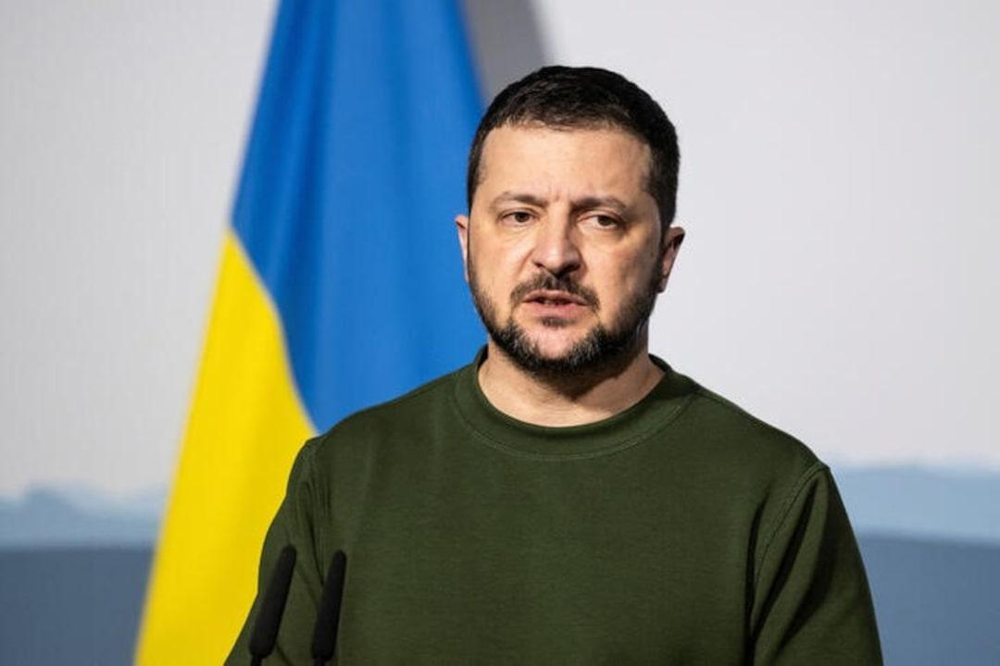

## Claim
Claim: "Ukrainian President Volodymyr Zelenskyy owns 15 homes including a $35 million home in Florida, has $1.2 billion in an overseas bank account, owns 15 homes, three private planes and has a monthly income of $11 million."

## Actions
```
image_search("Volodymyr Zelenskyy Florida home")
image_search("Volodymyr Zelenskyy bank account")
image_search("Volodymyr Zelenskyy private planes")
image_search("Volodymyr Zelenskyy income")
```

## Evidence
### Evidence from `image_search`
The first source, from [Business Wire](https://www.businesswire.com/news/home/20240219354828/en/Florida-Oceanfront-Mansion-Not-Purchased-by-Ukraines-Zelenskyy-Heads-to-Luxury-Auction), has no content. The second source, from [Reuters](https://www.reuters.com/article/world/exclusive-wife-of-ukraine-president-elect-got-penthouse-bargain-from-tycoon-idUSKCN1S81TE/), contains an image of a building . The third source, from [Yahoo](https://www.yahoo.com/lifestyle/oceanfront-florida-mansion-whose-ownership-184443105.html), contains images of a Florida mansion .


### Evidence from `image_search`
The search results include an article from [aa.com.tr](https://www.aa.com.tr/en/russia-ukraine-war/ukrainian-president-urges-swiss-government-to-freeze-bank-accounts-of-russian-oligarchs/2540426) with no content. PBS NewsHour has an image of Volodymyr Zelenskyy (). Al Jazeera published an article about Volodymyr Zelenskyy ().


### Evidence from `image_search`
The search results include images of Volodymyr Zelenskyy near planes. One image from ABC News shows Zelenskyy arriving in the United States on a plane (), and another from ABC News Australia shows Zelenskyy near a plane (). Sky News shows a plane landing in the UK, possibly belonging to Zelenskyy ().

The sources are: [https://abcnews.go.com/Politics/zelenskyys-trip-washington-treated-mini-state-visit-sources/story?id=95658338](https://abcnews.go.com/Politics/zelenskyys-trip-washington-treated-mini-state-visit-sources/story?id=95658338), [https://www.abc.net.au/news/2023-05-14/ukraine-zelenskyy-makes-surprise-paris-visit-talks-with-macron/102344976](https://www.abc.net.au/news/2023-05-14/ukraine-zelenskyy-makes-surprise-paris-visit-talks-with-macron/102344976), and [https://news.sky.com/video/volodymyr-zelenskyys-plane-lands-in-uk-ahead-of-major-summit-in-london-13319190](https://news.sky.com/video/volodymyr-zelenskyys-plane-lands-in-uk-ahead-of-major-summit-in-london-13319190).


### Evidence from `image_search`
From [Source](https://www.reuters.com/world/europe/ukraines-zelenskiy-publishes-income-part-transparency-drive-2024-01-28/): 
Content: Reuters published an article on January 28, 2024, about Volodymyr Zelenskyy publishing his income as part of a transparency drive. The article includes an image of Zelenskyy. 


## Elaboration
The evidence provides some information about Zelenskyy's assets, but it is insufficient to verify the claim. The image search results show images of a Florida mansion and Zelenskyy near planes, but do not confirm ownership. The Reuters article mentions Zelenskyy publishing his income, which could be used to verify the claim about his income, but the article's content is not provided. The claim about the bank account cannot be verified with the provided evidence.

To verify the claim, I would need information about Zelenskyy's property ownership, bank accounts, and income.


## Actions
```
image_search("Volodymyr Zelenskyy property ownership")
image_search("Volodymyr Zelenskyy financial assets")
```

## Evidence
### Evidence from `image_search`
From [Source](https://www.theguardian.com/news/2021/oct/03/revealed-anti-oligarch-ukrainian-president-offshore-connections-volodymyr-zelenskiy): 
Content: The Guardian published an article in October 2021 about Volodymyr Zelenskyy's offshore connections. 


## Elaboration
The evidence from The Guardian ([https://www.theguardian.com/news/2021/oct/03/revealed-anti-oligarch-ukrainian-president-offshore-connections-volodymyr-zelenskiy](https://www.theguardian.com/news/2021/oct/03/revealed-anti-oligarch-ukrainian-president-offshore-connections-volodymyr-zelenskiy)) mentions Zelenskyy's offshore connections, which could be related to the claim about his bank account. However, the article's content is not provided, so I cannot verify the claim about the $1.2 billion in an overseas bank account. The evidence does not provide information about the number of homes, private planes, or monthly income.


## Actions
```
image_search("Volodymyr Zelenskyy property declaration")
image_search("Volodymyr Zelenskyy financial holdings")
```

## Evidence
### Evidence from `image_search`
From [Source](https://www.ft.com/content/71ef1c81-6b72-4b48-a25d-71d029327f23): 
Content: The Financial Times published an article with an image of Volodymyr Zelenskyy. 


## Elaboration
The evidence is still insufficient to verify the claim. The Financial Times article provides an image of Zelenskyy, but no information about his property, financial assets, or income. The claim remains unverified due to a lack of specific details about Zelenskyy's assets.


## Final Judgement
The claim is not supported by the provided evidence. While some images show Zelenskyy near planes and a Florida mansion, there is no concrete evidence to confirm the specific details of his assets, such as the number of homes, the amount in his bank account, or his monthly income. The search results point to articles about his income declaration and offshore connections, but the content is not provided to verify the claim.

`false`

### Verdict: FALSE

### Justification
The claim is unsubstantiated. While images show Zelenskyy near planes and a Florida mansion, there is no evidence to confirm the specific details of his assets, such as the number of homes, the amount in his bank account, or his monthly income. The search results point to articles about his income declaration and offshore connections, but the content is not provided to verify the claim.
