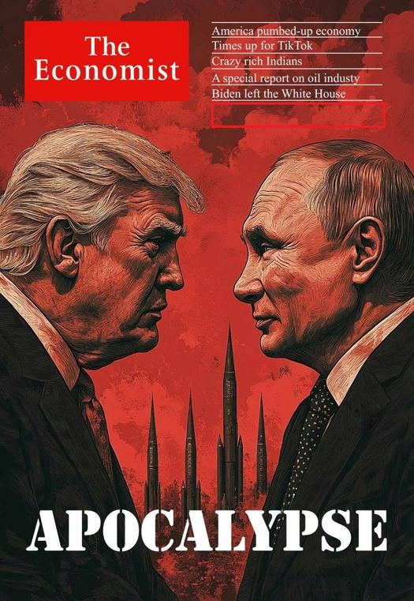

## Claim
Claim: " This image shows a screenshot of an authentic cover of the magazine The Economist from the end of 2024 illustrating Donald Trump and Vladimir Putin and warning of an apocalypse."

## Actions
```
reverse_search()
image_search("The Economist cover Trump Putin apocalypse")
```

## Evidence
### Evidence from `reverse_search`
The image of The Economist cover featuring Donald Trump and Vladimir Putin is altered and not authentic. PesaCheck states that the original cover from March 16, 2024, did not include the images of Trump and Putin ([https://pesacheck.org/altered-this-front-cover-was-not-published-by-the-economist-cd0c20d99b9b](https://pesacheck.org/altered-this-front-cover-was-not-published-by-the-economist-cd0c20d99b9b)). DW also mentions the fake cover in an article about fabricated news reports ([https://www.dw.com/en/fact-check-how-to-spot-fabricated-news-reports/a-71992819](https://www.dw.com/en/fact-check-how-to-spot-fabricated-news-reports/a-71992819)).

Ukrinform reports that the image is a fake cover created by Russian propagandists, lacking a publication date, and is being used to disseminate nuclear threats ([https://www.ukrinform.net/rubric-factcheck/3930063-russian-propaganda-fabricates-the-economist-cover-about-beginning-of-world-war-iii.html](https://www.ukrinform.net/rubric-factcheck/3930063-russian-propaganda-fabricates-the-economist-cover-about-beginning-of-world-war-iii.html)). The actual Economist issue published on November 16, 2024, featured a different cover , and the next issue, scheduled for November 23, 2024, will focus on Elon Musk . The fake cover is being used to disseminate nuclear threats aimed at Western audiences .


### Evidence from `image_search`
From [Source](https://www.economist.com/leaders/2024/02/22/caught-between-putin-and-trump): 
Content: The Economist published a cover on February 24th - March 1st 2024, with a picture of Putin and Trump. 


## Elaboration
The claim is false. The image is a manipulated cover of The Economist. The original cover from March 16, 2024, did not feature Trump and Putin. The image is being used to disseminate nuclear threats. The actual Economist issue published on November 16, 2024, had a different cover, and the next issue, scheduled for November 23, 2024, will focus on Elon Musk.


## Final Judgement
The image is a fabricated cover of The Economist. The original cover did not feature Trump and Putin. The image is being used to spread misinformation. `false`

### Verdict: FALSE

### Justification
The image is a fabricated cover of The Economist, as confirmed by PesaCheck ([https://pesacheck.org/altered-this-front-cover-was-not-published-by-the-economist-cd0c20d99b9b](https://pesacheck.org/altered-this-front-cover-was-not-published-by-the-economist-cd0c20d99b9b)) and Ukrinform ([https://www.ukrinform.net/rubric-factcheck/3930063-russian-propaganda-fabricates-the-economist-cover-about-beginning-of-world-war-iii.html](https://www.ukrinform.net/rubric-factcheck/3930063-russian-propaganda-fabricates-the-economist-cover-about-beginning-of-world-war-iii.html)). The actual covers from November 2024 featured different content.
