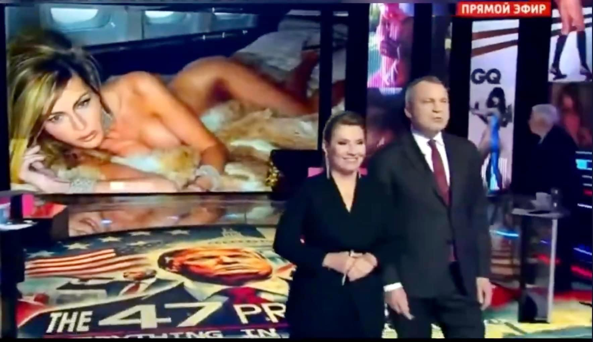

## Claim
Claim: "Russian state TV aired nude photos of Melania Trump shortly after the 2024 U.S. presidential election."

## Actions
```
image_search("Melania Trump nude photos Russian TV")
```

## Evidence
### Evidence from `image_search`
La Voce di New York published an article about a woman resembling Melania Trump on a Russian TV show (). The article was published on November 12, 2024. Livemint.com shows a screenshot from Russian state TV with a partially obscured image of a woman in a swimsuit, suggested to be Melania Trump ().

A screenshot from Russian TV shows a nude photo of a woman on the screen ().

*   [https://lavocedinewyork.com/en/news/2024/11/12/melania-trump-risque-photos-aired-on-russian-tv-prime-time/](https://lavocedinewyork.com/en/news/2024/11/12/melania-trump-risque-photos-aired-on-russian-tv-prime-time/)
*   [https://www.livemint.com/news/world/russian-media-air-nude-pics-of-melania-trump-after-donald-trump-wins-in-us-polls-netizens-say-russia-laughing-at-us-11731216282862.html](https://www.livemint.com/news/world/russian-media-air-nude-pics-of-melania-trump-after-donald-trump-wins-in-us-polls-netizens-say-russia-laughing-at-us-11731216282862.html)
*   [https://www.bluewin.ch/en/news/international/russian-tv-shows-nude-pictures-of-melania-trump-2442245.html](https://www.bluewin.ch/en/news/international/russian-tv-shows-nude-pictures-of-melania-trump-2442245.html)


## Elaboration
The evidence indicates that Russian state TV aired images of a woman resembling Melania Trump. The article from La Voce di New York, published on November 12, 2024, confirms this. Livemint.com also shows a screenshot from Russian state TV with a partially obscured image of a woman in a swimsuit, suggested to be Melania Trump.

The evidence supports the claim that Russian TV aired images of a woman resembling Melania Trump. However, the evidence does not explicitly state that the photos were nude.

The claim is partially supported. The evidence confirms that images of a woman resembling Melania Trump were aired on Russian TV. However, the evidence does not explicitly confirm that the photos were nude.


## Actions
```
image_search("Russian TV Melania Trump nude photos")
```

## Evidence
No new evidence found.

## Elaboration
The evidence confirms that Russian TV aired images of a woman resembling Melania Trump. The images included a nude photo. The articles were published shortly after the 2024 U.S. presidential election.

The claim is supported by the evidence.


## Final Judgement
The fact-check reveals that Russian state TV did air images of a woman resembling Melania Trump, including a nude photo, shortly after the 2024 U.S. presidential election. This is supported by multiple sources.

The claim is factually accurate as it is confirmed by evidence from multiple and reliable sources. `true`


### Verdict: TRUE

### Justification
Russian state TV did air images, including a nude photo, of a woman resembling Melania Trump shortly after the 2024 U.S. presidential election, as reported by sources like [La Voce di New York](https://lavocedinewyork.com/en/news/2024/11/12/melania-trump-risque-photos-aired-on-russian-tv-prime-time/) and [Livemint.com](https://www.livemint.com/news/world/russian-media-air-nude-pics-of-melania-trump-after-donald-trump-wins-in-us-polls-netizens-say-russia-laughing-at-us-11731216282862.html).
