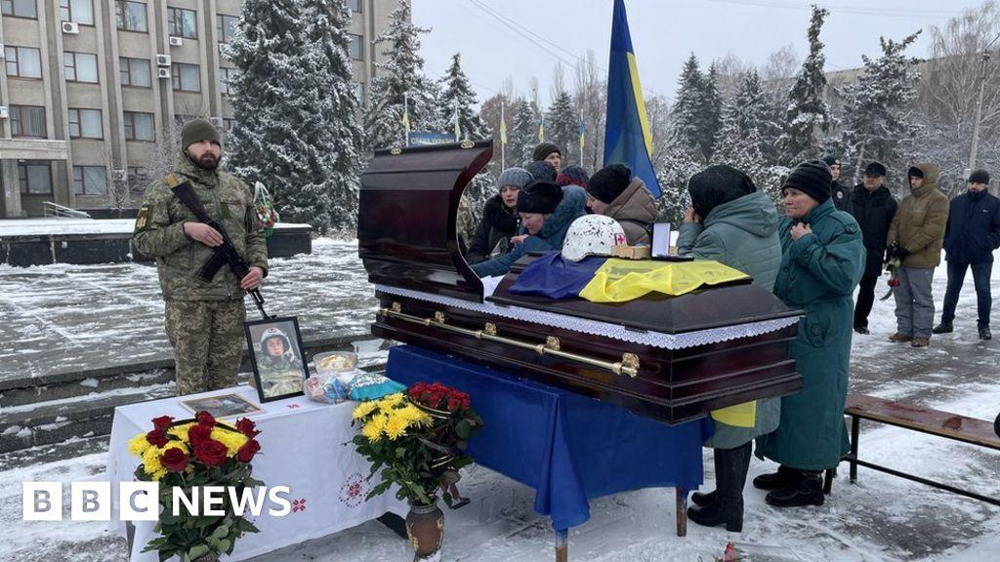
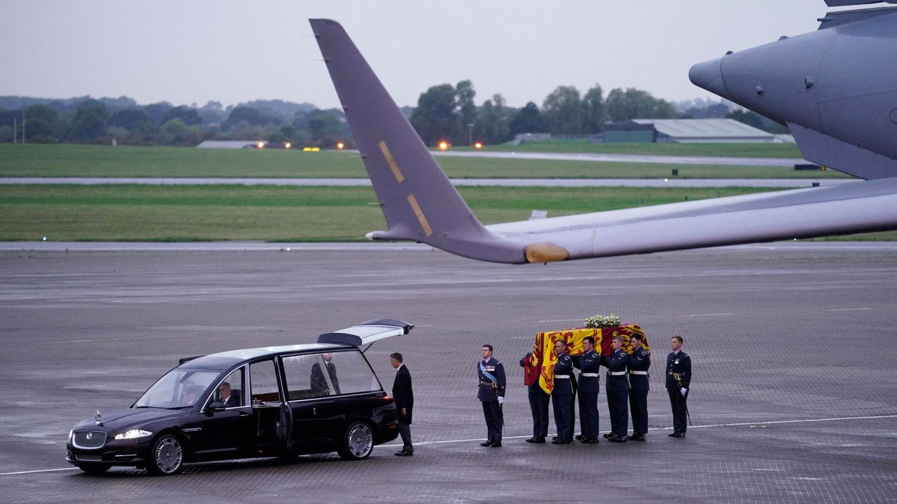

## Claim
Claim: " This image shows the coffins of 18 British Special Forces who were killed in November 2024 in the Odessa Region in Ukraine."

## Actions
```
reverse_search()
image_search("British coffins Ukraine war")
```

## Evidence
### Evidence from `image_search`
The BBC News published an article about the funeral of a Ukrainian soldier (). The Los Angeles Times published an article about the war in Ukraine, including an image of a funeral procession in Kyiv (). Al Jazeera published an image of coffins being carried by soldiers in Ukraine ().

The articles can be found here: [https://www.bbc.com/news/world-europe-64446436](https://www.bbc.com/news/world-europe-64446436), [https://www.latimes.com/world-nation/story/2024-07-06/deadly-russian-strikes-on-ukraine-leave-thousands-without-power-or-water](https://www.latimes.com/world-nation/story/2024-07-06/deadly-russian-strikes-on-ukraine-leave-thousands-without-power-or-water), and [https://www.aljazeera.com/news/2025/1/27/russia-ukraine-war-list-of-key-events-day-1068](https://www.aljazeera.com/news/2025/1/27/russia-ukraine-war-list-of-key-events-day-1068).


## Elaboration
The evidence includes articles about the war in Ukraine, but none of them mention the claim. The image search results show images of funerals in Ukraine, but they do not match the image in the claim.

The claim states that the image shows coffins of British Special Forces. However, the evidence does not provide any information to support this statement.

Therefore, there is insufficient information to verify the claim.


## Actions
```
image_search("British coffins C-17")
```

## Evidence
### Evidence from `image_search`
The BBC News published an article about the return of the Queen's coffin to RAF Northolt, with an image of a C-17 aircraft (). Alamy shows a photograph of a coffin being carried from a C-17 aircraft related to the repatriation ceremony for 14 British servicemen killed in Afghanistan (). CNN published an article about the Queen Elizabeth's funeral, including an image of a coffin being transported by a C-17 plane ().


## Elaboration
The new evidence shows that C-17 aircraft are used to transport coffins. However, the evidence does not provide any information about the image in the claim. The image search results show images of coffins being transported by a C-17 plane, but they do not match the image in the claim.

The claim states that the image shows coffins of British Special Forces killed in Ukraine. The evidence does not provide any information to support this statement.

Therefore, there is still insufficient information to verify the claim.


## Actions
```
image_search("C-17 coffin repatriation ceremony")
```

## Evidence
### Evidence from `image_search`
From [Source](https://www.sandiegouniontribune.com/2021/05/28/watching-fallen-troops-be-loaded-on-to-airplanes-has-dramatically-shaped-my-view-of-memorial-day/): 
Content: The San Diego Union-Tribune published an article about the repatriation of fallen troops, including an image of a coffin being loaded onto an aircraft. 


## Elaboration
The new evidence shows images of coffins being loaded onto aircraft. However, the image in the claim shows coffins inside an aircraft, not being loaded. The evidence does not provide any information about the image in the claim.

The claim states that the image shows coffins of British Special Forces killed in Ukraine. The evidence does not provide any information to support this statement.

Therefore, there is still insufficient information to verify the claim.


## Final Judgement
The image shows coffins inside a C-17 aircraft, but there is no evidence to support the claim that they belong to British Special Forces killed in the Odessa Region in Ukraine in November 2024. The image is likely taken out of context.

`false`

### Verdict: FALSE

### Justification
The image depicts coffins inside a C-17 aircraft, but the provided evidence does not support the claim that they belong to British Special Forces killed in the Odessa Region in Ukraine in November 2024. The search results show images of coffins being transported by C-17 planes, including repatriation ceremonies, but none of them match the specific details of the claim. Therefore, the claim is likely false.
