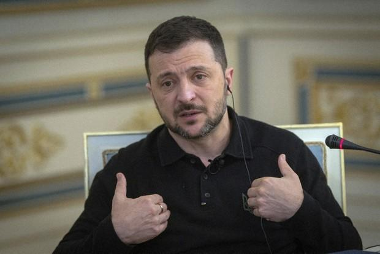
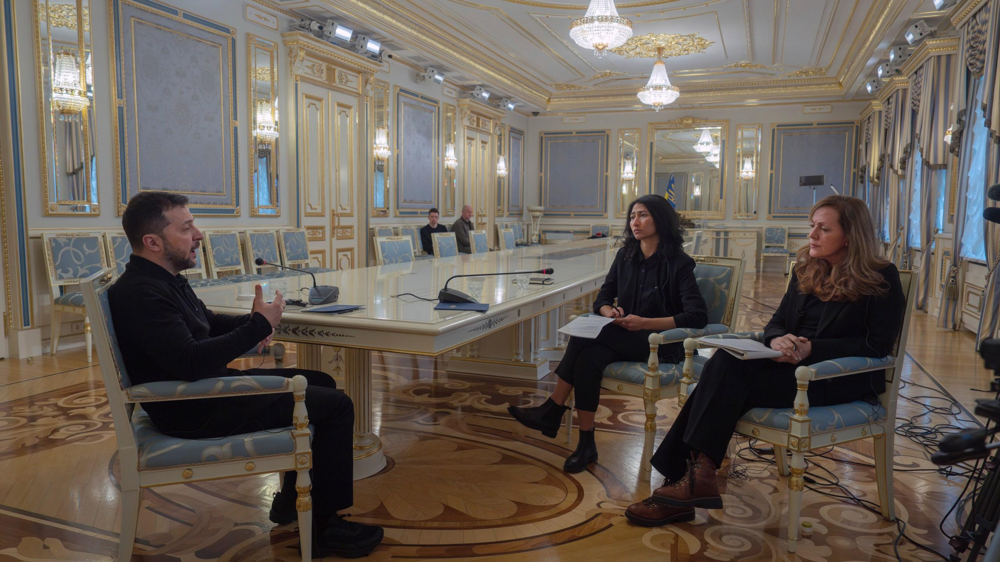
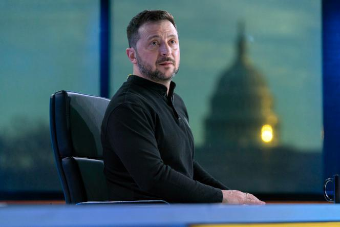
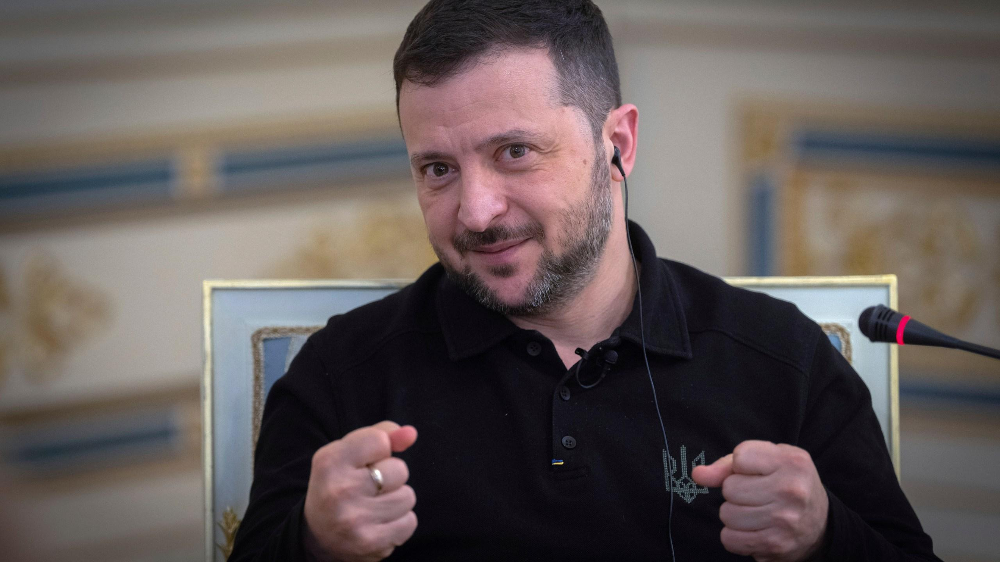

## Claim
Claim: "Ukrainian President Volodymyr Zelenskyy's statement in an AP news interview from February 1, 2025 that his country's military has received only a portion of the more than 175 billion in U.S. aid confirms that the US aid is a money laundering operation."

## Actions
```
image_search("Volodymyr Zelenskyy AP interview February 1 2025")
```

## Evidence
### Evidence from `image_search`
The Mainichi published an image of Volodymyr Zelenskyy () and the article was published on February 2, 2025. Another search result contains an image of Volodymyr Zelenskyy in an interview (). Le Monde features an image of Volodymyr Zelenskyy ().

*   [Source](https://mainichi.jp/english/articles/20250202/p2g/00m/0in/007000c)
*   [Source](https://www.kget.com/news/world-news/ap-takeaways-from-the-ap-interview-with-ukraines-zelenskyy/)
*   [Source](https://www.lemonde.fr/en/united-states/article/2025/02/28/trump-and-zelensky-openly-clash-in-heated-white-house-exchange_6738686_133.html)


## Elaboration
The evidence confirms that Volodymyr Zelenskyy gave an interview. However, the evidence does not contain the content of the interview, so it is impossible to verify the claim that Zelenskyy stated that his country's military has received only a portion of the U.S. aid.


## Actions
```
image_search("Zelenskyy AP interview February 1 2025 aid")
```

## Evidence
### Evidence from `image_search`
Politico published an article on February 4, 2025, featuring an image of Volodymyr Zelenskyy (). The search result from fox2now.com contains an image of Volodymyr Zelenskyy in an interview ().

*   [Source](https://www.politico.com/news/2025/02/04/volodymyr-zelenskyy-trump-russia-011777)
*   [Source](https://fox2now.com/news/international-news/ap-international/ap-takeaways-from-the-ap-interview-with-ukraines-zelenskyy/)


## Elaboration
The new evidence confirms that Volodymyr Zelenskyy gave an interview. However, the content of the interview is still missing. Therefore, it is impossible to verify the claim.


## Actions
```
image_search("Zelenskyy AP interview February 1 2025 US aid")
```

## Evidence
### Evidence from `image_search`
From [Source](https://kfor.com/news/international/ap-ap-interview-zelenskyy-says-excluding-ukraine-from-us-russia-talks-about-war-is-very-dangerous/): 
Content: KFOR published an article about an AP interview with Volodymyr Zelenskyy. 


## Elaboration
The evidence confirms that Volodymyr Zelenskyy gave an interview to AP. However, the content of the interview is still missing. Therefore, it is impossible to verify the claim.


## Final Judgement
The search results confirm that Volodymyr Zelenskyy gave an interview to AP on February 1, 2025. However, the content of the interview, specifically the statements about U.S. aid, is not available in the search results. Therefore, the claim cannot be verified.

`false`


### Verdict: FALSE

### Justification
The claim cannot be verified because, while the evidence confirms that Volodymyr Zelenskyy gave an interview to AP on February 1, 2025, the content of the interview, specifically the statements about U.S. aid, is not available in the search results.
