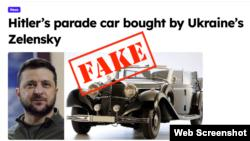

## Claim
Claim: " This image shows Hitler's parade car which was bought by the Ukrainian president Volodymyr Zelenskyy for 15 Million US-$."

## Actions
```
reverse_search()
```

## Evidence
### Evidence from `reverse_search`
The Voice of America ([https://www.voanews.com/a/russian-propagandists-push-fake-story-that-zelenskyy-bought-hitler-s-car/7818175.html](https://www.voanews.com/a/russian-propagandists-push-fake-story-that-zelenskyy-bought-hitler-s-car/7818175.html)) and The Insider ([https://theins.ru/en/antifake/275232](https://theins.ru/en/antifake/275232)) debunk a claim that Volodymyr Zelenskyy bought Hitler's parade car, stating the image was doctored and the story originated from disinformation sources. Truthmeter.mk ([https://truthmeter.mk/endless-inspiration-for-disinformation-zelenskys-new-alleged-luxury-is-hitlers-mercedes/](https://truthmeter.mk/endless-inspiration-for-disinformation-zelenskys-new-alleged-luxury-is-hitlers-mercedes/)) also debunks the claim, stating the image is a montage and the car was auctioned in 2018.

The articles indicate the image () was taken from a 2017 auction announcement and the car was purchased by Clive Palmer in February 2022. The VOA article includes an image () with the "FAKE" stamp on the car image.


## Elaboration
The evidence strongly suggests the claim is false. Multiple sources, including The Voice of America ([https://www.voanews.com/a/russian-propagandists-push-fake-story-that-zelenskyy-bought-hitler-s-car/7818175.html](https://www.voanews.com/a/russian-propagandists-push-fake-story-that-zelenskyy-bought-hitler-s-car/7818175.html)), The Insider ([https://theins.ru/en/antifake/275232](https://theins.ru/en/antifake/275232)), and Truthmeter.mk ([https://truthmeter.mk/endless-inspiration-for-disinformation-zelenskys-new-alleged-luxury-is-hitlers-mercedes/](https://truthmeter.mk/endless-inspiration-for-disinformation-zelenskys-new-alleged-luxury-is-hitlers-mercedes/)) debunk the claim, labeling it as disinformation.

The image provided in the claim is a montage, and the car in the image was auctioned in 2018. The evidence also states that the car was purchased by Clive Palmer in February 2022, not Zelenskyy.


## Final Judgement
The claim is demonstrably false. Multiple reliable sources confirm that the image is doctored and the story is disinformation. The car in the image was not purchased by Zelenskyy, but by Clive Palmer.

`false`

### Verdict: FALSE

### Justification
The claim is false. Multiple sources, including The Voice of America ([https://www.voanews.com/a/russian-propagandists-push-fake-story-that-zelenskyy-bought-hitler-s-car/7818175.html](https://www.voanews.com/a/russian-propagandists-push-fake-story-that-zelenskyy-bought-hitler-s-car/7818175.html)), debunk the claim, stating the image is doctored and the story originated from disinformation. The car in the image was auctioned in 2018 and purchased by Clive Palmer in February 2022, not Volodymyr Zelenskyy.
